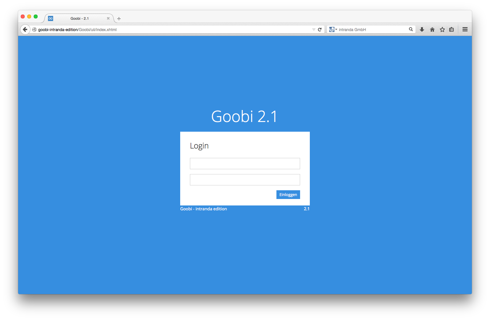

# 4.1.1.  Einloggen

Für die Arbeit mit Goobi benötigen Sie einen gültigen Zugang. Einen solchen erhalten Sie üblicherweise von ihrem Systemadministrator. In den meisten Fällen ist dieser Benutzerzugang der gleiche, der in den meisten Institutionen z. B. auch für das Betriebssystem vergeben wurde. Bei Problemen mit dem Zugang zu Goobi und der Benutzerauthentifizierung wenden Sie sich bitte an Ihren Systemadministrator oder an den Support der intranda GmbH.

Wenn Sie über einen gültigen Zugang verfügen, öffnen Sie bitte einfach die Startseite von Goobi. Tragen Sie hier Ihren Benutzernamen sowie Ihr Passwort ein und klicken Sie auf `Einloggen`.

Nachdem Sie sich eingeloggt haben, ändert sich das Erscheinungsbild von Goobi. In der Menüleiste stehen Ihnen nach dem Einloggen abhängig von Ihren Nutzerrechten verschiedene Optionen für die Arbeit mit Goobi zur Verfügung. Ihr Bildschirm sieht ungefähr wie in der folgenden Abbildung aus.

Im rechten Bereich der Menüleiste erkennen Sie, dass Sie eingeloggt sind. Wenn Sie Ihren Nutzernamen anklicken, öffnet sich ein Menü mit der Möglichkeit der `Benutzerkonfiguration`. Dort sehen Sie im Detail, in welchen Benutzergruppen und Projekten Sie Mitglied sind. Abhängig von Ihrer Mitgliedschaft in Benutzergruppen ist die Auflistung der weiteren Menüpunkte in der Menüleiste unterschiedlich. 

