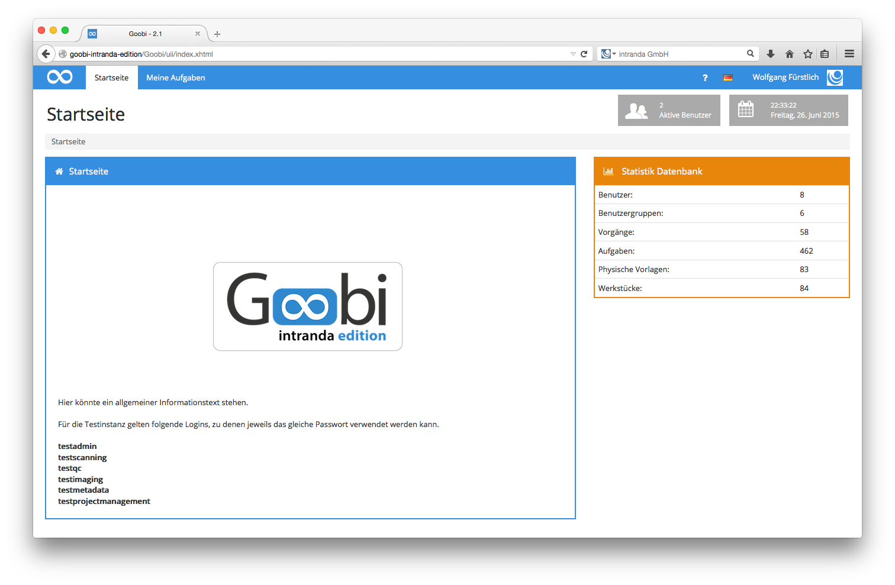

# 4.1.2. Menü

Die Navigation erfolgt, wie üblich bei Webanwendungen, über ein Navigationsmenü. Nachdem ein Benutzer eingeloggt ist, bieten sich für ihn in der Navigation je nach zugewiesenen Benutzerrechten verschiedene Optionen. Im Folgenden sehen Sie einige Beispiele wie die Menüleiste von Goobi je nach Rechten des eingeloggten Benutzers unterschiedlich aussehen kann. 

Wie an den drei Abbildungen deutlich wird, sind die Möglichkeiten der Arbeiten mit Goobi je nach Benutzerrechten sehr verschieden. Während ein Projektmitarbeiter beispielsweise als Scanoperateur in seinem Projekt lediglich einen Einblick in seine konkrete Arbeit hat, bieten sich für Benutzer mit erweiterten Rechten zum Teil wesentlich andere, umfangreichere Möglichkeiten mit Goobi zu arbeiten.

Ein Benutzer mit erweiterten Rechten hat die Möglichkeit, einen detaillierten Einblick in all die Werke zu nehmen, die zu einem der Projekte gehören, bei denen der Benutzer selbst Projektmitglied ist. Darüber hinaus kann ein Benutzer mit erweiterten Rechten auch neue Werke auf der Basis sogenannter `Produktionsvorlagen` in Goobi hinzufügen.

Ein Benutzer mit administrativen Rechten hat in Goobi die meisten Möglichkeiten, mit den Daten zu arbeiten. Ein solcher Administrator darf nicht nur die Vorgänge der Projekte einsehen, bei denen er selbst Mitglied ist, sondern sämtliche Projekte. Er hat darüber hinaus auch die Berechtigung, Änderungen an Vorgängen und Workflows vorzunehmen. Zusätzlich kann er in der Nutzerverwaltung Benutzer hinzufügen, Benutzergruppen definieren, einzelne Benutzer den Benutzergruppen und auch den Projekten zuweisen. Neben diesen Einstellungen hat der Administrator außerdem die Möglichkeiten, Projekte detailliert zu konfigurieren, auf Regelsätze mit ihren Struktur- und Metadaten Einfluss zu nehmen und auch die Konfiguration für die Authentifizierung festzulegen.

Im Abschnitt Goobi Anwender liegt der Schwerpunkt auf Themen für Benutzer, die als Projektmitglieder ihre tägliche Arbeit mit Goobi durchführen und dabei hauptsächlich mit dem Menüpunkt `Meine Aufgaben` arbeiten werden.

