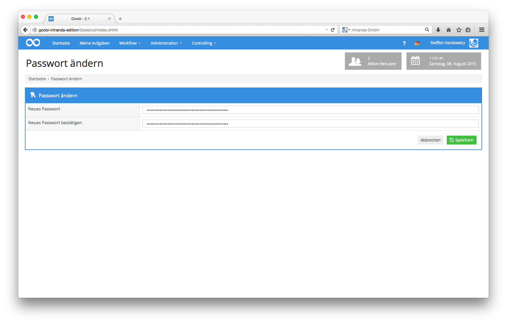

# 4.1.7. Passwort ändern

Aus Sicherheitsgründen sollten Sie, wie bei jedem anderen technischen System auch, gelegentlich Ihr Passwort ändern. Zum Ändern Ihres Passwortes klicken Sie bitte im rechten Bereich der Menüleiste auf Ihren Nutzernamen und anschliessend auf den Menüpunkt Passwort ändern. Es öffnet sich die zugehörige Oberfläche.

Um Ihr bestehendes Passwort zu ändern, müssen Sie in der Maske Ihr gewünschtes neues Passwort sowie die Bestätigung des neuen Passwortes in die beiden Eingabefelder eingeben. Ein Klick auf `Speichern` übernimmt den neuen Wert. Beim nächsten Einloggen in Goobi müssen Sie von nun an das neue Passwort verwenden. Bitte beachten Sie, dass Sie Ihr Passwort keinem anderen Benutzer mitteilen. Bitte verwenden Sie Sonderzeichen, Zahlen, Groß- und Kleinschreibung und mindestens 8 Zeichen, um ein sicheres Passwort zu erzeugen.

