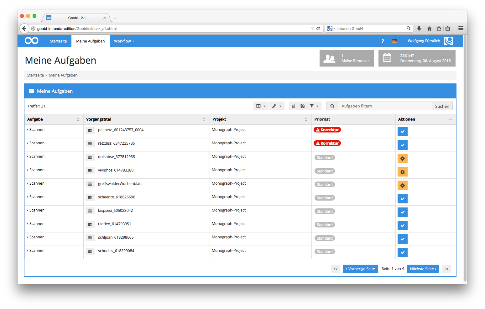
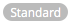
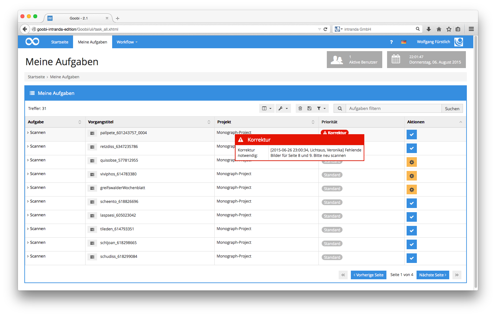
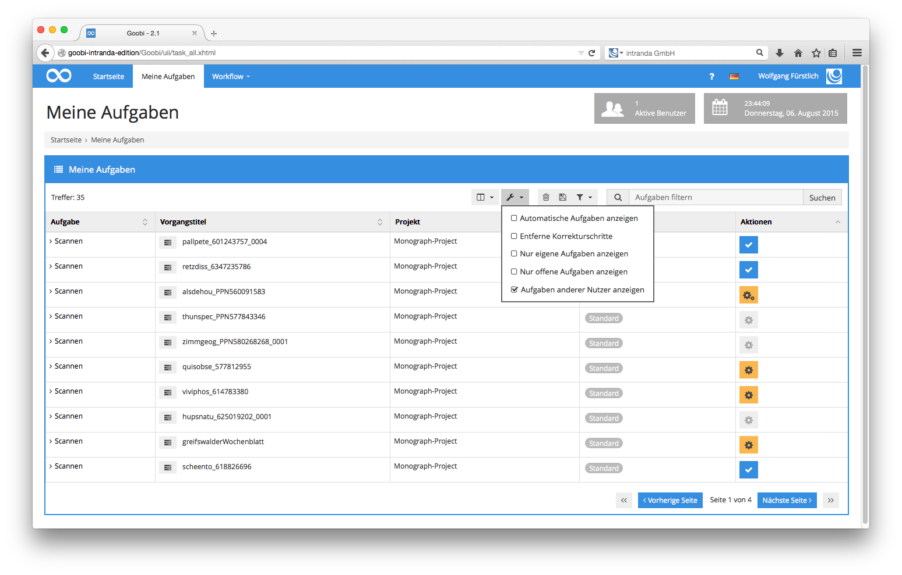
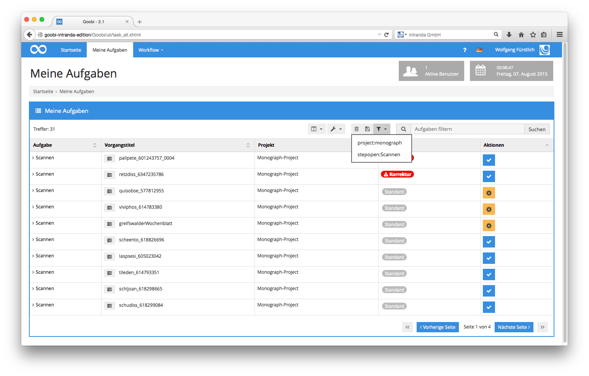
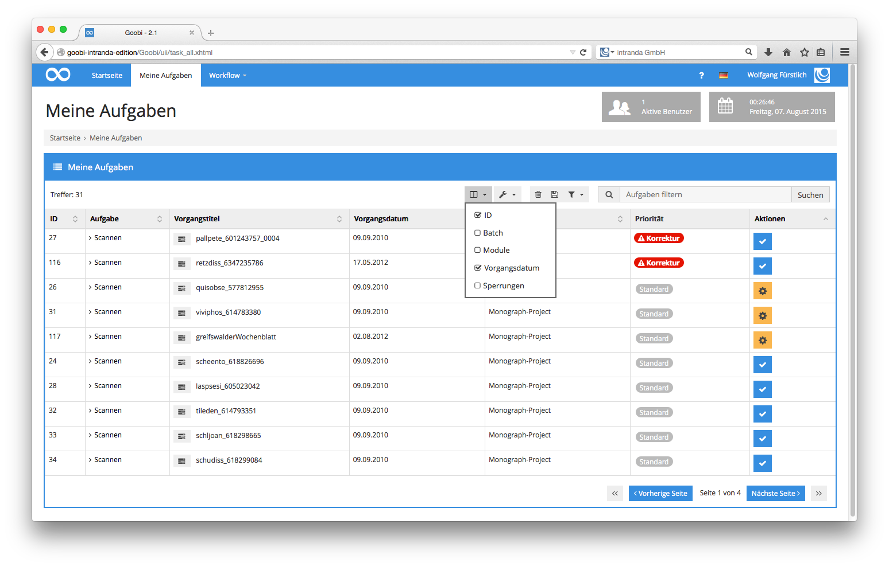

# 4.1.8.  Meine Aufgaben

Nachdem sie sich erfolgreich in Goobi eingeloggt haben, arbeiten die meisten Nutzer üblicherweise mit dem Menüpunkt Meine Aufgaben. Klicken Sie dazu in der Menüleiste auf den Menüpunkt `Meine Aufgaben`. Es erscheint ein Bildschirm wie der folgende.


In der Liste der eigenen Aufgaben werden ausschließlich diejenigen Aufgaben zu den Vorgängen in Goobi aufgelistet, die zu einem Projekt gehören, bei dem der Nutzer selbst Mitglied ist. Außerdem werden nur diejenigen Aufgaben aufgeführt, für die der Nutzer die erforderliche Qualifikation mitbringt. In der vorangegangenen Abbildung werden beispielsweise für einen Scanoperateur lediglich die Aufgaben angezeigt, die sich gerade im Workflowschritt Scannen befinden. In der Spalte `Aufgabe` wird dabei der Titel der jeweiligen Aufgabe aufgeführt. In der Spalte `Vorgangstitel` ist der Titel des Vorgangs zu sehen, zu dem die Aufgabe gehört. Die Spalte `Projekt` zeigt an, aus welchem Projekt der Vorgang stammt, und die Spalte `Priorität` erlaubt eine Übersicht, welche Priorität der jeweiligen Aufgabe zugeordnet wurde. Folgende Prioritätsstufen existieren in Goobi:

_**Bedeutung der Symbole für die Prioritäten der Arbeitsschritte**_

| **Priorität** | **Bedeutung** |
| :--- | :--- |
|   | Die Aufgabe hat eine normale Priorität. |
|   | Die Aufgabe hat Priorität und sollte bevorzugt bearbeitet werden. |
|   | Die Aufgabe hat eine hohe Priorität und sollte eilig bearbeitet werden. |
|   | Die Aufgabe hat höchste Priorität und sollte dringend bearbeitet werden. |
|   | Zu dieser Aufgabe oder anderen Aufgaben innerhalb des Workflows dieses Vorgangs liegt mindestens eine Korrekturmeldung vor, so dass diese Aufgabe bevorzugt bearbeitet werden sollte. |

Goobi zeigt Ihnen je nach Konfiguration und Vorgang zusätzliche Informationen an, die Ihnen einen Rückschluss darüber erlaubt, wie dringlich die Bearbeitung dieser Aufgabe jeweils ist. Erscheint beispielsweise ein Hinweis auf Priorität, so wurde diese für diesen Arbeitsschritt durch den Projektleiter hochgesetzt. Eine Sortierung nach Priorität erfolgt in Goobi grundsätzlich unabhängig davon, nach welcher Spalte Sie die Liste der eigenen Aufgabe sortieren lassen. Hoch priorisierte Aufgaben werden stets am Anfang der Liste angezeigt.

Neben den Prioritäten besteht außerdem die Möglichkeit, dass Korrekturmeldungen durch eine andere Arbeitsstation an eine frühere Arbeitsstation innerhalb des Workflows gesendet wurden. Zu einem späteren Zeitpunkt erkannte Fehler können somit gezielt wieder zu einer Person zurückgesendet und mit einer Korrekturmeldung versehen werden. Die zuständige Person erkennt an einem roten Warnhinweis sofort in der Liste der eigenen Aufgaben, dass es sich hierbei um einen Arbeitsschritt handelt, der zu einem früheren Zeitpunkt bereits abgeschlossen wurde und bei dem jetzt ein Fehler aufgefallen ist. Halten Sie den Mauszeiger einfach über den Warnhinweis um zu sehen, welche Korrekturmeldung hier zu dieser Aufgabe eingetragen wurde.


In der Spalte `Aktionen` ist der Status einer jeden Aufgabe anhand des angezeigten Icons ebenfalls erkennbar. Im Bereich `Meine Aufgaben` sind folgende Symbole für die Aktionen anzutreffen:

_**Bedeutung der Symbole für den Bearbeitungsstatus von Arbeitsschritten**_

| **Symbol** | **Bedeutung des Symbols** |
| :--- | :--- |
|   | Diese Aufgabe befindet sich derzeitig noch nicht in Arbeit. Mit einem Klick auf dieses Icon übernehmen Sie diese Aufgabe. |
|   | Dieses Icon zeigt Ihnen an, dass diese Aufgabe bereits von Ihnen selbst bearbeitet wird. Ein Klick auf dieses Icon öffnet die Detailanzeige zu diesem Arbeitsschritt. |
|   | Dieses Icon zeigt Ihnen an, dass sich die zugehörige Aufgabe bereits in Bearbeitung durch einen anderen Benutzer befindet. Ein Klick auf das Icon öffnet die Details zu dieser Aufgabe. Eine Bearbeitung der Aufgabe ist durch Sie ohne vorherige Freischaltung durch den Goobi-Administrator nicht möglich. |
|   | Diese Aufgabe ist Teil eines Batches und kann durch Annahme zusammen mit anderen Aufgaben des gleichen Batches gemeinsam bearbeitet werden. |
|   | Dieses Icon zeigt, dass es sich bei dieser Aufgabe um eine Batch-Aufgabe handelt, die Sie bereits zur Bearbeitung übernommen haben. |
|   | Dieses Icon zeigt, dass es sich bei dieser Aufgabe um eine Batch-Aufgabe handelt, die bereits ein anderer Benutzer zur Bearbeitung übernommen hat. Ein Klick auf das Icon öffnet die Details zu dieser Aufgabe. Eine Bearbeitung der Aufgabe ist durch Sie ohne vorherige Freischaltung durch den Goobi-Administrator nicht möglich. |

Möchten Sie prüfen, welche Bedeutung die einzelnen Symbole haben, halten Sie einfach den Mauszeiger über die entsprechenden Symbole. Im Falle der Icons für `Aktionen` wird ihnen somit z.B. angezeigt, welcher Benutzer diesen Arbeitsschritt gerade in Bearbeitung hat.

Für große Treffermengen haben Sie die Möglichkeit zwischen den einzelnen Tabellenseiten zu navigieren. Klicken Sie dazu unterhalb der Tabelle auf die Pfeilsymbole, um zwischen den einzelnen Tabellenseiten zu blättern. Mittels eines Klicks auf die aktuelle Seitenzahl der Tabelle blenden Sie ein Eingabefeld ein, in dem Sie die gewünschte Tabellenseite direkt eingeben können. Eine Bestätigung der Eingabe mit der Taste `Enter` führt dazu, dass Goobi direkt die gewünschte Tabellenseite öffnet.

Die Anzeige unter `Meine Aufgaben` kann in begrenztem Rahmen nach individuellen Vorgaben angepasst werden. Grundsätzlich lässt sich die Liste der angezeigten Aufgabe nach jeder der angezeigten Spalten auf- oder absteigend sortieren. Werden Ihnen zu viele Aufgaben angezeigt, haben Sie die Möglichkeit, oberhalb der Tabelle mit den bereitstehenden Menüpunkten Einfluß auf die Anzeige zu nehmen.


Die folgenden Optionen zur Anpassung der Anzeige stehen zur Verfügung:

_**Optionen zur Anpassung der eigenen Aufgaben**_

| **Option** | **Erläuterung** |
| :--- | :--- |
| Automatische Aufgaben anzeigen | Durch die Aktivierung dieser Option werden auch Aufgaben angezeigt, die automatisch ablaufen sollten und nicht manuell durch einen Nutzer ausgeführt werden müssen. |
| Entferne Korrekturschritte | Mit der Nutzung dieser Option werden all diejenigen Aufgaben aus der Tabelle ausgeblendet, zu denen eine Korrekturmeldung vorliegt. |
| Nur eigene Aufgaben anzeigen | Mit dieser Option werden ausschliesslich Aufgaben angezeigt, die durch Sie selbst bereits angenommen wurden und sich noch in Bearbeitung befinden. |
| Nur offene Aufgaben anzeigen | Mittels dieser Option werden nur diejenigen Aufgaben aufgeführt, die bisher nicht durch einen Benutzer angenommen wurden und sich daher auch noch nicht in Bearbeitung befinden. |
| Aufgaben anderer Nutzer anzeigen | Durch Aktivierung dieser Option lassen sich auch diejenigen Aufgaben anzeigen, für deren Ausführung Sie prinzipiell berechtigt wären, die allerdings bereits durch einen anderen Nutzer bearbeitet werden. |

Neben der einfachen Begrenzung der angezeigten Aufgaben bietet Goobi die Möglichkeit, gezielt bestimmte Aufgaben aus der gesamten Liste derjenigen Aufgaben von Vorgängen zu filtern, bei denen der Nutzer Projektmitglied ist und für die er die erforderlichen Qualifikationen aufweist. Tippen Sie dafür in das Eingabefeld `Aufgaben filtern` den gewünschten Filtertext ein, um Aufgaben in der Liste zu finden. Eine Beschreibung der möglichen Eingaben für den Filter erfolgt im `Abschnitt Vorgänge filtern`.

Einmal eingegebene Filter lassen sich über das Speichersymbol für jeden Goobi-Nutzer speichern, so dass auch komplexe Filterausdrücke zum späteren Zeitpunkt jederzeit erneut auf einer Liste der gespeicherten Filter ausgewählt und angewendet werden können. Zum Speichern eines Filters klicken Sie nach der Eingabe eines Filters einfach auf das Speichern-Symbol. Damit wird es in die Liste der vordefinierten Filter aufgenommen. Aus dieser Liste können Sie den gespeicherten Filter zu einem späteren Zeitpunkt jederzeit wieder auswählen und anwenden.

Möchten Sie in der Liste der eigenen Aufgaben weitere Spalten durch Goobi anzeigen lassen, so haben Sie hierzu ebenfalls die Möglichkeit. Wählen Sie hier nun diejenigen Spalten aus, die Sie anzeigen lassen möchten:

_**Auflistung der zusätzlich aktivierbaren Tabellenspalten im Bereich 'Meine Aufgaben'**_

| **Spalte** | **Beschreibung des Spalteninhalts** |
| :--- | :--- |
| ID | Anzeige der `ID` des Vorgangs für den jeweiligen Arbeitsschritt. |
| Vorgangsdatum | Die Spalte `Vorgangsdatum` listet Ihnen das Datum auf, an dem der Vorgang, zu dem der Arbeitsschritt gehört, in Goobi erzeugt wurde.  |
| Modul | Anzeige der eingetragenen `Module` oder `Plug-Ins`, die zu dem jeweiligen Arbeitsschritt im Workflow festgelegt wurden. Diese Module oder Plug-Ins beinhalten zusätzliche Funktionalität, die den Funktionsumfang von Goobi für einen speziellen Arbeitsschritt erweitert. |
| Sperrungen | Die Spalte `Sperrungen`  listet Ihnen die Namen anderer Benutzer auf, die zu der jeweiligen Aufgabe gerade den Goobi-internen METS-Editor geöffnet haben. Die Bearbeitung der Struktur- und Metadaten im METS-Editor in Goobi erlaubt ausschließlich die Bearbeitung durch jeweils eine Person. Da für einzelne Projekte und Aufgaben je nach Standort und Konfiguration auch mehrere Personen zuständig sein können, ist mittels der Spalte `Sperrungen` ersichtlich, ob zur Zeit gegebenenfalls andere Mitarbeiter die Metadaten einzelner Vorgänge in Goobi exklusiv bearbeiten. |
| Batch | Die Spalte `Batch` führt die Batch-ID für den jeweiligen Vorgang auf. Ein Wert ist an dieser Stelle nur sichtbar, wenn sich der entsprechende Vorgang zusammen mit anderen Vorgängen in einem gemeinsamen Batch befindet und somit mehrere Vorgänge gleichzeitig bearbeitet werden sollen. |


Zur Anpassung der Anzeige der einzelnen Spalten wählen Sie einfach diejenige Spalte aus, die Sie zusätzlich angezeigt haben möchten, indem Sie die jeweilige Checkbox auswählen.

