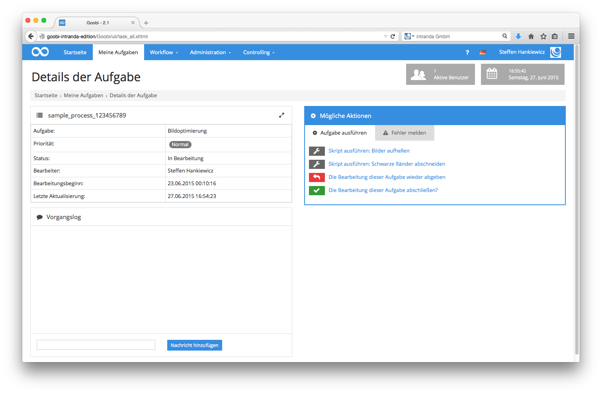

# 4.2.3. Manuelle Skriptschritte

Neben den Aufgaben in Goobi, die bereits beschrieben wurden, besteht die Möglichkeit, beliebige externe Programme oder Skripte aus Goobi heraus durch den Nutzer gezielt aufrufen zu lassen. Dazu bietet Goobi die Möglichkeit, dass zu einem Arbeitsschritt zusätzliche Schaltknöpfe im Bereich der möglichen Aktionen konfiguriert werden. Diese Schaltknöpfe tragen die Bezeichnungen, die vom Goobi-Administrator bei der Konfiguration des Workflows festgelegt wurden, und rufen bei Ausführung einen oder mehrere konfigurierte Befehle auf Seiten des Servers auf.

Durch die Konfiguration des Administrators ist es für den Nutzer möglich zu entscheiden, ob diese Skripte tatsächlich ausgeführt werden sollen. Dazu klickt der Nutzer einfach auf einen oder mehrere der angebotenen Aktionen. Je nach Konfiguration erhält der Nutzer nach Ausführung des Skripts eine entsprechende Rückmeldung über das korrekte Ausführen der serverseitigen Bearbeitung.

