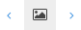

# 4.3.2.2.1. Neue Strukturelemente hinzufügen

Abhängig davon, welches Strukturelement aktiviert wurde, werden in der Box neues Strukturelement unterschiedliche Elemente für die Auswahl angeboten. Wählen Sie die Position, an der das neue Strukturelement eingefügt werden soll, unter den folgenden Optionen aus:

_**Positionen für neue Strukturelemente**_

| **Position** | **Beschreibung des Position für das neue Strukturelement** |
| :--- | :--- |
| Vor dem aktuellen Element | Wählen Sie `Vor dem aktuellen Element`, um ein Strukturelement abhängig vom aktuell ausgewählten Element unmittelbar vor diesem einzufügen |
| Hinter das aktuelle Element | Wählen Sie `Hinter das aktuelle Element`, um das hinzuzufügende Strukturelement auf gleicher Hierarchieebene direkt hinter dem aktuellen Element einzufügen. |
| Als erstes Subelement | Wählen Sie `Als erstes Subelement`, um das neu hinzuzufügende Strukturelement innerhalb der Hierarchie als Unterelement vor bereits bestehenden Subelementen innerhalb des aktuell ausgewählten Strukturelementes einzufügen |
| Als letztes Subelement | Wählen Sie `Als letztes Subelement`, um ein neues Strukturelement innerhalb der Hierarchie als Unterelement des aktuellen Elementes hinzuzufügen. Dabei wird das neue Strukturelement an der letzten Stelle aller bestehenden Elemente eingefügt. |

Je nachdem, welche der vier Optionen Sie gewählt haben, wird die Liste der auswählbaren Strukturelemente variieren. Die Auswahl dieser Elemente hängt davon ab, wie der Goobi-Administrator das System speziell für das aktuelle Projekt mittels der frei konfigurierbaren Regelsätze definiert hat. Innerhalb bestimmter Strukturelemente können dadurch gezielt Struktur- und Metadaten vorgegeben werden, die in der Hierarchie erlaubt sind. Innerhalb eines Strukturelements `Monographie` ist z.B. das Strukturelement `Zeitschriftenartikel` nicht zu vergeben, während ein `Kapitel` durchaus zum normalen Umfang einer `Monographie` gehören dürfte. Abhängig von dieser Konfiguration wird also die Liste je nach aktuell im linken Navigationsbaum ausgewähltem Strukturelement aufgelistet.

Die schnellste Arbeitsweise, um in Goobi neue Strukturelemente hinzuzufügen, ist die Auswahl der Option `Als letztes Subelement` gefolgt von der Auswahl des gewünschten Strukturelements aus der bereitgestellten Liste. Navigieren Sie nun mittels der Bildnavigationsleiste oder der Tastenkombinationen durch das Imageset. Haben Sie die Startseite für das aktuell hinzuzufügende Strukturelement gefunden, so klicken Sie auf das kleine Bildsymbol neben dem Eingabefeld `Erste Seite`.  Blättern Sie anschließend zwischen den Seiten, bis Sie die letzte Seite des aktuell hinzuzufügenden Strukturelements ermittelt haben. Klicken Sie nun auf das kleine Bildsymbol rechts neben dem Eingabefeld `Letzte Seite`.  Durch das Klicken der Bildsymbole übernimmt Goobi automatisch diejenige Seite, die im rechten Bereich der Bildanzeige aktuell ausgewählt ist. Darüberhinaus bietet Goobi die Möglichkeit mittels der kleinen Pfeilsymbole neben dem Bildsymbol, die Seite des vorherigen bzw. nachfolgenden Bildes zu übernehmen. Auf diese Weise können Seiten zugewiesen werden, ohne dass dafür in der Bildanzeige unnötig oft geblättert werden muss.  Klicken Sie anschließend auf `Strukturelement hinzufügen`, um dieses neue Strukturelement als jeweils letztes Subelement innerhalb des aktuellen Strukturelementes einzusetzen. Verfahren Sie auf diese Weise für alle hinzuzufügenden Strukturelemente und fügen diese jeweils als letztes Subelement an, um effizient Strukturelemente hinzuzufügen.

| Icon | Bedeutung |
| :--- | :--- |
|  | Bedienelemente zur Zuweisung der Start- oder Endseite eines neuen Strukturelements |
|  | Das aktuell angezeigte Bild als Start- oder Endseite verwenden |
|  | Das vorherige Bild als Start- oder Endseite verwenden |
|  | Das nachfolgende Bild als Start- oder Endseite verwenden |

Möchten Sie innerhalb eines Strukturelements, das sie neu hinzugefügt haben, weitere Unterelemente erzeugen, so wählen Sie zunächst das übergeordnete Element aus, innerhalb dessen die hinzuzufügenden Strukturelemente eingefügt werden sollen. Verfahren Sie anschließend auf die gleiche Weise, indem Sie jedes Strukturelement als jeweils letztes Subelement hinten anfügen.

Auf diese Weise vergeben Sie in Goobi in einem Arbeitsschritt gleich zwei entscheidende Informationen: Einerseits erfassen Sie die digitale Struktur des Werkes, wie Sie es logisch beschreiben in Form von Kapiteln, Unterkapiteln, Vorwörtern, Nachwörter, Inhaltsverzeichnis oder anderen Strukturelementen, die in Ihrer Goobi-Installation individuell konfigurierbar sind. Auf der anderen Seite vergeben Sie gleichzeitig während des Hinzufügens von Strukturelementen die passenden Seitenbereiche für jedes einzelne Strukturelement.

Durch das Klicken auf das kleine Bildsymbol. bzw. die kleinen Pfeilsymbole neben den Textfeldern `Erste Seite` und `Letzte Seite` übernimmt Goobi automatisch die Start- und Endseite eines jeden Strukturelements und fügt diese dem Strukturelement zu. Somit ist innerhalb der im Hintergrund sich aufbauenden Metadatendatei vollständig bekannt, auf welchen Seitenbereichen welche Strukturelemente vorhanden sind. Für den späteren Fall der Darstellung dieser Digitalisate z.B. auf einer Webseite, ist es somit jederzeit möglich, gezielt alle Seiten eines speziellen Unterstrukturelementes anzuzeigen. Ein Download einer PDF-Datei eines Unterkapitels kann somit stets die korrekt zugewiesenen Seiten enthalten.

Bei einigen Strukturelementen werden unterhalb des ausgewählten Typs außerdem Eingabefelder angezeigt, um unmittelbar Metadaten zu dem Strukturelement zu vergeben. Welche Felder hierbei angezeigt werden \(z.B. Haupttitel, Schlagworte o.ä.\) hängt von dem gewählten Struktrutyp sowie der Konfiguration der Regelsätze in Goobi ab.

