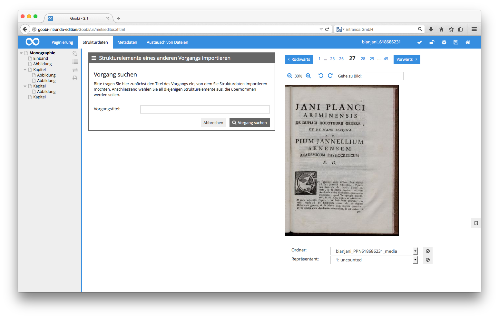

# 4.3.2.2.3. Kopieren von Strukturelementen aus anderen Vorgängen

Innerhalb von Goobi besteht auch die Möglichkeit, Strukturelemente aus der METS-Datei eines Vorgangs in einen anderen Vorgang zu kopieren.  Klicken Sie hierzu in der Box `Ausgewähltes Strukturelement` auf die Funktion `Strukturelement eines anderen Vorgangs importieren`. Im Anschluss daran kann aus der angebotenen Baumansicht das zu kopierende Strukturelement ausgewählt und innerhalb der aktuellen METS-Datei der Zielort angegeben werden.

Tragen Sie zunächst den namen des Vorgangs ein, von dem Sie die Daten übernehmen möchten und klicken anschließend auf `Vorgang suchen`.

Im Anschluss daran haben Sie die Möglichkeit, ein oder mehrere Strukturelemente des ausgewählten Vorgangs auszuwählen, indem Sie auf diese klicken. Nach der Auswahl gelangen Sie mit der Schaltfläche `Weiter` zum Strukturbaum des aktuell geöffneten Vorgangs.

Wählen Sie nun hier dasjenige Strukturelement aus, in das die zuvor ausgewählten Strukturelemente des anderen Vorgangs eingefügt werden sollen. Beachten Sie hierbei, dass nur diejenigen Strukturelemente als Ziel ausgewählt werden können, die laut Regelsatz die kopierten Elemente enthalten dürfen. Bitte beachten Sie in diesem Zusammenhang ebenso, dass durch diese Funktionalität ausschließlich die logischen Strukturelemente aus einem anderen Vorgang kopiert werden. Bilder und Seitenzuweisungen werden hingegen in diesem Kopiervorgang nicht übernommen.

