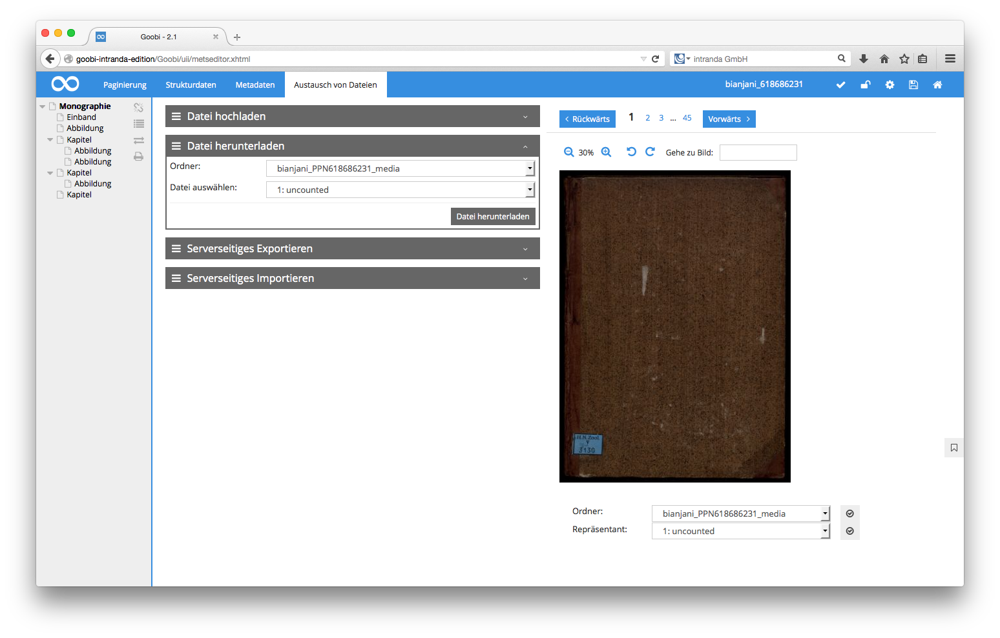

# 4.3.3.3. Datei herunterladen

Mit dieser Funktion kann eine Datei aus dem aktuellen Ordner des Vorgangs auf den Computer des Nutzers heruntergeladen werden. Dabei kann der Nutzer die gewünschte Datei auswählen und erhält den Dialog zum Speichern von Dateien seines Browsers angezeigt.

