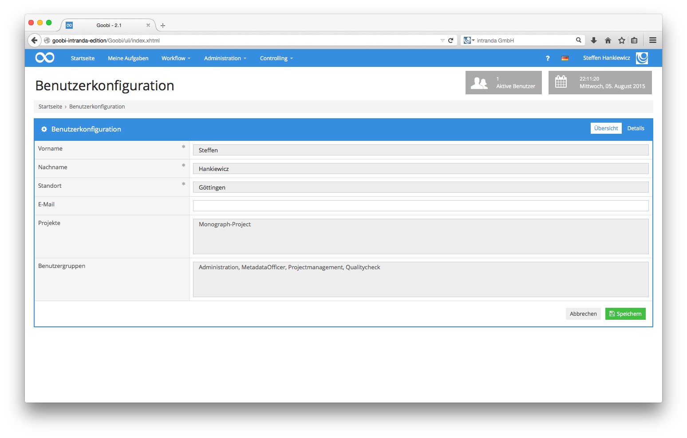
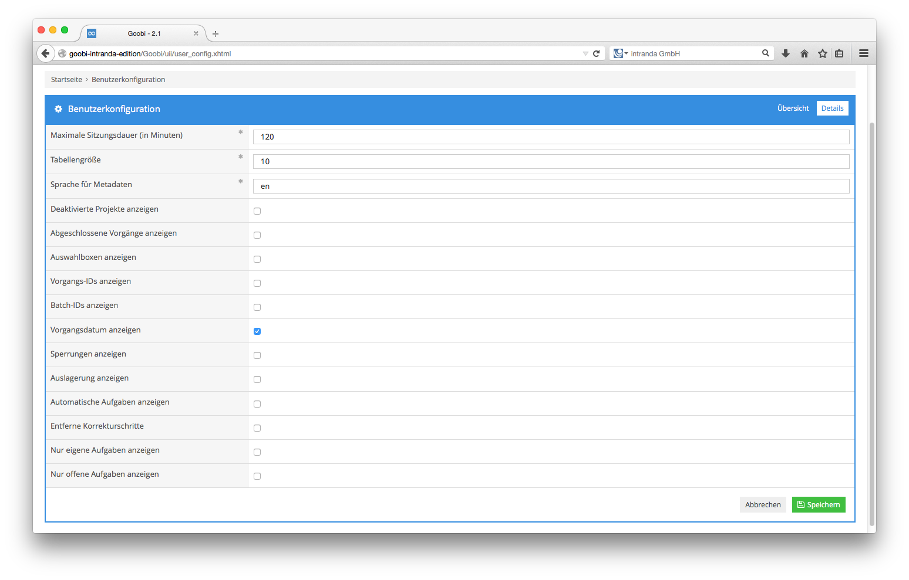
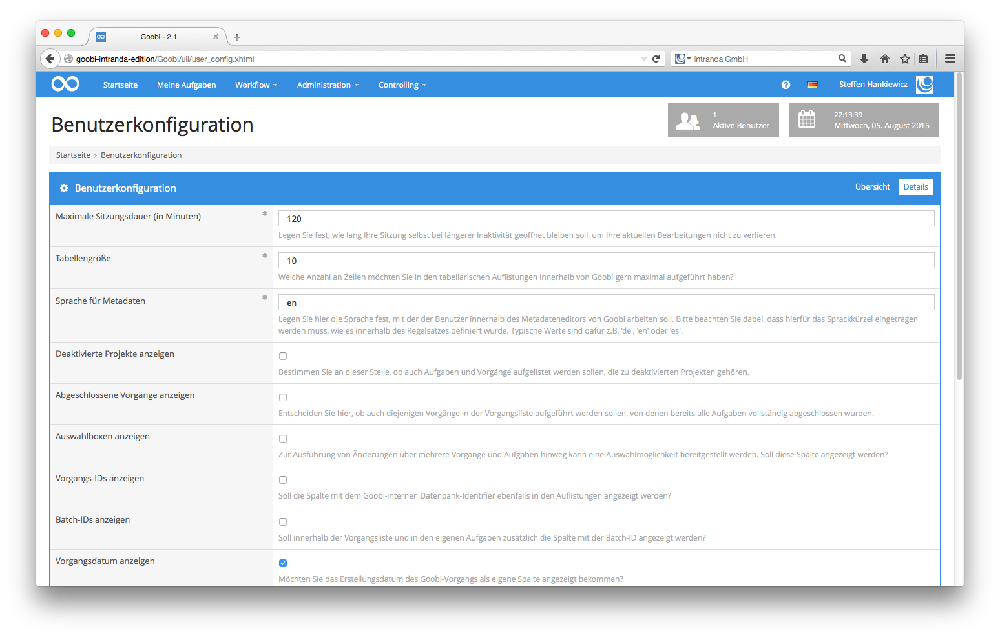

# 4.1.6. Eigene Einstellungen

Wenn Sie in Goobi eingeloggt sind, haben Sie die Möglichkeit, Einstellungen für Ihr eigenes Nutzerprofil festzulegen. Diese Einstellung erreichen Sie indem Sie in der Menüleiste auf Ihren Nutzernamen und dann den Menüpunkt Benutzerkonfiguration anklicken. In dem nun geöffneten Formular haben Sie die Möglichkeit, Details für Ihr persönliches Profil festzulegen.


In dem Bereich der `Details` lassen sich einige Werte für die Arbeit mit Goobi festlegen. Der Wert für die `Zeitüberschreitung der Session` legt hier in Minuten fest, nach welcher Zeit, in der durch Sie nicht in Goobi gearbeitet wurde, Sie automatisch von Goobi abgemeldet werden. Ein automatisches Ausloggen findet wie im Beispiel dieser Abbildung nach 120 Minuten Inaktivität durch Goobi statt.

Der Wert der `Tabellengröße` \(in diesem Beispiel: 10\) legt fest, wie viele Zeilen die Tabellen in Goobi auf einer Seite auflisten sollen, bevor für die Einsicht auf weitere Daten auf die nächste Tabellenseite geblättert werden muss.

Die `Sprache der Metadaten` legt fest, welche Sprache des konfigurierten Regelsatzes für die Struktur- und Metadaten innerhalb des eingebetteten METS-Editors in Goobi verwendet werden soll. Der hier festgelegte Wert muss dabei nicht identisch mit Ihrer konfigurierten Sprache sein, die für die Goobi-Oberfläche gewählt wurde. Die hier definierte Sprache muss jedoch im Regelsatz konfiguriert sein. Mittels dieser Einstellung ist es möglich, dass z. B. besondere Sprachen für Struktur- und Metadaten vorgegeben werden können, unabhängig von den Sprachen, in denen Goobi selbst verfügbar ist.

Mit der Checkbox `Vorgangsdatum anzeigen` kann der Benutzer festlegen, dass ihm im Bereich Meine Aufgaben und auch im Bereich der `Vorgänge` und `Produktionsvorlagen` eine zusätzliche Spalte mit dem Datum angezeigt wird, an dem der entsprechende Vorgang angelegt wurde.


Zu den weiteren Werten, die innerhalb der Benutzerkonfiguration vorgenommen werden können, erhalten Sie eine ausführliche Erläuterung, indem sie innerhalb der Menüleiste einfach die Hilfefunktion aktivieren. Anschliessend werden Beschreibungen zu den einzelnen Feldern angezeigt, die Ihnen bei der Eingabe Unterstützung geben.

Bitte beachten Sie, dass erst ein Klick auf `Speichern` die hier eingestellten Werte übernimmt.

