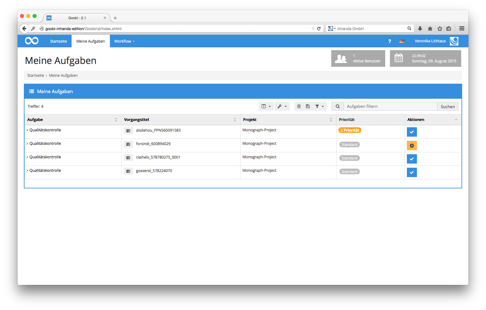
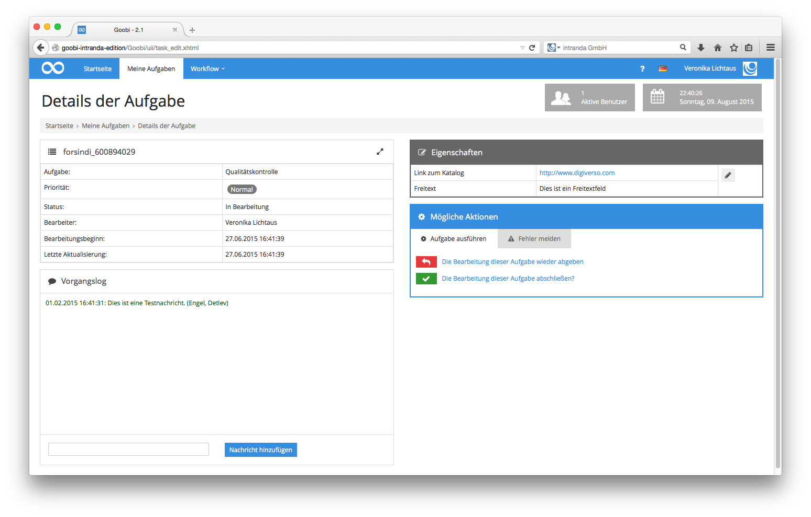
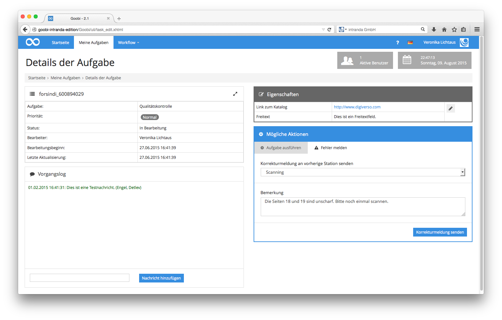

# 4.2.2. Qualitätskontrolle

An zahlreichen Standorten, die mit Goobi arbeiten, findet eine manuelle Qualitätskontrolle der Scantätigkeiten aus einem vorangegangenen Arbeitsschritt innerhalb des Workflows statt. Die Arbeitsweise derjenigen Personen, die diese Qualitätskontrolle durchführen, unterscheidet sich kaum von der Art und Weise, wie die Scanoperateure zuvor gearbeitet haben. Ähnlich wie im [Abschnitt Scannen](4.2.1.md) verfahren auch die Benutzer der Benutzergruppe Qualitätskontrolle nach dem erfolgreichen Einloggen in Goobi so, dass sie zunächst in der Menüleiste auf `Meine Aufgaben` klicken. Anschließend wählen die Benutzer der Qualitätskontrolle aus der Liste der bereit gestellten Aufgaben abhängig von Priorität und Korrekturmeldung eine Aufgabe aus, um diese zur Bearbeitung zu übernehmen.

Nach der Übernahme der gewünschten Aufgabe erstellt Goobi ähnlich wie bei den Scanoperateuren innerhalb des Arbeitsverzeichnisses des Benutzers einen Ordner. In diesem Ordner werden durch Goobi all diejenigen Digitalisate zugänglich gemacht, die durch einen früheren Arbeitsschritt – üblicherweise das Scannen – in Goobi eingespielt wurden. 

Zumeist sind die Workflows in Goobi so konfiguriert, dass Benutzer innerhalb der Qualitätskontrolle keine Änderungen in dem Ordner vornehmen sollen und daher lediglich eine lesende Berechtigung für diesen erhalten. Gegebenenfalls zuvor eingetragene allgemeine Anmerkungen sind auch in diesem Arbeitsschritt im `Vorgangslog` im linken unteren Bereich des Fensters ersichtlich. 

Konfigurierte erweiterte Eigenschaften, die ein Benutzer dieser Benutzergruppe in dieser Aufgabe eintragen oder auswählen soll, werden neben den allgemeinen Eigenschaften zur Bearbeitung angeboten. Mit einem herkömmlichen Programm zur Betrachtung von Images kann der Benutzer nun alle Dateien innerhalb des bereitgestellten Verzeichnisses durchlaufen und die Qualität der eingestellten Digitalisate sicherstellen. 

Entspricht die Qualität den Anforderungen, die an das Projekt gestellt werden, so genügt ein Klick auf den Link `Die Bearbeitung dieser Aufgabe abschließen`, um damit die Aufgabe aus der Liste der eigenen Aufgabe zu entfernen. Der zwischenzeitlich durch Goobi bereitgestellte Ordner, der einen lesenden Zugriff auf die Digitalisate erlaubte, wird automatisch wieder aus dem Arbeitsverzeichnis des Nutzers entfernt. Somit ist ein weiterer Zugriff auf die Daten des Vorgangs innerhalb des vorgegebenen Workflows nicht möglich.

Fällt während der Qualitätskontrolle auf, dass die Qualität einzelner Digitalisate ungenügend ist, einzelne Seiten fehlen oder einige Seiten mehrfach vorhanden sind, so bietet Goobi die Möglichkeit, eine Korrekturmeldung an eine frühere Arbeitsstation zu senden. 

Klicken Sie in diesem Falls im Bereich `Mögliche Aktionen` auf die Registerkarte `Fehler melden`. In der anschließend sichtbaren Auswahlliste erhalten Sie die Möglichkeit, sämtliche vor dem aktuellen Arbeitsschritt stattgefundenen Aufgaben mit dem jeweils verantwortlichen Benutzer auszuwählen. Im Freitextfeld unterhalb der ausgewählten Aufgabe kann eine Beschreibung zum festgestellten Fehler eingetragen werden.

Durch das Klicken auf den Link `Korrekturmeldung senden` erhält die ausgewählte Arbeitsstation die fehlerhaft ausgeführte Aufgabe erneut in ihre Liste der eigenen Aufgaben. Die an dieser Stelle eingetragene Fehlerbeschreibung wird dem Nutzer in seiner Aufgabenliste automatisch angezeigt, wenn er seinen Mauszeiger über den roten Warnhinweis hält oder den somit als Korrekturaufgabe markierten Arbeitsschritt erneut übernimmt. Bei der Korrektur des gemeldeten Fehlers erhält dieser Nutzer dann ebenfalls die Möglichkeit eine Beschreibung zur Lösung des angemerkten Fehlers hinzuzufügen. Auf diese Weise ist es möglich Vorgänge auch im Fehlerfall zwischen den einzelnen Aufgaben des Workflows mehrfach zuzuweisen.

