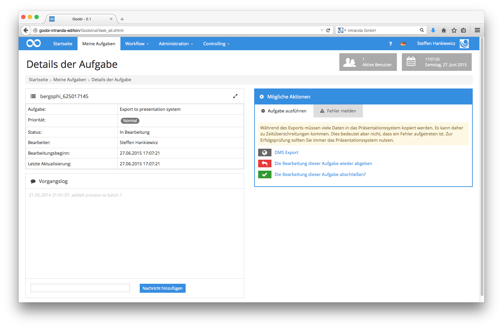

# 4.2.6. Export in das DMS

Ein häufiger Arbeitsschritt in verschiedensten Digitalisierungsprojekten zahlreicher Einrichtungen ist, dass die Digitalisate zusammen mit ihren Struktur- und Metadaten, die zum Teil mit relativ großem Aufwand erfasst wurden, der Öffentlichkeit bereit gestellt werden. Solche Bereitstellungen von Digitalisaten können in verschiedenen Systemen erfolgen und sind von der Software Goobi unabhängig. Sie können somit auch auf einer ganz anderen Hardware in Betrieb genommen werden als sie für Goobi nötig ist. Die Übergabe der Digitalisate zusammen mit den Struktur- und Metadaten in Form einer METS-Datei an ein solches `Document Management System (DMS)` erfolgt durch Goobi in diesem Arbeitsschritt, entweder vollautomatisch oder semiautomatisch - je nach Konfiguration.

Im Falle eines semiautomatischen Arbeitsschrittes erfolgt der Export manuell und die Arbeitsweise entspricht für die zuständige Person der Benutzergruppe annähernd derjenigen, wie sie zuvor für die anderen Benutzergruppen beschrieben wurde. Nach dem Einloggen und dem Wählen einer Aufgabe aus der Liste `Meine Aufgaben` gelangt der Benutzer in die Details der übernommen Aufgabe. Dort findet er ähnlich wie bei den zuvor beschriebenen Aufgaben eine Oberfläche mit den Details zur Aufgabe und dem `Vorgangslog` für den Vorgang der gewählten Aufgabe vor. Im Bereich der `Möglichen Aktionen` steht dem Benutzer ein zusätzlicher Schaltknopf zur Verfügung, mit dem der eigentliche Export an das externe DMS-System gestartet werden kann.

Bitte beachten Sie, dass der Export der Digitalisate und der zugehörigen Struktur- und Metadaten abhängig von der Konfiguration und je nach Datenmenge längere Zeit in Anspruch nehmen kann. Für den Fall, dass Goobi so konfiguriert wurde, dass der Export in das DMS validiert werden soll, verhindert Goobi ein weiteres Arbeiten bis die Kommunikation zwischen Goobi und dem DMS abgeschlossen ist. Erst nach Abschluss dieser Kommunikation, die im Falle großer Datenmengen auch durchaus einige Minuten dauern kann, zeigt Goobi in der Benutzeroberfläche eine Information über den Abschluss des Exports an. 

Im Falle eines Misserfolgs des Exports führt Goobi die ausführliche Fehlermeldung in der Oberfläche auf, die den erfolgreichen Export verhinderte. Solche potentiell auftretenden Fehler liegen zumeist in einer Verletzung der Regeln innerhalb der Struktur- und Metadaten. Je nach Konfiguration kann dem Benutzer innerhalb der Aufgabe für den `Export in das DMS` ebenfalls ein Zugriff auf die Struktur- und Metadaten in Form des Metadateneditors von Goobi gewährt werden, um solche Validierungsfehler selbst sofort zu beheben. In den häufigsten Fällen ist es jedoch so, dass in dieser Aufgabe auftretende Fehler zu dem Absenden einer Korrekturmeldung an die zuständige vorherige Arbeitsstation führen. Eine Beschreibung, wie eine solche Korrekturmeldung zwischen verschiedenen Arbeitsstationen innerhalb des Workflows stattfindet, finden Sie im [Abschnitt Qualitätskontrolle](4.2.2.md).

Ist Goobi durch die Administratoren des Systems so konfiguriert, dass bei dem Export in das DMS nicht auf das Ende der Kommunikation zwischen Goobi und dem DMS gewartet werden soll, erfolgt durch Goobi unmittelbar nach dem Klick auf den Link `Export in das DMS` eine positive Rückmeldung, dass der Export erfolgreich im Hintergrund gestartet wurde. Eine Validierung der Ergebnisse findet im Hintergrund im Rahmen des Exports dennoch statt, sie ist allerdings innerhalb der Oberfläche von Goobi für den Benutzer nicht sichtbar und wird stattdessen mit den Systemereignissen in Form von Logdateien gespeichert. Eine unmittelbare Weiterarbeit mit Goobi ist somit für den Nutzer ohne zusätzliche Wartezeit sofort möglich, so dass anschließend auf den Link `Diese Aufgabe abschließen` geklickt werden kann. Die Aufgabe wird automatisch aus der Liste der eigenen Aufgabe in Goobi entfernt.

Seit der Version 1.9 von Goobi besteht neben der manuellen Exportmöglichkeit in das DMS auch die Möglichkeit, diesen Export vollautomatisch von Goobi durchführen zu lassen. In diesem Falle werden die Aufgaben des Exports in das DMS nur dann in der Aufgabenliste eines zuständigen Nutzers aufgeführt, wenn es zu einem Fehlerfall während dieses Exports kommt. Für den Regelfall eines korrekten Exportes, der bei korrekter Konfiguration von Goobi durch die Validierung der Arbeitsergebnisse der vorherigen Aufgaben sichergestellt ist, findet der Export vollautomatisch innerhalb des Workflows statt und aktiviert den nachfolgenden Arbeitsschritt nach Abschluss des Exports.

In Goobi 2.0 wurde der Export so angepasst, dass an dieser Stelle verschiedene Plugins integriert werden können. Dies erlaubt es, flexibel auf die Erfordernisse verschiedener Präsentationsumgebungen eingehen zu können. Um diesen Plugin-basierten Export nutzen zu können, muss ein Arbeitsschritt über die Einstellung `Export DMS` verfügen. Zusätzlich muss darüber hinaus jedoch ebenfalls das bereitgestellt Export-Plugin eingetragen sein. Wird hingegen kein spezieller Plugin-basierter Export innerhalb des Arbeitsschritts konfiguriert, wird stattdessen der Standard-Export genutzt.

