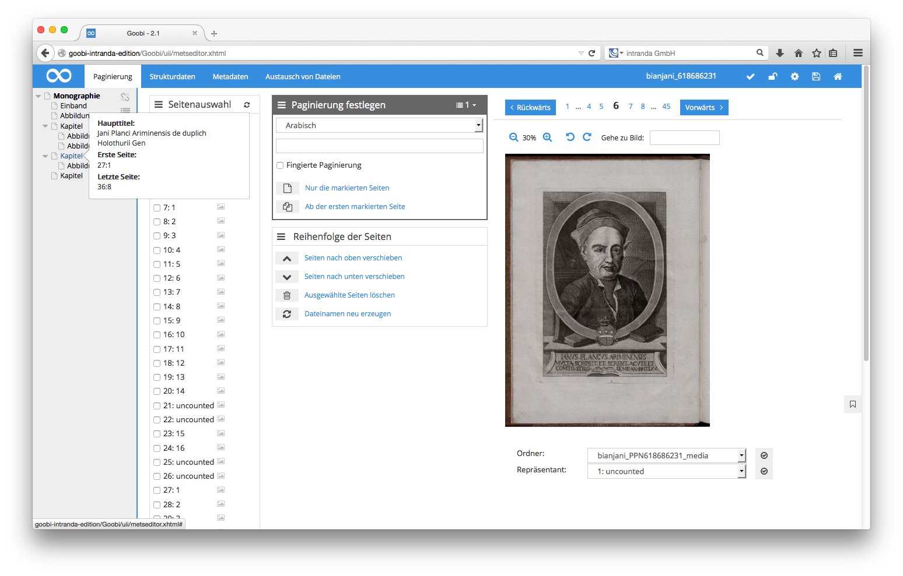

# 4.3.1.1. Strukturbaum

Im linken grau hinterlegten Bereich befindet sich der Strukturbaum. Hier lassen sich alle Strukturelemente, die für das vorliegende Werk bereits erfasst wurden inklusive ihrer Hierarchie auf einen Blick einsehen. Das jeweilig gerade ausgewählte Strukturelement ist innerhalb der Baumansicht fett hervorgehoben. Jedes Strukturelement hat als Bezeichnung den Typ, der für dieses Element ausgewählt wurde.

| Icon | Beschreibung |
| :--- | :--- |
|  | Symbol zum Ein- und Ausklappen des Hierarchiebaums der Strukturelemente |

Ein Klick auf das Icon vor den Strukturelementen ermöglicht ein Auf- und Zuklappen der einzelnen Bereiche innerhalb des Strukturbaumes. Halten Sie den Mauszeiger über das kleine Symbol zu einem Strukturelement, so sehen Sie in einem Popup weitere Details zu dem Strukturelement ohne es öffnen zu müssen.

