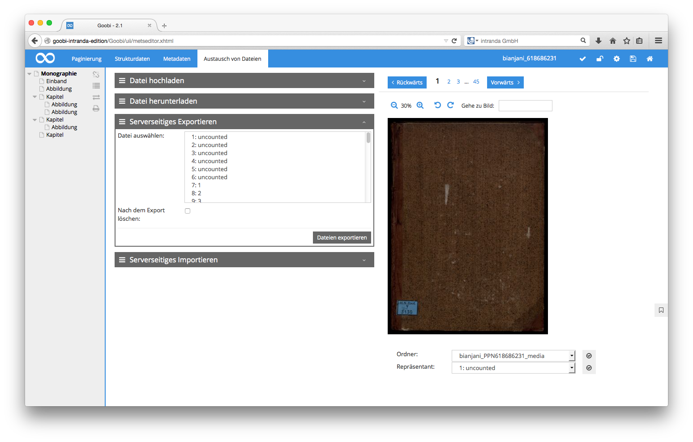

# 4.3.3.4. Serverseitiges exportierten

Auf dem Goobi Server wird automatisch innerhalb des konfigurierten Ordners `tempfolder` ein Unterordner `fileupload` erzeugt. Dieser Ordner dient dem serverseitigen Austausch von Dateien zwischen Vorgängen.

In diesem Bereich des METS-Editors können eine oder mehrere Seiten ausgewählt werden, die in den Austauschordner exportiert werden sollen. Dabei wird im Austauschordner ein Ordner mit dem Titel des aktuellen Vorgangs angelegt. Die ausgewählten Seiten werden in allen Bildverzeichnissen \(Derivaten\) des aktuellen Vorgangs gesucht und in den Vorgangsordner des Austauschordners exportiert. 

Optional können für den Export ebenfalls alle ausgewählten Seiten des aktuellen Vorgangs gelöscht werden. Das Löschen wird dann sowohl für die Dateinamen-Zuweisung als auch die Zuordnung zu Strukturelementen oder die zugeordneten Metadaten angewendet. Zusätzlich wird die Datei aus allen Ordnern des Vorgangs gelöscht.

Sollte das aktuell angezeigte Bild gelöscht worden sein, wird stattdessen das erste Bild des Vorgangs angezeigt. Andernfalls wird lediglich die markierte Bildnummer aktualisiert.

