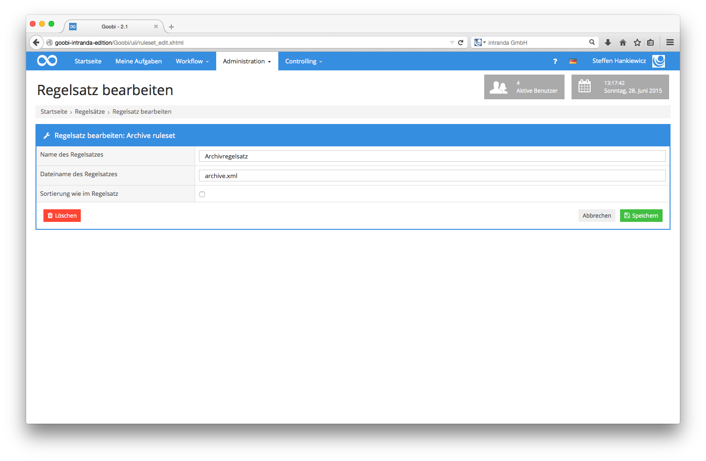

# 5.2. Regelsätze

Ein wesentliches Merkmal von Goobi ist, dass sämtliche Struktur- und Metadaten, die im Rahmen von Digitalisierungsprojekten erfasst werden sollen, auf der Basis eines flexiblen Regelsatzsystems vergeben werden können. Vor Projektbeginn ist es daher möglich, dass die Projektleitung festlegt, welche Strukturelemente und welche Metadatenelemente für das aktuelle Projekt erlaubt sein sollen. Die Sammlung dieser Struktur- und Metadaten, die Rechte, wie diese und in welchen Häufigkeiten sie verwendet werden dürfen sowie die zugehörigen Übersetzungen für die Oberflächen werden in den Regelsatzdateien festgelegt.

Die Erarbeitung der Regelsatzdatei wird detailliert in einer eigenständigen Dokumentation beschrieben. An dieser Stelle erfolgt hingegen eine Beschreibung darüber, wie innerhalb von Goobi mit dem entsprechenden Regelsatz gearbeitet werden kann. Klicken Sie auf der Menüleiste auf den Menüpunkt `Administration` und in dem nun geöffneten Menü auf `Regelsätze` und öffnen Sie damit die Maske für die Auflistung der in Goobi bereits festgelegten Regelsätze.


Ein Klick auf den Link `Neuen Regelsatz anlegen` öffnet eine Bearbeitungsmaske zum Anlegen eines weiteren Regelsatzes.

| Icon | Beschreibung |
| :--- | :--- |
|  | Neuen Regelsatz anlegen |
|  | Bestehenden Regelsatz bearbeiten |

Vergeben Sie an dieser Stelle einen sprechenden Namen, den Sie in Goobi für die Zuweisung innerhalb von Projekten verwenden möchten, und nennen Sie die Regelsatzdatei wie diese im Dateisystem tatsächlich benannt ist.



In der Bearbeitungsmaske für den Regelsatz kann neben dem Titel und dem Dateinamen außerdem festgelegt werden, nach welcher Sortierreihenfolge die Daten aus diesem Regelsatz in Goobi angezeigt werden sollen.  Die Standardsortierung in Goobi ist eine alphabetische Sortierung. Innerhalb des METS- Editors von Goobi werden somit alle Auflistungen von Strukturelementnamen und Metadatenfeldern alphabetisch sortiert aufgelistet. Ändert man hingegen innerhalb dieser Bearbeitungsmaske die Sortierung durch die Aktivierung der Checkbox `Sortierung wie im Regelsatz`, so erfolgt in Goobi die Sortierung nicht mehr alphabetisch. Für den konfigurierten Regelsatz werden dann die Struktur- und Metadaten in der Reihenfolge aufgelistet, wie sie innerhalb des Regelsatzes tatsächlich aufgeführt wurde. Dies könnte z. B. dann sinnvoll sein, wenn ganz bewusst manuell Einfluss auf die Sortierung der Struktur- und Metadaten genommen werden soll.  Ein Klick auf die Schaltfläche `Speichern` übernimmt die Änderungen, die innerhalb der Bearbeitungsmaske vorgenommen wurden. Ein Klick auf die Schaltfläche `Löschen`, löscht den ausgewählten Regelsatz. Bitte beachten Sie bei der Eingabe des Dateinamens, dass die angegebene Datei auch tatsächlich innerhalb des in Goobi konfigurierten Regelsatzpfades existiert. Der Standardpfad, in dem Goobi diese Regelsätze erwartet, lautet:

```bash
/opt/digiverso/goobi/rulesets/
```

Im Falle des oben aufgeführten Beispiels in der Abbildung muss also eine Datei `archive.xml` im Verzeichnis der Regelsätze vorliegen, um von Goobi genutzt zu werden:

```bash
/opt/digiverso/goobi/rulesets/archive.xml
```


