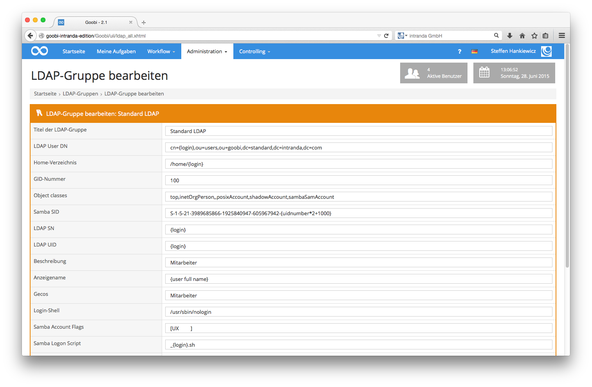

# 5.3. LDAP-Gruppen

Eine wesentliche Komponente von Goobi ist die Integration sowohl von Goobi als auch der angeschlossenen zusätzlichen Dienste an ein zentrales Authentifizierungssystem. Diese Authentifizierung erfolgt in den meisten Fällen über einen bereitgestellten LDAP-Server. Mittels dieses zentralen LDAP-Servers können Nutzer mit einem einzigen Nutzerkonto mit nur einem Login und einem Passwort in verschiedenen Systemen arbeiten.

Im Fall von Goobi ist es somit möglich, sich mit dem eigenen Nutzerkonto in Goobi einzuloggen, aber auch direkt auf das Arbeitsverzeichnis zuzugreifen, innerhalb dessen Goobi für die Nutzer Daten zur Bearbeitung bereitstellt.

Der Zugriff auf das Arbeitsverzeichnis erfolgt im Hintergrund über einen Samba-Server, der die jeweilige Nutzeranfrage über den zentralen LDAP-Server authentifiziert. Zur Konfiguration der LDAP-Gruppen klicken Sie in der Menüleiste auf den Menüpunkt Administration und öffnen dort LDAP-Gruppen. Sie erhalten somit eine Übersicht über sämtliche in Goobi festgelegten LDAP-Gruppen. In den meisten Fällen ist lediglich eine LDAP-Gruppe konfiguriert worden.

Klicken Sie auf das Icon zur Bearbeitung einer der konfigurierten LDAP-Gruppen, so gelangen Sie in die Bearbeitungsmaske. Innerhalb dieser können Sie die einzelnen Parameter für die LDAP- Authentifizierung konfigurieren.

| Icon | Beschreibung |
| :--- | :--- |
|  | Neue LDAP-Gruppe anlegen |
|  |  Bestehende LDAP-Gruppe bearbeiten |


**Tipp:** Bitte beachten Sie hierbei, dass Sie alle Änderungen an den hier bereitgestellten Daten mit großer Sorgfalt und in Absprache mit dem Systemadministrator vornehmen. Eine Fehlkonfiguration an dieser Stelle könnte für alle Nutzer den weiteren Zugriff auf Goobi verhindern. Bitte wenden Sie sich jederzeit an das intranda Supportteam für den Fall, dass Sie an der Konfiguration der LDAP-Gruppen Änderungen vornehmen möchten, aber unsicher über die einzelnen Parameter sind.


Nach der Änderung der jeweiligen Parameter der LDAP-Gruppe führt ein Klick auf die Schaltfläche Speichern zurück zur Liste der LDAP-Gruppen und übernimmt die Änderungen. Ein Klick auf die Schaltfläche Löschen löscht die aktuell ausgewählte LDAP-Gruppe dauerhaft aus Goobi. Bitte beachten Sie hierbei, dass Nutzer sich anschließend nicht mehr authentifizieren können. Eine weitere Arbeit mit Goobi ist nach Fehlkonfiguration einer LDAP-Gruppe oder Löschen einer LDAP-Gruppe nicht mehr möglich.

