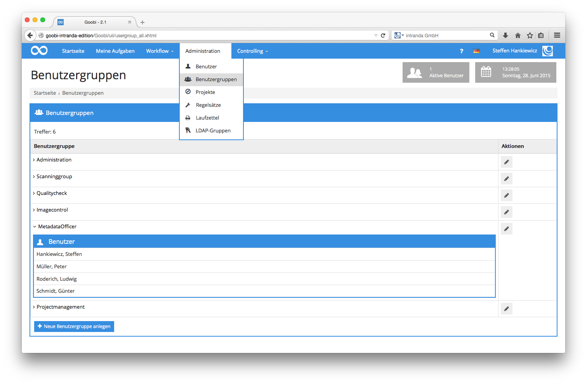

# 5.5. Benutzergruppen

Goobi benötigt für die flexible Handhabung der frei konfigurierbaren Workflows und der damit involvierten Benutzer, dass verschiedene Benutzergruppen festgelegt werden. Solche Benutzergruppen lassen sich verstehen als Rollen, Tätigkeiten oder Qualifikationen, die einzelne Personen innerhalb von Workflows haben können.  Typische Beispiele für solche Benutzergruppen oder Rollen können unter anderem beispielsweise Scanoperateure, Metadatenbearbeiter oder Administratoren sein. Definieren Sie in Goobi diese Gruppen frei, um diese anschließend einzelnen Benutzern zuordnen zu können.  Sie gelangen in die Auflistung der bestehenden Benutzergruppen, indem Sie über den Menüpunkt `Administration` in der Menüleiste den Menüpunkt `Benutzergruppen` auswählen. In der somit geöffneten Liste der Benutzergruppen werden nun all diejenigen Gruppen angezeigt, die bereits in Goobi festgelegt wurden. Zu jeder dieser festgelegten Benutzergruppe lassen sich alle Benutzer auflisten, die dieser Benutzergruppe zugewiesen wurden. Klicken Sie für diese Auflistung einfach auf das kleine Symbol vor jeder aufgelisteten Benutzergruppe. Anschließend erhalten Sie Einsicht in alle zugewiesenen Benutzer.

Zusätzliche Benutzergruppen können Sie erzeugen, indem Sie einfach auf den Link `Neue Benutzergruppe anlegen` klicken. Bestehende Benutzergruppen hingegen lassen sich bearbeiten, indem in der Spalte `Aktionen` auf das Editieren-Icon geklickt wird.

| Icon | Beschreibung |
| :--- | :--- |
|  | Neue Benutzergruppe anlegen |
|  |  Neue Benutzergruppe anlegen |

Die Bearbeitungsmaske für die Benutzergruppen ist sehr übersichtlich, da sich hier lediglich zwei Werte konfigurieren lassen. Vergeben Sie zunächst einen frei definierbaren Titel für die Benutzergruppe. Beachten Sie hierbei, dass Sie diesen Titel möglichst sprechend wählen, um Ihnen und anderen Administratoren in Goobi eine bessere Übersicht zu gewährleisten.

Zu jeder definierten Benutzergruppe müssen Sie darüber hinaus eine Berechtigungsstufe festlegen. Goobi unterscheidet in der aktuellen Version die Benutzergruppen in drei verschiedene Berechtigungsstufen.

## Einfache Nutzerberechtigung

In der `Einfachen Nutzerberechtigung` gewährleistet Goobi ausschließlich, dass ein Nutzer den Zugriff auf die eigenen Aufgaben erhält und Vorgänge in Goobi suchen kann. Ein solcher Nutzer kann entsprechend eigene Aufgaben annehmen und abschließen, aus seiner Liste der Aufgaben auswählen oder auch Einblick in die bestehenden Vorgänge von Goobi nehmen. Dieser Einblick ist allerdings ausschließlich mit lesender Berechtigung möglich. Einen Zugriff auf weitere Informationen in Goobi hat der Benutzer nicht.

## Verwaltung

Die Berechtigungsstufe `Verwaltung` erlaubt dem Benutzer neben dem Zugriff auf die eigenen Aufgaben und die Suche nach Vorgängen, ebenfalls einen Zugriff auf die Produktionsvorlagen. Somit kann der Benutzer aus all denjenigen konfigurierten Vorgangsvorlagen neue Goobi-Vorgänge für diejenigen Projekte erzeugen, in denen der Benutzer selbst Mitglied ist. 

Mit der Berechtigungsstufe Verwaltung lassen sich also neue Vorgänge auf der Basis konfigurierter Workflows anlegen. Darüber hinaus ist es einem Nutzer, der einer solchen Benutzergruppe zugewiesen ist, möglich, Änderungen an bestehenden Vorgängen vorzunehmen. Solche Änderungen können z.B. den Workflow der Vorgänge betreffen. Es kann aber auch ein Zugriff direkt auf den Metadateneditor erfolgen, ohne dass der Vorgang sich gerade in einem Arbeitsschritt für eine solche Bearbeitung befinden muss. Darüber hinaus stehen Nutzern innerhalb dieser Berechtigungsstufe ebenfalls alle Funktionen im Bereich der Vorgänge in der Spalte `Aktionen` und der Box `Mögliche Aktionen` zur Verfügung.

## Administration

Die Benutzergruppe `Administration` gestattet einen administrativen Zugriff auf übergreifende Bereiche innerhalb von Goobi. Die administrative Berechtigung erlaubt dem Anwender neben all denjenigen Berechtigungen, die die `Einfache Nutzerberechtigung` und `Verwaltung` bereits bieten, dass administrative Veränderungen in Goobi vorgenommen werden dürfen. 

Dies betrifft unter anderem die Konfiguration von Regelsätzen, LDAP-Gruppen und Projekten, aber auch die Festlegung von Benutzergruppen und Benutzern mit ihren Berechtigungen. Die Berechtigungsstufe `Administration` erlaubt somit einen vollen Zugriff auf alle Funktionen von Goobi und sollte entsprechend wenigen Benutzern zugänglich gemacht werden.

