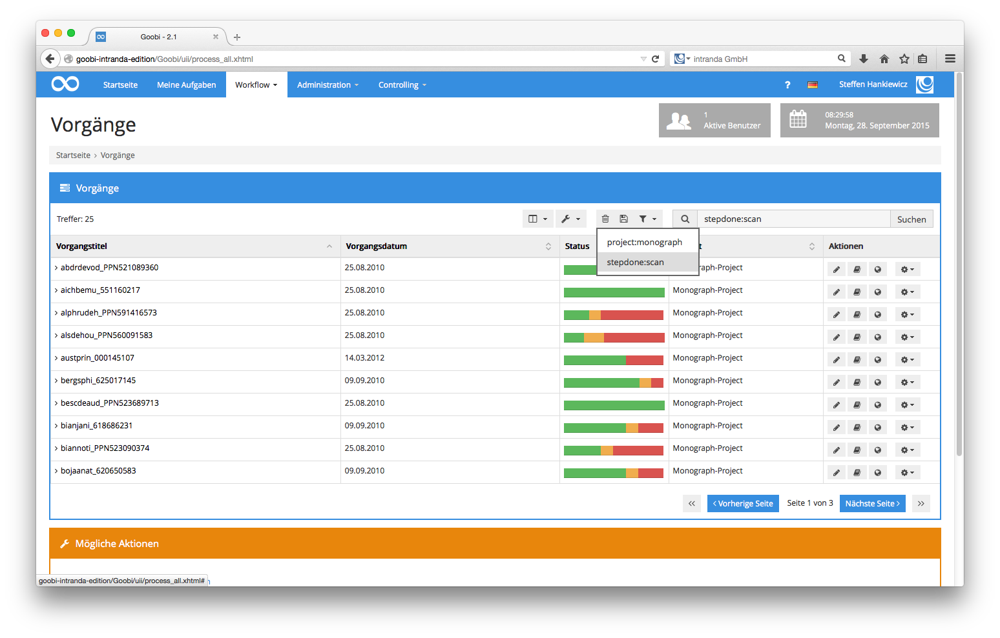
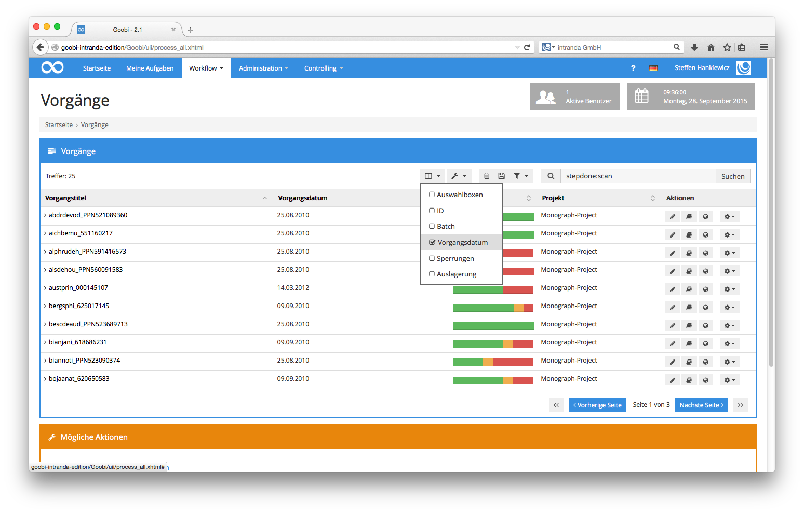
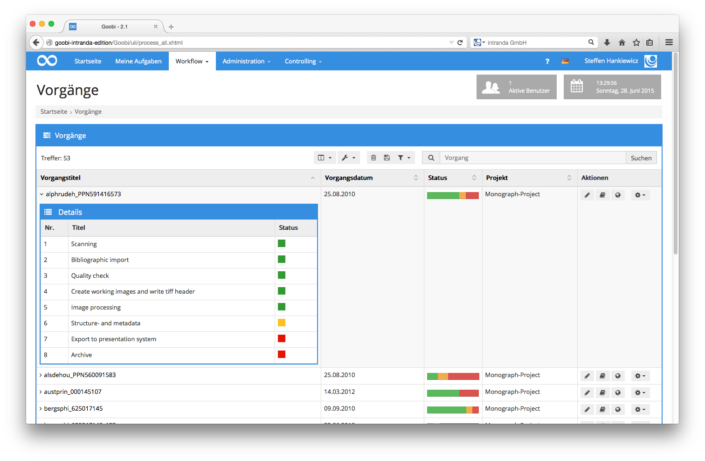

# 5.6. Vorgänge

Sämtliche Objekte, die innerhalb von Goobi durch verschiedene Digitalisierungsworkflows laufen und dabei ihren individuellen Fortschrittstatus haben, sind über den Bereich `Vorgänge` einsehbar. Klicken Sie hierfür in der Menüleiste auf den Menüpunkt `Workflow` und öffnen Sie den Punkt `Vorgänge`. Auf diese Weise erhalten Sie anschließend eine Liste sämtlicher Vorgänge, für deren Zugriff Sie eine Berechtigung besitzen. Sind Sie wie im nachfolgenden Screenshot z.B. Administrator, so haben Sie Einblick in alle Vorgänge, die in Goobi verwaltet werden.

Haben Sie dagegen als maximale Berechtigungsstufe in Goobi Verwaltungsrechte ohne administrative Befugnisse, so sind Ihnen ausgewählte Projekte zugewiesen. Im Bereich `Vorgänge` können Sie entsprechend nur diejenigen Vorgänge einsehen, auf die Sie mit Ihren Projektmitgliedschaften Zugriff haben. Die Anzahl der aufgelisteten Treffer innerhalb der tabellarischen Auflistung der Vorgänge wird dadurch bestimmt, wie die individuellen Benutzerkonfigurationen konfiguriert wurden. Im Fall der vorherigen Abbildung sehen Sie maximal zehn Tabellenzeilen, bevor Sie mit dem Paginator unterhalb der Tabelle zur nächsten Seite blättern müssen, um weitere Vorgänge aufgelistet zu bekommen.

Einfache Filter mittels Checkboxen oberhalb der Tabelle erlauben ein schnelles Filtern oder auch die Anzeige ausgeblendeter Vorgänge. So lassen sich z.B. für einen Administrator mit Klick auf das Icon `Anzeige anpassen` oberhalb der Vorgangstabelle, mittels der Checkbox `Deaktivierte Projekte` zeigen, all diejenigen Vorgänge einblenden, die derzeitig ausgeblendet wurden, da das zugehörige Projekt deaktiviert wurde. 

Mittels der Checkbox `Abgeschlossene Vorgänge` zeigen, lassen sich hingegen all diejenigen Vorgänge anzeigen, deren Projekt zwar noch aktiv ist, die jedoch alle einzelnen Arbeitsschritte ihres Workflows bereits durchlaufen haben. Goobi zeigt ohne die Auswahl dieser beiden Checkboxen also nur diejenigen Vorgänge an, die sich gerade innerhalb des Workflows in Bearbeitung befinden. Abgeschlossenen Vorgänge und deaktivierte Projekte sind standardmäßig ausgeblendet.

Möchten Sie die Liste der dargestellten Vorgänge weitergehend filtern, da die Trefferanzahl aller Vorgänge beispielsweise zu umfangreich ist, so können Sie in dem Eingabefeld `Vorgänge filtern` einfach einen Suchfilter eingeben. Die Möglichkeiten für diesen Filter sind sehr umfangreich und werden in Abschnitt 5.6.1 Vorgänge filtern detailliert beschrieben.

Möchten Sie statt der Option, einen Filter einzugeben stattdessen auf eine bequeme Filterung zurückgreifen, so klicken Sie hierfür in der Menüleiste auf den Menüpunkt `Workflow` und öffnen den Punkt `Vorgang suchen`. Dort erhalten Sie eine detaillierte Filtermaske, in der Sie nach sämtlichen Kombinationen aus Eigenschaften, Vorgängen, Arbeitsschrittstatus, etc. filtern können. Diese Filterung innerhalb der Maske `Vorgang suchen` übersetzt Ihre Suchanfrage in einen solchen Such-Filter-String wie in Abschnitt 5.6.1 Vorgänge filtern beschrieben. 

Möchten Sie nach der Eingabe eines Filters diesen für die Zukunft häufiger verwenden, so haben Sie die Möglichkeit diesen Filter in der Liste der vordefinierten Filter zu speichern. Klicken Sie hierfür nach Eingabe des Filterstrings einfach auf das `Speichern`-Symbol neben der Auswahlliste der vordefinierten Filter. Wenn Sie zu einem späteren Zeitpunkt einen Ihrer vordefinierten Filter ausführen wollen, so wählen Sie diesen einfach aus der Liste der vordefinierten Filter aus und der Filterstring wird automatisch in das Eingabefeld `Filter` übernommen. Die Trefferliste wird automatisch in der Maske `Vorgänge` aktualisiert.

In der Tabelle sehen Sie verschiedene Spalten, nach denen jeweils auch sortiert werden kann. Somit besteht z.B. die Möglichkeit, die Vorgänge nach ihrem Vorgangstitel oder ihrem Status bzw. auch der Projektzugehörigkeit auf- oder absteigend sortieren zu lassen.

Sie können an dieser Stelle auch die tabellarische Anzeige der Vorgänge ändern. Sie haben hier die Möglichkeit, verschiedene weitere Spalten innerhalb der Tabelle aufführen zu lassen. Dabei können neben solchen Spalten wie dem Identifier und dem Datum, wann ein Vorgang erzeugt wurde, unter anderem auch Auswahlboxen für die Auswahl einzelner Vorgänge für Batch-Aktionen angezeigt werden. Wählen Sie diese Option, so können Sie anschließend in jeder Zeile der Vorgänge eine Checkbox auswählen. Sämtliche Aktionen lassen sich nach der Aktivierung der Auswahlboxen anschließend nicht mehr nur auf die Treffer dieser Seite oder das gesamte Trefferset, sondern darüber hinaus auch nur auf diejenigen Vorgänge anwenden, die mittels dieser sichtbar gemachten Checkbox markiert wurden.

Ebenfalls haben Sie hier die Möglichkeit, mittels Klick auf einen `Vorgangstitel` detailliert in den Workflow eines Vorgangs Einblick zu nehmen, um den Status einzelner Arbeitsschritte zu überprüfen. Es öffnet sich hierdurch eine kleine Übersicht zu dem gewählten Vorgang und zeigt Ihnen den genauen Status, innerhalb dessen sich die einzelnen Arbeitsschritte des gewählten Vorgangs derzeitig befinden. Halten Sie den Mauszeiger über die kleinen farbigen rechteckigen Symbole hinter jedem Arbeitsschritt, so Sie sehen in einer Schnellübersicht, welcher Benutzer diesen Arbeitsschritt zu welchem Zeitpunkt bearbeitet hat.

