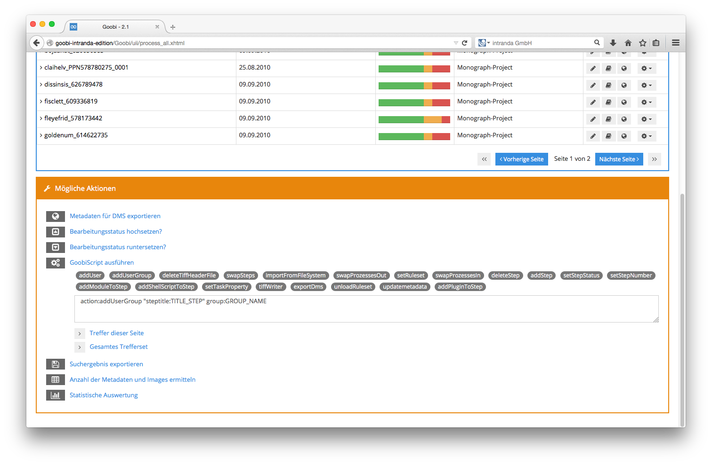

# 5.6.4. GoobiScript

Innerhalb der möglichen Aktionen, die sich auf mehrere Vorgänge gemeinsam anwenden lassen, besteht die Möglichkeit, GoobiScripts ausführen zu lassen. Klicken Sie hierfür im Bereich der möglichen Aktionen auf die Aktion `GoobiScript` ausführen. Anschließend erhalten Sie eine Übersicht über all diejenigen Aktionen, die sich auf das Trefferset, die aktuelle Trefferseite oder auch nur eine Auswahl an Treffern anwenden lassen.

Jedes GoobiScript besteht aus der Nennung des Namens, welches GoobiScript ausgeführt werden soll, sowie den zugehörigen Parametern. Sämtliche aufgelisteten GoobiScripts zeigen nach einem Klick auf eines dieser Skripte die jeweils relevanten Parameter an. Ersetzen Sie hierbei die in Großbuchstaben dargestellten Parameter durch ihre gewünschten Einstellungen. Bitte beachten Sie, dass Parameter, die Leerzeichen beinhalten \(das können z.B. Titel von Arbeitsschritten sein\) in Anführungszeichen gesetzt werden.



Folgende GoobiScripts stehen Ihnen zur Verfügung:

## GoobiScript: addUser

Das GoobiScript `addUser` erlaubt das Hinzufügen eines Benutzers zu einem bestimmten Arbeitsschritt. Bevor Sie dieses GoobiScript anwenden, stellen Sie zunächst sicher, wie der genaue Login-Name desjenigen Nutzers lautet, den Sie für einen Arbeitsschritt hinzufügen möchten. Anschließend prüfen Sie, wie die genaue Bezeichnung für den Arbeitsschritt lautet, zu dem sie den Nutzer hinzufügen möchten.

Beachten Sie hierbei, dass Parameter, deren Wert Leerzeichen beinhalten, zusammen mit der Parameterbenennung und dem trennenden Doppelpunkt in Anführungszeichen gesetzt werden müssen. Wählen Sie für den Parameter `steptitle` denjenigen Titel des Arbeitsschrittes, zu dem Sie den Benutzer hinzufügen möchten.

## GoobiScript: addUserGroup

Ähnlich wie bei `addUser` werden auch in diesem GoobiScript Berechtigungen für Arbeitsschritte ergänzt. Versehen Sie den Parameter `steptitle` mit dem vollständigen Titel desjenigen Arbeitsschrittes, zu dem Sie die Benutzergruppe hinzufügen möchten, und nennen Sie den Namen der Benutzergruppe als Parameter `group`, den Sie zu diesem Arbeitsschritt hinzufügen möchten.

## GoobiScript: deleteTiffHeaderFile

Das GoobiScript `deleteTiffHeaderFile` erfordert keine Eingabe zusätzlicher Parameter. Nach dem Ausführen dieses GoobiScripts werden die bereits generierten Tiff-Header-Dateien gelöscht, die durch ein Programm verwendet werden können, das die Tiff-Header in Images schreibt. Auf diese Weise ist es z.B. möglich, zentral geänderte Tiff-Header für die Zukunft anwenden zu lassen, da nicht bestehende Tiff-Header-Dateien bei dem nächsten Zugriff auf die Datei automatisch neu auf der Basis der Konfiguration erzeugt werden.

## GoobiScript: swapSteps

Das GoobiScript `swapSteps` erlaubt Ihnen, dass zwei Arbeitsschritte innerhalb des Workflows mehrerer Vorgänge in der Reihenfolge gegeneinander getauscht werden. Führen Sie hierfür Details der beiden Arbeitsschritte auf, die Sie gegeneinander tauschen möchten. Nennen Sie hierfür die Nummer innerhalb des Workflows sowie den vollständigen Titel des ersten und des zweiten Arbeitsschrittes. Nach dem Ausführen dieses GoobiScripts sind die beiden genannten Arbeitsschritte in ihren Reihenfolgennummern getauscht. Somit lässt sich recht einfach eine Änderung von Workflows über viele Vorgänge hinweg erzielen.

## GoobiScript: importFromFileSystem

Das GoobiScript `importFromFileSystem` importiert aus einem definierten Ausgangsverzeichnis bestehende Imagesets zu den bereits in Goobi vorhandenen Vorgängen. Dies ist z.B. für einen Einsatzzweck nützlich, wo Projekte, die vor dem Einsatz von Goobi erzeugt wurden, einfach nach Goobi importiert werden können. Bitte beachten Sie hierbei, dass sämtliche vorhandenen Image-Verzeichnisse innerhalb des definierten Ausgangsverzeichnisses die gleiche Benennung haben müssen, wie die Vorgänge in Goobi. Nur bei identischer Schreibweise der Ordnernamen und Vorgangstitel kann ein korrekter automatischer Import aus dem Dateisystem erfolgen. Definieren Sie im Parameter `sourcefolder` denjenigen Pfad, innerhalb dessen sich die einzelnen Verzeichnisse für die zu importierenden Vorgänge befinden.

## GoobiScript: setRuleset

Das GoobiScript `setRuleset` erlaubt an zentraler Stelle den zu verwendenden Regelsatz von Goobi für mehrere Vorgänge gemeinsam zu ändern. Dies könnte vor allem dann wichtig sein, wenn nach intensiven Regelsatzbearbeitungen und den dazu gehörigen Tests, die aus Sicherheitsgründen in einem neu erzeugten Regelsatz stattfanden, der neue Regelsatz nun auf die Vorgänge angewendet werden soll. Definieren Sie hierfür einfach mit dem Parameter `ruleset` den Namen für den Regelsatz, wie er innerhalb der Auflistung der Regelsätze in Goobi definiert wurde. Beim Ausführen dieses GoobiScripts wird unabhängig davon, welcher Regelsatz derzeitig für die einzelnen zu ändernden Vorgänge gerade eingestellt ist, der neu zugewiesene Regelsatz eingetragen.

## GoobiScript: deleteStep

Führen Sie das GoobiScript `deleteStep` aus, um für mehrere Vorgänge gemeinsam einen ausgewählten Arbeitsschritt aus dem Workflow zu löschen. Bitte beachten Sie hierbei, dass sämtliche produktionsrelevanten Daten, die für diesen Arbeitsschritt mitgeführt wurden \(z. B. Bearbeiter, Bearbeitungsdatum, Status\) ebenfalls gelöscht werden. Das Ausführen dieses GoobiScripts löscht den in dem Parameter `steptitle` mit seinem vollständigen Titel definierten Arbeitsschritt aus den gewählten Vorgängen.

## GoobiScript: addStep

Das GoobiScript `addStep` ermöglicht das automatische Anlegen eines Arbeitsschrittes mit einem definierten Titel sowie einer definierten Reihenfolgenposition. Setzen Sie den Parameter `steptitle`, um für diesen neu hinzuzufügenden Arbeitsschritt einen Titel zu vergeben und definieren Sie im Parameter `number`, welche Reihenfolgennummer dieser Arbeitsschritt innerhalb des Workflows haben soll.

## GoobiScript: setStepStatus

Wählen Sie das GoobiScript `setStepStatus` um den Workflowstatus für mehrere Vorgänge gemeinsam zu verändern.  
Definieren Sie im Parameter `steptitle` den Titel desjenigen Arbeitsschrittes, dessen Status Sie ändern möchten, und definieren Sie im Parameter `status` den numerischen Wert für den einzustellenden Status.

Die erlaubten Werte sind hierbei:

```text
0=gesperrt
1=offen
2=in Bearbeitung
3=geschlossen
4=Fehler
5=deaktiviert
```

## GoobiScript: setStepNumber

Führen Sie das GoobiScript `setStepNumber` aus, um die Reihenfolgennummer eines Arbeitsschrittes für mehrere Vorgänge zu verändern. Definieren Sie hierfür im Parameter `steptitle` den vollständigen Titel des zu ändernden Arbeitsschrittes und vergeben Sie mit dem Parameter `number` diejenige Reihenfolgennummer, die alle Arbeitsschritte dieser gewählten Vorgänge erhalten sollen.

## GoobiScript: addShellScriptToStep

Das GoobiScript `addShellScriptToStep` erlaubt das Hinzufügen von Shell-Scripten oder anderen Komandozeilen-Aufrufen zu gewünschten Arbeitsschritten mehrerer Vorgänge.

Definieren Sie hierfür zunächst in dem Parameter `steptitle` den vollständigen Titel der zu ändernden Arbeitsschritte und geben in dem Parameter `script` den vollständigen Befehl an, den Goobi per Kommandozeile bei Aktivierung dieses Arbeitsschrittes ausführen soll. 

Beachten Sie hierfür, dass Shell-Kommandos auf Linux-Ebene stets mit `/bin/bash/` beginnen.


Wenn in dem Befehl Parameter gruppiert werden sollen, damit sie als ein Argument an den neuen Prozess übergeben werden, müssen die dafür nötigen Anführungszeichen mit jeweils einem vorangeführten Anführungszeichen escaped werden. Ein Beispiel wäre folgendes GoobiScript:

`action:addShellScriptToStep "steptitle:example_step" "label:testlabel" "script:/bin/bash /path/to/script.sh ""parameter mit leerzeichen"""`


## GoobiScript: setTaskProperty

Verwenden Sie das GoobiScript `setTaskProperty`, um einzelne Optionen für einen bestimmten Arbeitsschritt in mehreren Vorgängen gemeinsam zu setzen. Definieren Sie im Parameter `steptitle` zunächst den vollständigen Titel des Arbeitsschrittes, den Sie wählen möchten. Im Parameter `property` wählen Sie einen der folgenden Werte aus:

<table>
  <thead>
    <tr>
      <th style="text-align:left"><b>Parameter</b>
      </th>
      <th style="text-align:left">Beschreibung</th>
    </tr>
  </thead>
  <tbody>
    <tr>
      <td style="text-align:left"><b>metadata</b>
      </td>
      <td style="text-align:left">f&#xFC;r die &#xC4;nderung der Eigenschaft Metadaten.</td>
    </tr>
    <tr>
      <td style="text-align:left"><b>readimages</b>
      </td>
      <td style="text-align:left">f&#xFC;r die &#xC4;nderung der Eigenschaft, ob ein lesender Zugriff auf
        die Bilder m&#xF6;glich sein soll.</td>
    </tr>
    <tr>
      <td style="text-align:left"><b>writeimages</b>
      </td>
      <td style="text-align:left">f&#xFC;r die Eigenschaft, ob ein schreibender Zugriff auf die Bilder erfolgen
        soll.</td>
    </tr>
    <tr>
      <td style="text-align:left"><b>validate</b>
      </td>
      <td style="text-align:left">f&#xFC;r die Eigenschaft, ob bei Abschluss des Arbeitsschrittes eine Validierung
        erfolgen soll.</td>
    </tr>
    <tr>
      <td style="text-align:left"><b>exportdms</b>
      </td>
      <td style="text-align:left">f&#xFC;r die Eigenschaft, ob der Arbeitsschritt einen Export in das Pr&#xE4;sentationssystem
        durchf&#xFC;hren k&#xF6;nnen soll.</td>
    </tr>
    <tr>
      <td style="text-align:left"><b>batch</b>
      </td>
      <td style="text-align:left">f&#xFC;r die Eigenschaft, ob der Arbeitsschritt zusammen mit allen anderen
        Arbeitsschritten im Batch-Modus ausgef&#xFC;hrt werden soll.</td>
    </tr>
    <tr>
      <td style="text-align:left"><b>automatic</b>
      </td>
      <td style="text-align:left">f&#xFC;r die Eigenschaft, ob der Arbeitsschritt automatisch ausgef&#xFC;hrt
        werden soll.</td>
    </tr>
    <tr>
      <td style="text-align:left"><b>importfileupload</b>
      </td>
      <td style="text-align:left">f&#xFC;r die Eigenschaft, ob in diesem Arbeitsschritt ein Datei-Upload
        f&#xFC;r den import verwendet werden soll
        <br />(Bitte beachten, dass diese Funktion keine Verwendung mehr in Goobi findet.)</td>
    </tr>
    <tr>
      <td style="text-align:left"><b>acceptandclose</b>
      </td>
      <td style="text-align:left">f&#xFC;r die Eigenschaft, ob der Arbeitsschritt ohne Aktion direkt angenommen
        und wieder geschlossen werden soll.</td>
    </tr>
    <tr>
      <td style="text-align:left"><b>acceptmoduleandclose</b>
      </td>
      <td style="text-align:left">
        <p>f&#xFC;r die Eigenschaft, ob ein Modul eine Arbeitsschritts angenommen
          und ausgef&#xFC;hrt werden soll und der Arbeitsschritt auch sofort abgeschlossen
          werden soll.</p>
        <p>(Bitte beachten, dass diese Funktion keine Verwendung mehr in Goobi findet.)</p>
      </td>
    </tr>
    <tr>
      <td style="text-align:left"><b>script</b>
      </td>
      <td style="text-align:left">f&#xFC;r die Eigenschaft, ob der Arbeitsschritt ein Script ausf&#xFC;hren
        soll.</td>
    </tr>
    <tr>
      <td style="text-align:left"><b>delay</b>
      </td>
      <td style="text-align:left">f&#xFC;r die Eigenschaft, ob dieser Arbeitsschritt ein Delay-Arbeitsschritt
        ist, der eine konfigurierte Zeit warten soll.</td>
    </tr>
    <tr>
      <td style="text-align:left"><b>updatemetadataindex</b>
      </td>
      <td style="text-align:left">f&#xFC;r die Eigenschaft, dass der interne Datenbank-Index in diesem Arbeitsschritt
        aktualisiert werden soll.</td>
    </tr>
    <tr>
      <td style="text-align:left"><b>generatedocket</b>
      </td>
      <td style="text-align:left">f&#xFC;r die Eigenschaft, ob der Nutzer in diesem Arbeitsschritt einen
        Laufzettel herunterladen k&#xF6;nnen soll.</td>
    </tr>
  </tbody>
</table>Setzen sie darüber hinaus den Wert der hier definierten Aktionen auf aktiviert oder deaktiviert, indem Sie den Parameter `value` mit den Werten `true` oder `false` setzen.


**Beispiel:** Wählen Sie als steptitle Scanning, als property `writeimages` und als value `true` und wenden Sie dieses GoobiScript für mehrere Vorgänge an, so haben Sie für den innerhalb des Workflows definierten Arbeitsschritt `Scanning` erlaubt, dass ein Benutzer, der diesen Arbeitsschritt annimmt, einen schreibenden Zugriff auf die Images in seinem Arbeitsverzeichnis erhält.


## GoobiScript: export

Mit dem GoobiScript `export` können viele Vorgänge exportiert werden. Mit den Parametern `exportImages` und `exportOcr` wird festgelegt, ob die zugehörigen Bilder und die OCR-Daten ebenfalls exportiert werden sollen. Falls im Workflow ein Export-Plugin konfiguriert wurde, wird dieses Plugin geladen und der Export damit durchgeführt, andernfalls findet der Standard-Export statt.

## GoobiScript: runScript

Mittels des GoobiScripts `runScript` können die Skripte eines Arbeitsschrittes außerhalb des regulären Workflows gestartet werden. Hierzu wird mit dem Parameter `steptitle` der vollständige Titel des Arbeitsschrittes angegeben, dessen Skripte gestartet werden sollen.

Enthält der Arbeitsschritt mehrere Skripte, kann der Parameter `script` verwendet werden, um den Namen des zu startenden Skriptes zu übergeben. Andernfalls werden alle Skripte des Arbeitsschrittes in der angegebenen Reihenfolge gestartet.

## GoobiScript: deleteProcess

Führen Sie das GoobiScript `deleteProcess` aus, um Vorgänge zu löschen. Dabei kann mit dem Parameter `contentOnly` angegeben werden, ob nur die Daten aus dem Dateisystem oder auch alle Informationen aus der Datenbank gelöscht werden sollen. Fehlt dieser Wert, wird der Vorgang vollständig entfernt.

## GoobiScript: updateMetadata

Dieses GoobiScript sorgt dafür, dass die interne `metadata` Tabelle der Goobi-Datenbank aktualisiert wird. Dies ist dann wichtig, wenn die Metadaten außerhalb von Goobi verändert wurden oder wenn ein neues Indexfeld definiert wurde.

## GoobiScript: addPluginToStep

Mit dem GoobiScript `addPluginToStep` können Plugins zu Arbeitsschritten hinzugefügt werden. Legen Sie hierzu mit dem Parameter `steptitle` then Namen des Arbeitsschrittes fest und verwenden Sie im Parameter `plugin` den Identifier des einzufügenden Plugins.

## GoobiScript: swapProzessesOut

Dieses GoobiScript für eine Auslagerung von Vorgängen auf einen externen Speicherbereich durch.


Bitte beachten: Dieses GoobiScript findet keine Verwendung mehr und sollte daher nicht mehr aufgerufen werden.


## GoobiScript: swapProzessesIn

Dieses GoobiScript holt Vorgänge aus einen externen Speicherbereich zurück in den Goobi-Speicherbereich.


Bitte beachten: Dieses GoobiScript findet keine Verwendung mehr und sollte daher nicht mehr aufgerufen werden.


## GoobiScript: updateImagePath


## GoobiScript: updateHistory


## GoobiScript: updateContentFiles


## GoobiScript: addToProcessLog


## GoobiScript: setProject


## GoobiScript: runPlugin


## GoobiScript: countImages


## GoobiScript: countMetadata


## GoobiScript: import


## GoobiScript: metadataDelete


## GoobiScript: metadataAdd


## GoobiScript: metadataReplace


## GoobiScript: metadataChange


## GoobiScript: changeProcessTemplate


## GoobiScript: updateDatabaseCache


## GoobiScript: propertySet


## GoobiScript: propertyDelete


## GoobiScript: executeStepAndUpdateStatus

can be used to execute a task. The script checks, if it is a script task, export task, plugin task or http task // if the task was automatic and the execution successful, the task will be closed and the next one is opened, // if it fails the task is set to error step and when the script/plugin return the waiting option, the status is not changed

## GoobiScript: exportDatabaseInformation

can be used to export all relevant database information to a process // the data is stored in an xml file in the process folder

