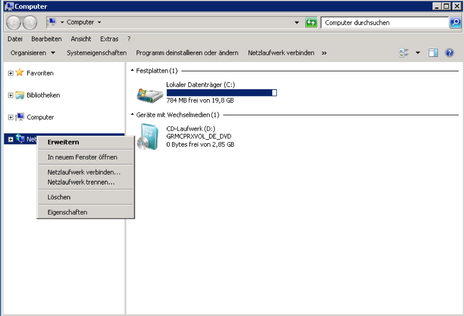
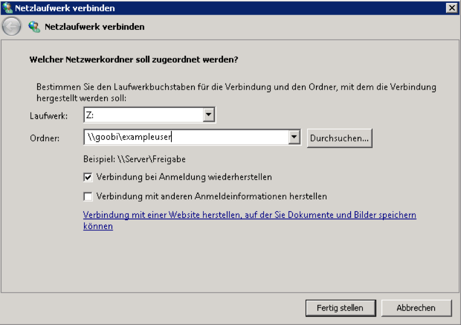
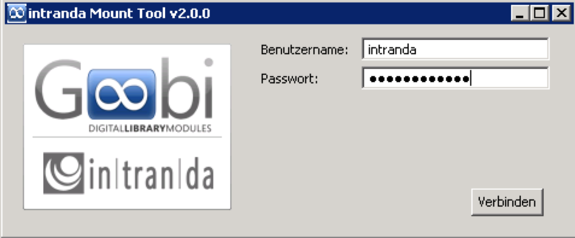

# 6.2.4. Dateisystemzugriff mittels Samba

## **Allgemeines**

Goobi verwendet Samba, um den Nutzern Verzeichnisfreigaben zum Lesen und Schreiben der Bilddaten zur Verfügung zu stellen. Die Installation von Samba sollte aus den Standardrepositories des Betriebssystems in der jeweils letzten stabilen Version erfolgen.

## **Beispielinstallation unter Ubuntu Linux 14.04 LTS**

Samba wird unter Ubuntu Linux 14.04 LTS aus den Standardrepositories mit dem folgenden Befehl installiert:

```bash
sudo aptitude install samba
```

Der Dienst kann mit den folgenden beiden Befehlen gestoppt und gestartet werden:

```bash
service smbd stop
service smbd start
service nmbd stop
service nmbd start
```

Die Konfigurationsdateien befinden sich unter diesem Pfad:

```bash
/etc/samba/
```

## **Zugriff mittels Windows 7 und neueren Versionen**

Unter Windows 7 sowie den nachfolgenden Versionen kann das Verzeichnis als Netzlaufwerk eingebunden werden. Hierzu erfolgt die Einrichtung mittels Klick auf `Start` und `Computer` und anschließend mit einem Rechtsklick auf `Netzwerk` und der Wahl von `Netzlaufwerk verbinden`.



Im Dialogfenster kann nun ein freier Laufwerksbuchstabe zugeordnet werden. Als Ordner erfolgt die Eingabe in der Form `SERVERNAME\USERNAME`, wobei `USERNAME` für den Goobi Benutzernamen steht. Entsprechen die Anmeldedaten für Goobi nicht denen des Windows PCs, so ist zusätzlich `Verbindung mit anderen Anmeldeinformationen herstellen` auszuwählen.



Gegebenenfalls müssen im nächsten Schritt Nutzername und Passwort eingegeben werden. Danach steht das Netzlaufwerk unter dem gewählten Laufwerksbuchstaben zur Verfügung.

## **Zugriff mittels Goobi Mount Tool**

Das Goobi Mount Tool ist eine alternative Methode zum Verbinden der Goobi Freigaben als Netzlaufwerk.

Die Konfiguration des Goobi Mount Tools erfolgt über die Datei `config.properties` im selben Verzeichnis wie `GoobiMountTool.exe`.

```bash
drive_letter=G
ip_address=192.168.100.1
```

Der Parameter `drive_letter` definiert hierbei den Laufwerksbuchstaben, unter dem das Netzlaufwerk eingebunden wird. `ip_address` bezeichnet die IP-Adresse des Goobi Servers, welcher die Netzlaufwerke zur Verfügung stellt.

Ist die Konfiguration korrekt erfolgt, so kann das Goobi Mount Tool direkt aufgerufen werden. Es erfordert im Weiteren nur noch die Eingabe der Goobi Anmeldeinformationen \(`Benutzername` und `Passwort`\).



Nach Auswahl von `Verbinden` steht das Netzlaufwerk unter dem konfigurierten Laufwerksbuchstaben zur Verfügung.

