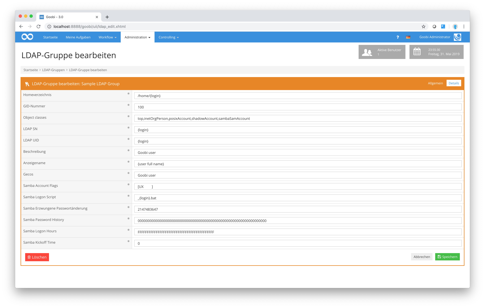

# 3.3. Authentifizierung der Nutzer mittels LDAP

## Allgemeines

Goobi verwendet in der Regel einen LDAP Server zur Authentifizierung der Benutzer. Hierdurch ist es möglich, sich mit dem selben Benutzernamen und Passwort wie in Goobi auch mit dem bereitgestellten Netzlaufwerk zu verbinden. In der Konfigurationsdatei `goobi_config.properties` wird einerseits angegeben, ob LDAP grundsätzlich von Goobi verwendet werden soll, andererseits wird dort auch der verwendete Truststore konfiguriert. Alle weiteren Einstellungen zu LDAP-Verbindungen und -Benutzergruppen werden im Administrationsbereich in der Benutzeroberfläche vorgenommen.

Der LDAP Server sollte über die Schemata `COSINE`, `inetOrgPerson`, `NIS` und `SAMBA` verfügen.

## Konfiguration in der Datei goobi\_config.properties

In der Datei `goobi_config.properties` stehen die folgenden Einstellungen für LDAP und den Truststore zur Verfügung:

| Eigenschaft | Typ | Standardwert | Beschreibung |
| ----------- | --- | ------------ | ------------ |
| `ldap_use` | Boolean | `false` | Dieser Wert gibt an, ob ein LDAP-Service verwendet werden soll. |
| `truststore` | Text |  | Dieser Wert gibt an, wo sich der Truststore befindet. |
| `truststore_password` | Text |  | Dieser Wert gibt das Passwort für die Authentifizierung im Truststore an. |

**Hinweis:** In früheren Goobi-Versionen gab es an dieser Stelle die Einstellungen `ldap_keystore` und `ldap_keystore_password`. Diese wurden umbenannt, da der Keystore auch für andere Zwecke verwendet werden kann. Diese Einstellungen werden **nicht mehr unterstützt**.

**Hinweis:** Gelegentlich tauchen in älteren Konfigurationsdateien die falsch überlieferten Einstellungen `ldap_truststore` und `ldap_truststore_password` auf. Diese Einstellungen existieren in Goobi nicht und werden entsprechend **nicht unterstützt**.

Die Konfiguration innerhalb der Konfigurationsdatei `goobi_config.properties` bei Verwendung eines lokalen LDAP Servers kann zum Beispiel wie folgt aussehen:

```text
# -----------------------------------
# ldap
# -----------------------------------

# Use LDAP server for authentication
ldap_use=true

# -----------------------------------
# truststore
# -----------------------------------

# Keystore for LDAP and other services
# There is no default value, but the truststore can look like this example:
# /opt/digiverso/goobi/scripts/mykeystore.ks
#truststore=
#truststore_password=
```

## Konfiguration in Goobi

<!---
Dieses Bildschirmfoto ist veraltet und kann durch die anderen vier Bilder (siehe Kommentare unten) ersetzt werden.
Es fehlen auf diesem Bild zwei neuere Einstellungen und ein paar Details entsprechen nicht mehr der heutigen Ansicht.

-->

LDAP-Gruppen können in Goobi im Bereich `Administration` -> `Authentifizierung` eingerichtet werden. Es wird zunächst eine Liste mit bereits eingerichteten Authentifizierungsoptionen angezeigt. Um eine LDAP-Gruppe einzurichten, muss eine neue Authentifizierung angelegt werden.

<!--- Hier soll ein Bild von ldap_all.xhtml mit drei Beispiel-Authentifikationen (OpenID, LDAP und Datenbank) zu sehen sein. -->


Aktuell stehen drei Authentifizierungsarten zur Verfügung. Bei allen muss mindestens ein Name, ein Typ und ein Login-Shell-Befehl ausgewählt werden. Wird als Typ LDAP ausgewählt, so stehen einige weitere Optionen zur Verfügung. Außerdem stehen für LDAP insgesamt drei Tabs (`Allgemein`, `Details` und `Authentifizierung`) zur Verfügung.

Auf der Seite `Allgemein` werden grundlegende Einstellungen zur LDAP-Gruppe vorgenommen, wie zum Beispiel die URL des LDAP-Servers, der User DN (distinguishing name) und Samba IDs. Das Feld `User DN` wird für das Mapping von der Nutzeridentifikation in der Goobi Datenbank zur Nutzeridentifikation in der LDAP-Gruppe verwendet. Der Platzhalter `{login}` repräsentiert dabei den Login-Namen eines Benutzers und muss angegeben werden, damit Goobi später für jeden neuen Goobi-Account auch einen namentlich angepassten LDAP-Account anlegen kann.

| Einstellung | Beschreibung |
| ----------- | ------------ |
| Name | Hier wird ein Name für die Authentifizierungsart angegeben. Dieser sollte innerhalb von Goobi eindeutig sein. |
| Typ | In diesem Menü kann ausgewählt werden, um welche Art von Authentifizierung es sich handelt. Die Optionen `Datenbank` und `OpenID` können ohne detailierte Konfiguration verwendet werden. Wird LDAP ausgewählt, so erscheinen weiter unten weitere Einstellungsmöglichkeiten. |
| LDAP URL | Hier wird die URL des LDAP-Services angegeben. Die URL muss ebenfalls die korrekte Portnummer beinhalten. Läuft der LDAP-Server auf dem selben Server, so kann hier `localhost:389` angegeben werden. |
| LDAP User DN | Dieses Feld beinhaltet Informationen für die Erstellung von LDAP-Accounts basierend auf Goobi-Datenbank-Accounts. Der Platzhalter `{login}` muss verwendet werden, damit Goobi später den richtigen Nutzernamen einsetzen kann. |
| Samba SID | Hier wird die Nutzeridentifikation für den zugehörigen Samba-Server angegeben. |
| Login-Shell | Hier kann ein Bash-Script angegeben werden, das beim Anmelden eines Nutzers ausgeführt werden soll. |
| Samba Primary Group SID | Hier wird die Gruppen ID für die Nutzergruppe beim Samba-Server angegeben. |

<!--- Hier soll ein Bild von ldap_edit.xhtml, Tab 1 (Allgemein) zu sehen sein. -->


Auf der Seite `Details` werden viele weitere Details zur LDAP-Gruppe eingestellt.

| Einstellung | Beschreibung |
| ----------- | ------------ |
| Benutzerverzeichnis | Hier wird der Benutzerordner für Nutzeraccounts angegeben. Der Platzhalter `{login}` wird dabei verwendet, damit Goobi später den richtigen Nutzernamen einsetzen kann. |
| GID-Nummer | Hier wird die Gruppen-ID-Nummer für die LDAP-Gruppe angegeben. Werden mehrere LDAP-Gruppen eingerichtet, so müssen sich diese IDs unterscheiden. |
| Object classes | In diesem Feld können weitere Parameter für die LDAP-Gruppe angegeben werden. Diese werden kommagetrennt aufgelistet. |
| LDAP SN | In diesem Feld wird die Serial-Number des Nutzers auf dem LDAP-System angegeben. Hierfür kann ebenfalls der Platzhalter `{login}` verwendet werden. |
| LDAP UID | In diesem Feld wird die Benutzer-ID angegeben, die für den jeweiligen LDAP-Account verwendet werden soll. Auch hier kann `{login}` als Platzhalter verwendet werden. |
| Beschreibung | Diese Beschreibung wird den von Goobi angelegten Nutzern im LDAP-System hinzugefügt. |
| Anzeigename | Dieses Textfeld beinhaltet einen Platzhalter für den vollständig angezeigten Namen des Nutzers. Hier kann `{user full name}` verwendet werden. Damit werden später Vorname und Nachname angezeigt. |
| Geocs | In diesem Feld können weitere Informationen zu Goobi Nutzern in der LDAP-Gruppe angegeben werden, wie zum Beispiel ein Ort oder Kontaktmöglichkeiten. |
| Samba Account Flags | Hier werden weitere Parameter für den Samba Account angegeben. |
| Samba Logon Script | In diesem Feld kann eine Script-Datei angegeben werden, die beim Login eines Nutzers auf dem Samba System ausgeführt werden soll. Um für jeden Nutzer eine eigene Script-Datei zu ermöglichen, kann auch hier der Platzhalter `{login}` verwendet werden. |
| Samba erzwungene Passwortänderung | Hier kann ein Zeitraum angegeben werden, nach dem jeder Nutzer sein Passwort aus Sicherheitsgründen ändern muss. Da dieses Passwort auch das Goobi-Passwort des entsprechenden Nutzers ist, muss ein Nutzer sein Goobi-Passwort ändern, um damit auch das Samba-Passwort zu ändern. |
| Samba Password History | Hier können Details zur Speicherung der letzten verwendeten Passwörter eines Samba-Nutzers angegeben werden. |
| Samba Logon Hours | Hier kann ein Zeitraum im Binärformat (in Stunden) angegeben werden, wann sich ein Nutzer am Samba-System anmelden kann. Um dies immer zuzulassen, muss der Wert 21x `F` beinhalten. |
| Samba Kickoff Time | Hier kann die Zeit in Millisekunden angegeben werden, nach der ein Nutzer auf dem Samba-System automatisch abgemeldet wird. |
| Benutzerverzeichnis aus der Konfigurationsdatei nutzen | Dieses Feld kann gesetzt werden, um das Benutzerverzeichnis nicht von LDAP bestimmen zu lassen, sondern das oben angegebene zu verwenden. |
| Attributname Benutzerverzeichnis | Mit diesem Wert kann auf älteren Systemen angegeben werden, mit welchem Key in der Goobi-Konfiguration das LDAP-Nutzer-Home-Verzeichnis angegeben ist. |

<!--- Hier soll ein Bild von ldap_edit.xhtml, Tab 2 (Details) zu sehen sein. -->


Auf der Seite `Authentifizierung` werden technische Details zur Authentifizierung bei dem im `Allgemein`-Tab eingerichteten LDAP-Service angegeben. Diese Seite beinhaltet einige Einstellungen, die früher nur einmalig in der Konfigurationsdatei `goobi_config.properties` vorgenommen werden konnten und können nun für diese spezielle LDAP-Authentifizierung angegeben werden.

| Einstellung | Beschreibung |
| ----------- | ------------ |
| Administrator Accountname | Hier wird der Nutzername des Administratoraccounts beim LDAP-Service angegeben. Es werden zusätzlich (mit Komma getrennt) weitere Parameter für die Identifikation des Administrators angegeben. |
| Administrator Passwort | Hier wird das Passwort für den Administratoraccount beim LDAP-Service angegeben. |
| LDAP next free unix id | In diesem Feld wird ein Platzhalter für die nächste freie Nutzer ID auf dem LDAP-Server angegeben. Zusätzlich werden (mit Komma getrennt) weitere Parameter für die Identifikation der Nutzer angegeben. |
| Root Zertifikat | Hier wird das SSL-Zertifikat für die Verbindung mit dem LDAP-Server angegeben. |
| PDC Zertifikat | Hier wird das PDC-Zertifikat für die Verbindung mit dem LDAP-Server angegeben. |
| Verschlüsselungsart | Hier kann die Verschlüsselunsart für Verbindungen mit dem LDAP-Service ausgewählt werden. Derzeit stehen `SHA` und `MD5` zur Verfügung. |
| SSL | Diese Option kann ausgewählt werden, um die Secure-Sockets-Layer-Verschlüsselung (SSL) zu verwenden. **Hinweis:** Die SSL-Verschlüsselung ist veraltet und es wird empfohlen, die TLS-Verschlüsselung zu verwenden. |
| Nur lesender Zugriff | Diese Option kann ausgewählt werden, wenn Nutzer nur Leserechte im LDAP-System haben sollen. |
| Zugriff ohne Authentifizierung | Mit dieser Option kann eingestellt werden, ob anonymer Zugriff auf das LDAP-System erfolgen darf. |
| TLS | Diese Option kann ausgewählt werden, um die Transport-Layer-Security-Verschlüsselung (TLS) zu verwenden. | 

<!--- Hier soll ein Bild von ldap_edit.xhtml, Tab 3 (Authentifizierung) zu sehen sein. -->


## Konfiguration im Betriebssystem

Neben den Goobi-spezifischen LDAP-Einstellungen ist weiterhin sicherzustellen, dass auch dem Betriebssystem die LDAP-Nutzer bekannt sind. Hierzu ist die korrekte Angabe der LDAP-Informationen insbesondere in den folgenden Dateien notwendig:

```bash
/etc/ldap/ldap.conf
/etc/ldap.conf
/etc/nsswitch.conf
/etc/pam.d/*
```

Die Verwendung des LDAP-Servers muss für SAMBA aktiviert sein. Seit Ubuntu 14.04 LTS ist dies standardmäßig voreingestellt.

