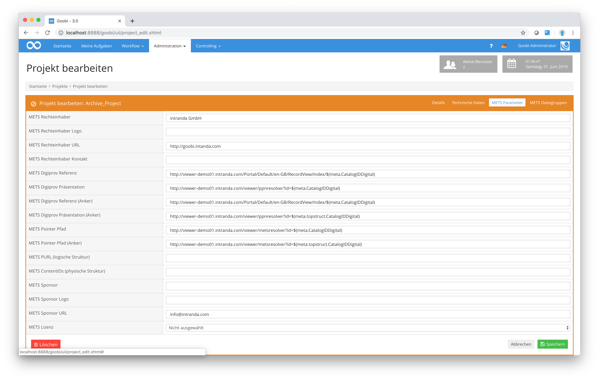

# 4.2. Mets Parameter

Die folgende Abbildung zeigt den Reiter `Mets-Parameter` aus den Goobi Projekteinstellungen:

Die hier aufgezeigten Konfigurationseinstellungen bedeuten das folgende:

_**Auflistung der METS-Parameter für die Projektkonfiguration**_

| **Name**                           | **Beispielwert**                                                                                                                                                                                                                                                            | **Bedeutung**                                                                                                                                                                                                 |
| ---------------------------------- | --------------------------------------------------------------------------------------------------------------------------------------------------------------------------------------------------------------------------------------------------------------------------- | ------------------------------------------------------------------------------------------------------------------------------------------------------------------------------------------------------------- |
| METS Rechteinhaber                 | Example Library                                                                                                                                                                                                                                                             | Definiert den METS Rechteinhaber.                                                                                                                                                                             |
| METS Rechteinhaber Logo            | [http://www.example.net/mylogo.png](http://www.example.net/mylogo.png)                                                                                                                                                                                                      | Definiert eine URL für ein Logo des METS Rechteinhabers.                                                                                                                                                      |
| METS Rechteinhaber URL             | [http://www.example.net](http://www.example.net)                                                                                                                                                                                                                            | Definiert eine URL für den METS Rechteinhaber.                                                                                                                                                                |
| METS Rechteinhaber Kontakt         | digitisation@example.net                                                                                                                                                                                                                                                    | Definiert eine Kontakt E-Mailadresse für den METS Rechteinhaber.                                                                                                                                              |
| METS Digiprov Referenz             | METS Digiprov Referenz                                                                                                                                                                                                                                                      | Definiert einen Link zu dem Katalogeintrag des Werkes.                                                                                                                                                        |
| METS Digiprov Präsentation         | 
<a href="http://presentation.example.net/ppnresolver?id=$(meta.CatalogIDDigital)">http://presentation.example.net/ppnresolver? id=$(meta.CatalogIDDigital)</a> 
                                                                                                   | Definiert einen persistenten Link zu dem Werk in der digitalen Bibliothek.                                                                                                                                    |
| METS Digiprov Referenz (Anker)     | 
<a href="http://catalog.example.net/A?function=search&#x26;request=$(meta.topstruct.CatalogIDDigital)$REGEXP(s/PPN=PPN/PPN=/)">http://catalog.example.net/A? function=search&#x26; request=$(meta.topstruct.CatalogIDDigital) $REGEXP(s/PPN=PPN/PPN=/)</a> 
 | Definiert einen Link zu dem Katalogeintrag des übergeordneten Werkes, wenn es sich bei dem exportierten Werk um ein Mehrbändiges Werk handelt.                                                                |
| METS Digiprov Präsentation (Anker) | 
<a href="http://presentation.example.net/ppnresolver?id=$(meta.topstruct.CatalogIDDigital)">http://presentation.example.net/ppnresolver? id=$(meta.topstruct.CatalogIDDigital)</a> 
                                                                               | Definiert einen Link zu dem übergeordneten Werk in der digitalen Bibliothek, wenn es sich bei dem exportierten Werk um ein Mehrbändiges Werk handelt.                                                         |
| METS Pointer Pfad                  | 
<a href="http://presentation.example.net/metsresolver?id=$(meta.CatalogIDDigital)">http://presentation.example.net/metsresolver? id=$(meta.CatalogIDDigital)</a>
                                                                                                  |  Definiert einen Link zu einem METS-Resolver für das Werk, über den die METS Datei später heruntergeladen werden kann.                                                                                        |
| METS Pointer Pfad (Anker)          | 
<a href="http://presentation.example.net/metsresolver?id=$(meta.topstruct.CatalogIDDigital)">http://presentation.example.net/metsresolver? id=$(meta.topstruct.CatalogIDDigital)</a>
                                                                              |  Definiert einen Link zu einem METS-Resolver für das übergeordnete Werk, wenn es sich bei dem exportierten Werk um ein Mehrbändiges Werk handelt, über den die METS Datei später heruntergeladen werden kann. |
| METS Sponsor                       | Deutsche Forschungsgemeinschaft                                                                                                                                                                                                                                             | Enthält den Namen des Geldgebers der Digitalisierung, beispielsweise die Deutsche Forschungsgemeinschaft.                                                                                                     |
| METS Sponsor Logo                  | 
<a href="https://pbs.twimg.com/profile_images/2269029699/5qf8y4k106b1gvpixq40_400x400.jpeg">https://pbs.twimg.com/profile_images/ 2269029699/5qf8y4k106b1gvpixq40_ 400x400.jpeg</a>
                                                                            | Enthält eine URL zu einem Logo des Geldgebers, der die Digitalisierung gefördert hat. Das Logo wird in das Design des DFG-Viewers integriert und ersetzt dort das Logo der Deutschen Forschungsgemeinschaft   |
| METS Sponsor URL                   | [http://intranda.com](http://intranda.com)                                                                                                                                                                                                                                  | Enthält die URL der Homepage des Geldgebers. Die URL wird im DFG-Viewer mit dem Logo des Geldgebers verknüpft.                                                                                                |
| METS Lizenz                        | CC-BY                                                                                                                                                                                                                                                                       | Enthält Angaben zur Lizenz, unter der das Digitalisat veröffentlicht wurde.                                                                                                                                   |

Diese Informationen zum `METS Rechteinhaber`, `METS Rechteinhaber Logo`, `METS Rechteinhaber URL` und `METS Rechteinhaber Kontakt` finden sich in der exportierten METS-Datei in der Sektion `amdSec` im Namespace `dv` wieder und dienen der Kompatibilität mit dem `DFG-Viewer`.

Innerhalb der Beispielwerte gibt es drei Variablen, die wie folgt erklärt sind

* `$(meta.CatalogIDDigital)` wird beim Export durch die CatalogIDDigital des Werkes aus der METS-Datei ersetzt.
* `$(meta.topstruct.CatalogIDDigital)` wird beim Export durch die CatalogIDDigital des Mehrbändigen Werkes aus der METS-Datei ersetzt.
* `$REGEXP(s/PPN=PPN/PPN=/)` wendet den definierten regulären Ausdruck auf die gesamte Zeile an. In diesem Fall wird `PPN=PPN` gesucht und durch `PPN=` ersetzt.
