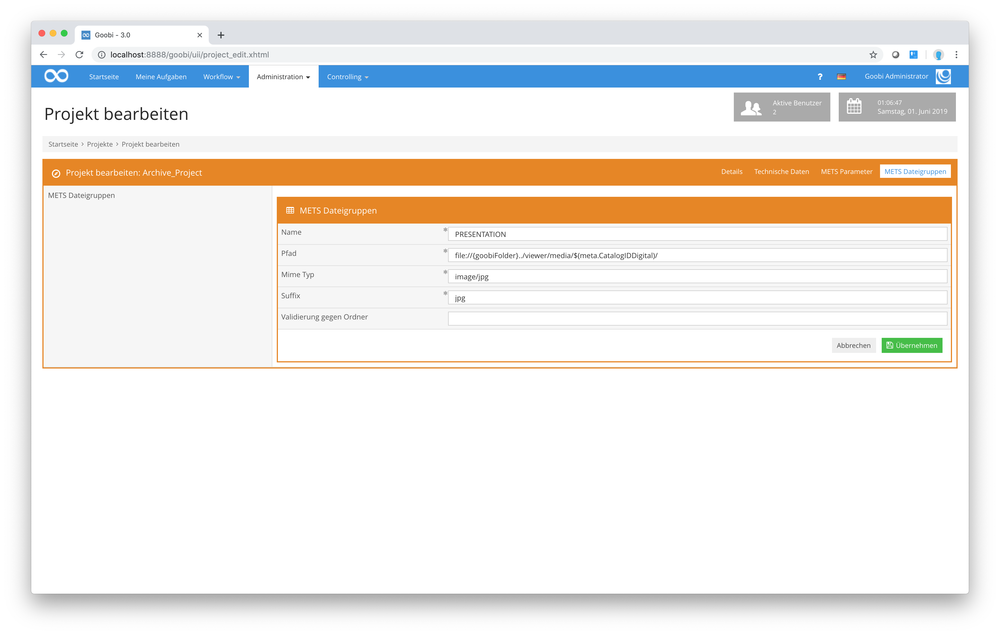

# 4.3. Mets Dateigruppen

Neben den aufgeführten Konfigurationsparametern lassen sich darüber hinaus auch die METS-Dateigruppen festlegen. Die Abbildung zeigt fünf definierte Dateigruppen:

* Min
* Max
* Thumbs
* Default
* Presentation

Die Dateigruppen `Min`, `Max`, `Thumbs` und `Default` dienen zur Kompatibilität mit dem `DFG-Viewer`.

In der nachfolgenden Abbildung ist der Konfigurationsdialog für die Konfiguration dieser METS-Dateigruppen ersichtlich:

Die hier bereitgestellten Konfigurationseinstellungen bedeuten folgendes:

_**Erläuterung aller Parameter zur Steuerung der METS-Dateigruppen-Generierung**_

| **Name** | **Beispielwert** | **Bedeutung** |
| :--- | :--- | :--- |
| Name | Default | Definiert den Namen einer METS Dateigruppe. Der verwendete Name findet sich im Attribut USE im Bereich fileGrp innerhalb von fileSec der METS Datei wieder. |
| Pfad | 
<a href="http://presentation.example.net/viewer/content/$(meta.CatalogIDDigital)/800/0/">http://presentation.example.net/</a>

<a href="http://presentation.example.net/viewer/content/$(meta.CatalogIDDigital)/800/0/">viewer/content/</a>

<a href="http://presentation.example.net/viewer/content/$(meta.CatalogIDDigital)/800/0/">$(meta.CatalogIDDigital)/800/0/</a>
 | Dieser Parameter definiert einen Basispfad, unter welchem die digitalen Objekte erreichbar sind. Innerhalb des Exports wird zu diesem Pfad ebenso der Dateiname der Dateien aus dem \_media-Ordner geschrieben. Die ebenfalls anzuhängende Dateiendung wird im Feld Suffix definiert. |
| Mime Typ | image/jpeg | Definiert den Mime-Typ der Dateien, die in dieser METS Dateigruppe verlinkt werden. Nach dem Export findet sich diese Eingabe innerhalb des MIMETYPE Attributs der file-Objekte wieder. |
| Suffix | jpg | Definiert die Dateiendung der Dateien, die in dieser METS Dateigruppe verlinkt werden. |
| Validierung gegen Ordner | video | Dieser Wert ist optional. Ist das Feld leer, wird die Dateigruppe normal generiert. Ist hier hingegen ein Wert eingetragen, überprüft Goobi, ob im images-Ordner innerhalb des Dateisystems ein Verzeichnis vorhanden ist, das dem hier definierten Wert oder der hier definierten Methode entspricht. Ist dies der Fall, wird die Dateigruppe mit den Dateien aus diesem Ordner ebenfalls erzeugt. Ist dieser Ordner hingegen nicht vorhanden, wird die Dateigruppe nicht erzeugt. |
| Nutze Dateiendungen und MIME type der Dateien | false | Dieser Wert kann auf `true` gesetzt werden, um die für dieses Projekt eingestellten Standard-Dateitypen zu ignorieren und stattdessen die Dateitypen der im `media`-Ordner vorhandenen Dateien zu verwenden. Dies kann praktisch sein, wenn für ein Projekt Dateien unterschiedlicher Typen verwendet werden sollen oder keine anderweitigen Konventionen existieren. Wird dieser Wert auf `false` gesetzt, so werden nur die für dieses Projekt eingestellten Dateitypen berücksichtigt. |
| Zu ignorierende Dateiendungen | | In diesem Feld können Mime-Typen angegeben werden, die beim Export nicht berücksigtigt werden sollen. Es kann zum Beispiel `images/jpeg` oder `images/*` verwendet werden. Mehrere Werte können mit Kommas getrennt werden, zum Beispiel: `images/jpeg,images/png`. |

Bei der Option Validierung gegen Ordner sind die folgenden Methoden möglich:

_**Auflistung aller Variablen für den Zugriff auf Verzeichnisse während der Dateigruppenvalidierung**_

| **Name**                |  **Beispielergebnis**                                                       |
| ----------------------- | --------------------------------------------------------------------------- |
| getProcessDataDirectory | /opt/digiverso/goobi/metadata/1165/                                         |
| getImagesDirectory      | /opt/digiverso/goobi/metadata/1165/images/                                  |
| getImagesTifDirectory   | /opt/digiverso/goobi/metadata/1165/images/kleiuniv\_PPN1234\_media/         |
| getImagesOrigDirectory  | /opt/digiverso/goobi/metadata/1165/images/master\_kleiuniv\_PPN1234\_media/ |
| getSourceDirectory      | /opt/digiverso/goobi/metadata/1165/images/kleiuniv\_PPN1234\_source/        |
| getOcrDirectory         | /opt/digiverso/goobi/metadata/1165/ocr/                                     |
| getTxtDirectory         | /opt/digiverso/goobi/metadata/1165/ocr/kleiuniv\_PPN1234\_txt/              |
| getWordDirectory        | /opt/digiverso/goobi/metadata/1165/ocr/kleiuniv\_PPN1234\_wc/               |
| getPdfDirectory         | /opt/digiverso/goobi/metadata/1165/ocr/kleiuniv\_PPN1234\_pdf/              |
| getAltoDirectory        | /opt/digiverso/goobi/metadata/1165/ocr/kleiuniv\_PPN1234\_xml/              |
| getImportDirectory      | /opt/digiverso/goobi/metadata/1165/import/                                  |

Neben den aufgeführten Methodenbenennungen, können ebenfalls konkrete Ordnerbezeichnungen angegeben werden, auf deren Vorhandensein innerhalb des images-Ordners geprüft wird:

| **Name**   |  **Beispielergebnis**                                               |
| ---------- | ------------------------------------------------------------------- |
| mp3        | /opt/digiverso/goobi/metadata/1165/images/kleiuniv\_PPN1234\_mp3/   |
| mpeg4      | /opt/digiverso/goobi/metadata/1165/images/kleiuniv\_PPN1234\_mpeg4/ |
| jp2        | /opt/digiverso/goobi/metadata/1165/images/kleiuniv\_PPN1234\_jp2/   |
