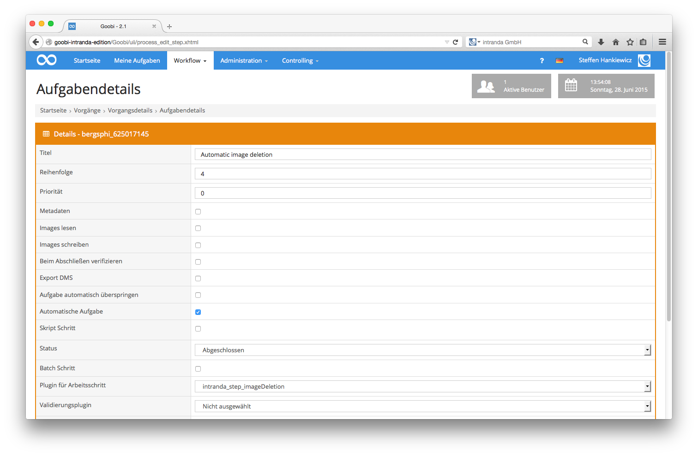

# 6.5.3. Automatisches Löschen von Images

Goobi verfügt seit der Version 1.9.2 über die Möglichkeit vollautomatische Arbeiten in Form von Plugins innerhalb des Workflows auszuführen. 

Ein solches vollautomatisches Arbeitsschritt-Plugin ist das Löschen von nicht mehr benötigten Images. Dieses `ImageDeletion-Plugin` sollte innerhalb des Workflows der letzte Arbeitsschritt sein. Für die Konfiguration des Arbeitsschritts muss hierbei beachtet werden, dass es sich um eine `Automatische Aufgabe` handeln muss und als `Schritteplugin` der Identifier `intranda_step_imageDeletion` definiert wird.

Innerhalb des Workflows wird somit das konfigurierte Schritteplugin automatisch aufgerufen. Dabei arbeitet dieses folgendermaßen:

Zunächst startet das Plugin eine Validierung des generierten JP2-Derivats. Anschließend erfolgt eine Prüfung auf Vorhandensein und Validität einer AMD-Ergebnisdatei von SDB, innerhalb der zumindest ein Objekt beschrieben ist. Die darauffolgende letzte Validierung stellt sicher, dass die Anzahl der Objekte innerhalb der Verzeichnisse `master` und `media` sowie die Anzahl der beschriebenen Objekte innerhalb der AMD-Datei identisch ist.

Erst nach erfolgreichem Abschluss der vorhergehenden Validierungen erfolgt abschließend der Löschvorgang. Dabei werden die Verzeichnisse `master` und `media` gelöscht.

Für den Fall, dass die vorhergegangenen Valdierungen fehlschlagen, bleibt der Arbeitsschritt offen stehen und verhindert das automatische Löschen, so dass ein manueller Eingriff erfolgen muss, um zunächst die Validität sicherzustellen, bevor eine Löschung von Daten aus dem entsprechenden Vorgang erfolgen kann.

