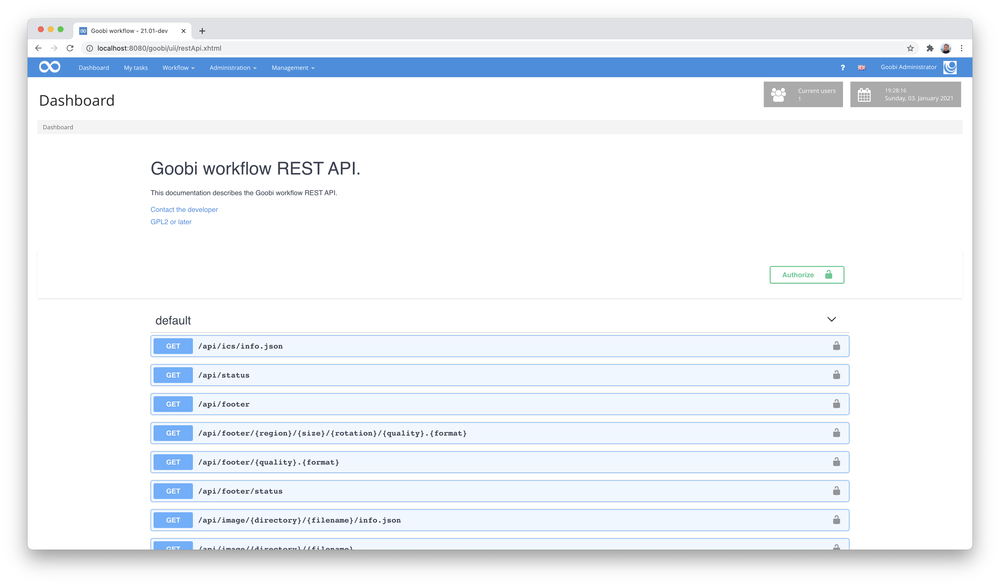
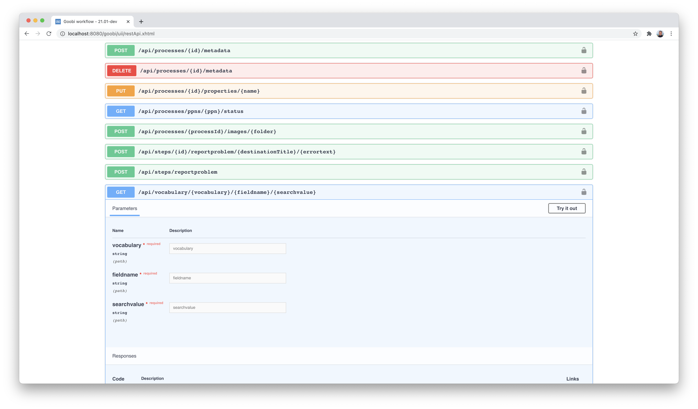

# 1. Nutzung der REST-API

Goobi workflow verfügt über eine sehr umfangreiche REST-API, die für die Anbindung externer Applikationen und Dienste an Goobi workflow eingesetzt werden kann.

## Konfiguration der REST-API

Diese Konfiguration der REST-API ist bereits hier detailliert dokumentiert:



Für eine einfache Durchführung von Tests ist es unter Umständen hilfreich, die Konfiguration innerhalb der Konfigurationsdatei `goobi_rest.xml` temporär so zu anzupassen, dass sämtliche Kommandos von dem gewünschten IP-Bereich \(z.B. für localhost\) mit einem einfachen Passwort \(`token`\) aufgerufen werden können. Eine solche Beispielkonfiguration könnte folgendermaßen aussehen:

```markup
<?xml version='1.0' encoding='UTF-8'?>
<config>
    <!-- allow all commands just locally with the token 'test' -->
    <endpoint path=".*">
      <method name="post">
        <allow netmask="0:0:0:0:0:0:0:1/128" token="test"/>
        <allow netmask="127.0.0.0/8" token="test"/>
      </method>
      <method name="get">
        <allow netmask="0:0:0:0:0:0:0:1/128" token="test"/>
        <allow netmask="127.0.0.0/8" token="test"/>
      </method>
      <method name="put">
        <allow netmask="0:0:0:0:0:0:0:1/128" token="test"/>
        <allow netmask="127.0.0.0/8" token="test"/>
      </method>
    </endpoint>
</config>
```

## Swagger UI als Schnittstellenbeschreibung

Für die REST-API von Goobi workflow gibt es eine automatisierte Dokumentation mittels `Swagger UI`. Hierbei handelt es sich um eine sehr verbreitete Schnittstellenbeschreibung, die es Entwicklern erlaubt, die REST-API von Goobi workflow interaktiv auszuprobieren und somit eine Anbindung externer Applikationen an Goobi workflow zu implementieren.



Mehr Informationen über die Möglichkeiten, die eine Schnittstellendokumentation via Swagger bietet, lassen sich hier erfahren:



Die Schnittstellenbeschreibung ist innerhalb von Goobi workflow über das Menü `Administration` zu erreichen und erlaubt von hier das Testen einzelner Kommandos direkt im Webbrowser:



Zur Veranschaulichung des Funktionsumfangs der REST-API von Goobi workflow erfolgt hier ein Einblick in die Schnittstellendokumentation im JSON-Format in stark verkürzter Form. Der volltändige aktuelle Umfang der zur Verfügung stehenden REST-Endpoints hängt wesentlich von der Goobi-Version sowie den installierten REST-Plugins ab und wird von dem hier aufgezeigten Beispiel stark abweichen:

```javascript
{
  "openapi": "3.0.1",
  "info": {
    "title": "Goobi workflow REST API.",
    "description": "This documentation describes the Goobi workflow REST API.",
    "contact": {
      "email": "info@intranda.com"
    },
    "license": {
      "name": "GPL2 or later",
      "url": "https://github.com/intranda/goobi-workflow/blob/master/LICENSE"
    }
  },
  "servers": [
    {
      "url": "/goobi"
    }
  ],
  "security": [
    {
      "query": [],
      "header": []
    }
  ],
  "paths": {
    "/api/ics/info.json": {
      "get": {
        "operationId": "getApplicationInfo",
        "responses": {
          "default": {
            "description": "default response",
            "content": {
              "application/json": {
                "schema": {
                  "$ref": "#/components/schemas/ApplicationInfo"
                }
              }
            }
          }
        }
      }
    },
    "/api/status": {
      "get": {
        "operationId": "getStatus",
        "responses": {
          "default": {
            "description": "default response",
            "content": {
              "application/json": {
                "schema": {
                  "$ref": "#/components/schemas/ResourceStatus"
                }
              }
            }
          }
        }
      }
    },
    "/api/footer": {
      "get": {
        "operationId": "redirectToCanonicalImageInfo",
        "responses": {
          "default": {
            "description": "default response",
            "content": {
              "application/json": {},
              "application/ld+json": {}
            }
          }
        }
      }
    },
    "/api/footer/{region}/{size}/{rotation}/{quality}.{format}": {
      "get": {
        "operationId": "getImage",
        "parameters": [
          {
            "name": "region",
            "in": "path",
            "required": true,
            "schema": {
              "type": "string"
            }
          },
          {
            "name": "size",
            "in": "path",
            "required": true,
            "schema": {
              "type": "string"
            }
          },
          {
            "name": "rotation",
            "in": "path",
            "required": true,
            "schema": {
              "type": "string"
            }
          },
          {
            "name": "quality",
            "in": "path",
            "required": true,
            "schema": {
              "type": "string"
            }
          },
          {
            "name": "format",
            "in": "path",
            "required": true,
            "schema": {
              "type": "string"
            }
          }
        ],
        "responses": {
          "default": {
            "description": "default response",
            "content": {
              "image/jpg": {},
              "image/png": {},
              "image/tif": {}
            }
          }
        }
      }
    },
    "/api/footer/{quality}.{format}": {
      "get": {
        "operationId": "redirectToFullImage",
        "parameters": [
          {
            "name": "quality",
            "in": "path",
            "required": true,
            "schema": {
              "type": "string"
            }
          },
          {
            "name": "format",
            "in": "path",
            "required": true,
            "schema": {
              "type": "string"
            }
          }
        ],
        "responses": {
          "default": {
            "description": "default response",
            "content": {
              "image/jpg": {},
              "image/png": {},
              "image/tif": {}
            }
          }
        }
      }
    },
    "/api/footer/status": {
      "get": {
        "operationId": "getStatus_1",
        "responses": {
          "default": {
            "description": "default response",
            "content": {
              "application/json": {
                "schema": {
                  "$ref": "#/components/schemas/ResourceStatus"
                }
              }
            }
          }
        }
      }
    },
    "/api/image/{directory}/{filename}/info.json": {
      "get": {
        "operationId": "getInfoAsJson",
        "parameters": [
          {
            "name": "directory",
            "in": "path",
            "required": true,
            "schema": {
              "type": "string"
            }
          },
          {
            "name": "filename",
            "in": "path",
            "required": true,
            "schema": {
              "type": "string"
            }
          }
        ],
        "responses": {
          "default": {
            "description": "default response",
            "content": {
              "application/ld+json": {
                "schema": {
                  "$ref": "#/components/schemas/ImageInformation"
                }
              },
              "application/json": {
                "schema": {
                  "$ref": "#/components/schemas/ImageInformation"
                }
              }
            }
          }
        }
      }
    },
    "/api/image/{directory}/{filename}": {
      "get": {
        "operationId": "redirectToCanonicalImageInfo_1",
        "parameters": [
          {
            "name": "directory",
            "in": "path",
            "required": true,
            "schema": {
              "type": "string"
            }
          },
          {
            "name": "filename",
            "in": "path",
            "required": true,
            "schema": {
              "type": "string"
            }
          }
        ],
        "responses": {
          "default": {
            "description": "default response",
            "content": {
              "application/json": {},
              "application/ld+json": {}
            }
          }
        }
      }
    },
    "/api/image/{directory}/{filename}/{region}/{size}/{rotation}/{quality}.{format}/{cacheCommand}": {
      "get": {
        "operationId": "isInCache",
        "parameters": [
          {
            "name": "directory",
            "in": "path",
            "required": true,
            "schema": {
              "type": "string"
            }
          },
          {
            "name": "filename",
            "in": "path",
            "required": true,
            "schema": {
              "type": "string"
            }
          },
          {
            "name": "region",
            "in": "path",
            "required": true,
            "schema": {
              "type": "string"
            }
          },
          {
            "name": "size",
            "in": "path",
            "required": true,
            "schema": {
              "type": "string"
            }
          },
          {
            "name": "rotation",
            "in": "path",
            "required": true,
            "schema": {
              "type": "string"
            }
          },
          {
            "name": "quality",
            "in": "path",
            "required": true,
            "schema": {
              "type": "string"
            }
          },
          {
            "name": "format",
            "in": "path",
            "required": true,
            "schema": {
              "type": "string"
            }
          },
          {
            "name": "cacheCommand",
            "in": "path",
            "required": true,
            "schema": {
              "type": "string"
            }
          }
        ],
        "responses": {
          "default": {
            "description": "default response",
            "content": {
              "text/plain": {
                "schema": {
                  "type": "boolean"
                }
              }
            }
          }
        }
      }
    },
    "/api/image/{directory}/{filename}/info.xml": {
      "get": {
        "operationId": "getInfoAsXml",
        "parameters": [
          {
            "name": "directory",
            "in": "path",
            "required": true,
            "schema": {
              "type": "string"
            }
          },
          {
            "name": "filename",
            "in": "path",
            "required": true,
            "schema": {
              "type": "string"
            }
          }
        ],
        "responses": {
          "default": {
            "description": "default response",
            "content": {
              "application/xml": {
                "schema": {
                  "$ref": "#/components/schemas/ImageInformation"
                }
              }
            }
          }
        }
      }
    }
  },
  "components": {
    "securitySchemes": {
      "query": {
        "type": "apiKey",
        "name": "token",
        "in": "query"
      },
      "header": {
        "type": "apiKey",
        "name": "token",
        "in": "header"
      }
    }
  }
}
```

