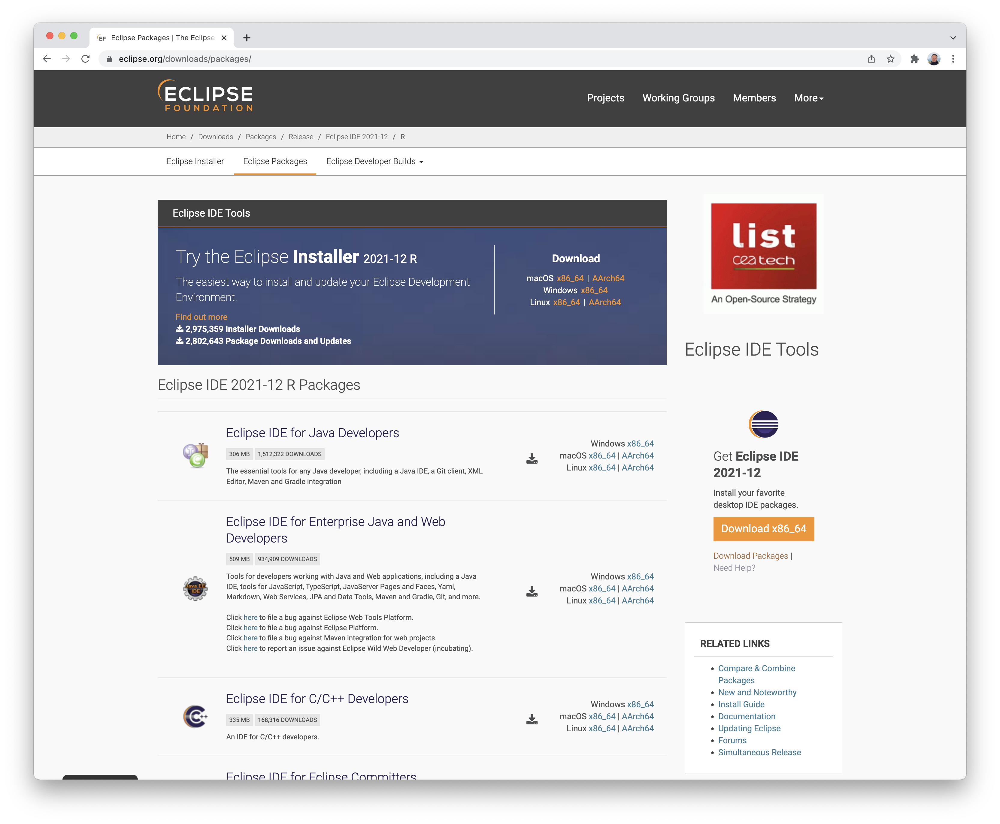
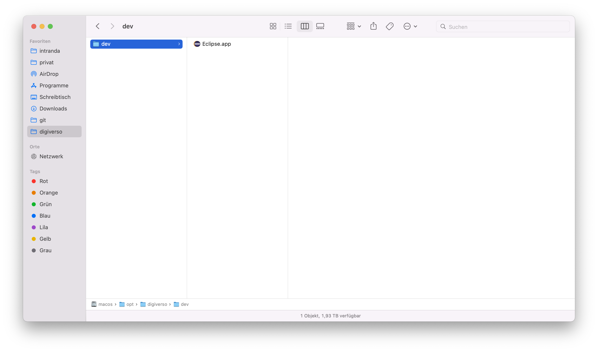
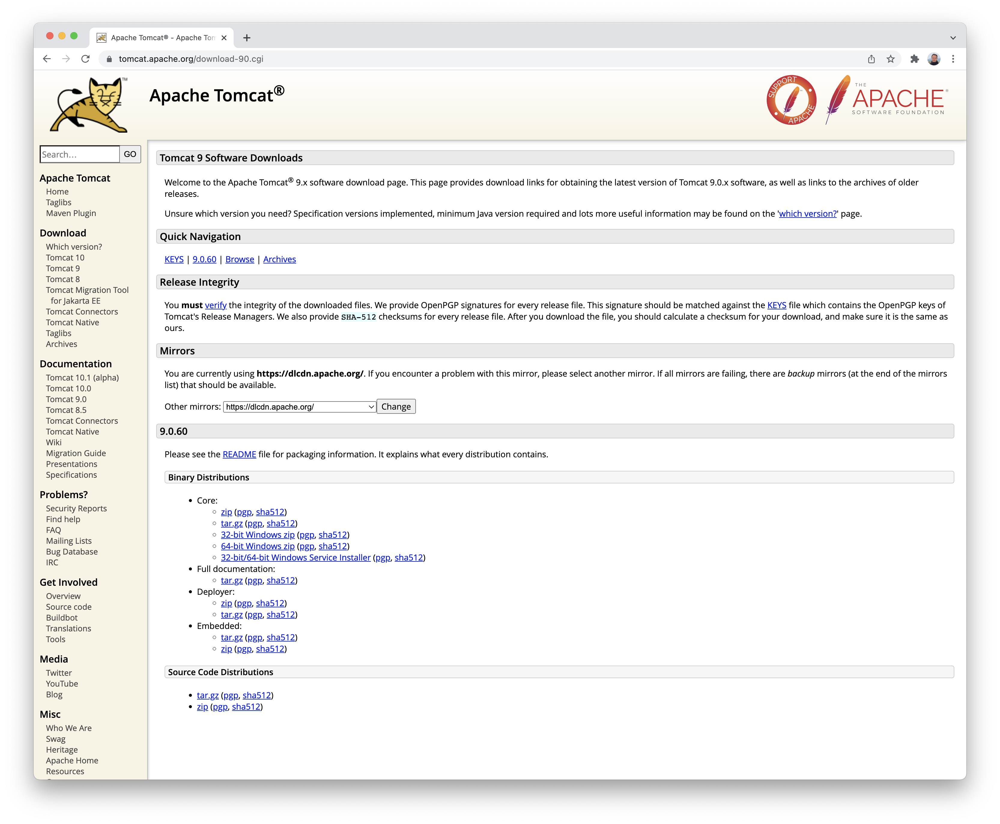
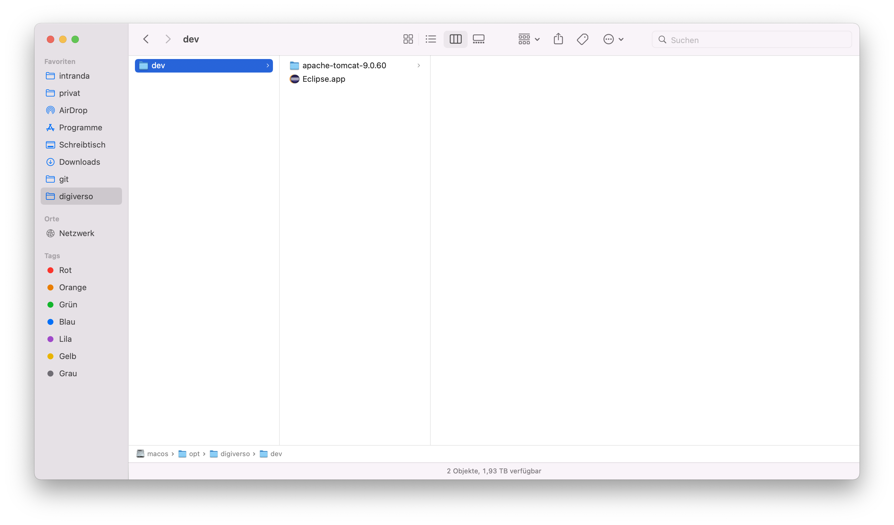
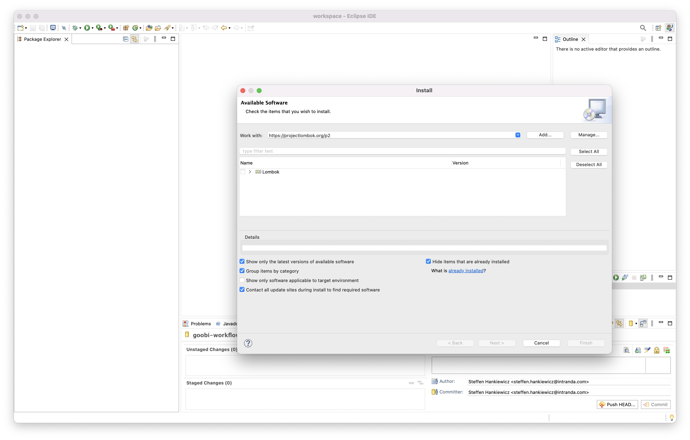
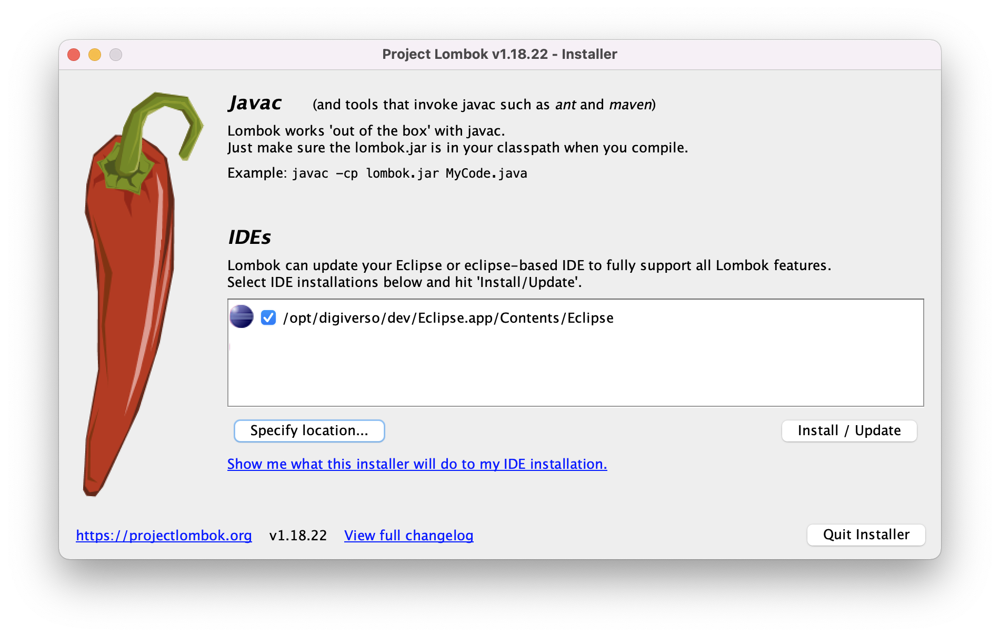
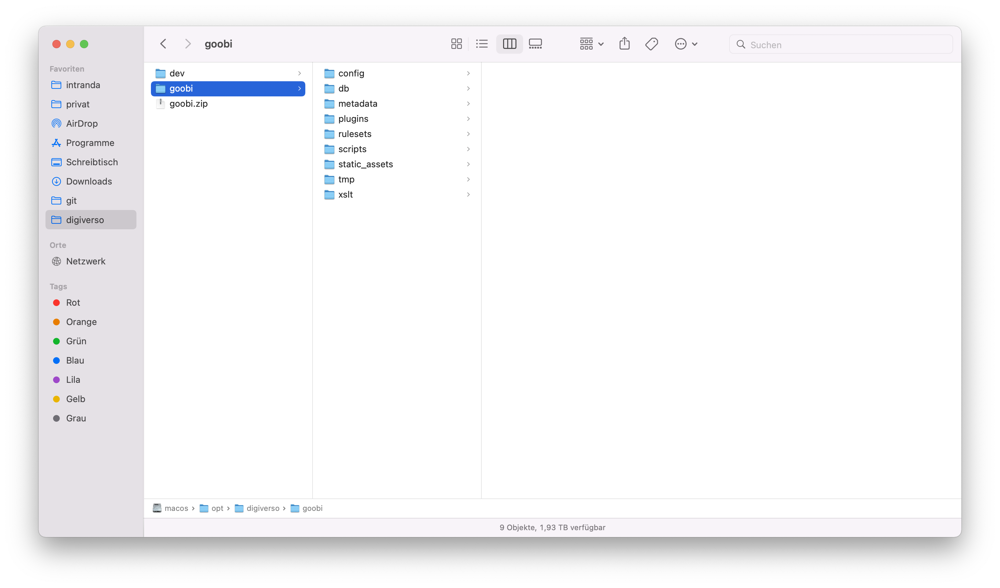

# 1.1 Vorbereitende Arbeiten

## 1.1.1 Installation von Java 11
Eine Voraussetzung für die Entwicklung von Goobi workflow und auch für die Entwicklungsumgebung ist ein erfolgreich installiertes Java 11. Dieses kann je nach Betriebssystem unterschiedlich installiert werden.

### Installation unter Linux:
Die Installation unter Ubuntu Linux erfolgt per Kommandozeile wie folgt:

```bash
sudo apt install openjdk-11-jdk
```

### Installation unter Mac:
Die Installation unter Mac erfolgt am besten unter Nutzung von [Homebrew](https://brew.sh/index_de) aus dem Terminal:

```bash
brew tap adoptopenjdk/openjdk
brew install --cask adoptopenjdk11
```

### Installation unter Windows:
Für die Installation unter Windows kann man von hier geeignete Installer herunterladen: https://adoptopenjdk.net/releases.html 


### Prüfen der Installation
Nach der erfolreichen Installation sollte auf dem Terminal mit dem Befehl `java -version` eine Ausgabe wie die folgende erscheinen:

```bash
$ java -version
openjdk version "11.0.11" 2021-04-20
OpenJDK Runtime Environment AdoptOpenJDK-11.0.11+9 (build 11.0.11+9)
OpenJDK 64-Bit Server VM AdoptOpenJDK-11.0.11+9 (build 11.0.11+9, mixed mode)
```

## 1.1.2. Installation von MariaDB
Für die Verwaltung der Daten verwendet Goobi workflow MariaDB. Dieses muss auf dem System entsprechend installiert werden.


### Installation unter Linux:
Die Installation unter Ubuntu Linux erfolgt per Kommandozeile wie folgt:

```bash
sudo apt install mariadb-server
```

Der Start und Stop der Datenbank kann so erfolgen:

```bash
## starten
systemctl start mariadb

## stoppen
systemctl stop mariadb
```


### Installation unter Mac:
Die Installation unter Mac erfolgt am besten unter Nutzung von [Homebrew](https://brew.sh/index_de) aus dem Terminal:

```bash
brew install mariadb
```

Der Start und Stop der Datenbank kann so erfolgen:

```bash
## starten
brew services start mariadb

## stoppen
brew services stop mariadb
```

### Installation unter Windows:
Die Installation unter Windows erfolgt analog. 


### Erzeugen einer leeren Datenbank für Goobi workflow
Damit Goobi worklow über Daten verfügen kann, muss eine Datenbank angelegt werden. Dies kann mit den folgenden Kommandos erfolgen:

```bash
sudo mysql -e "CREATE DATABASE goobi;
USE goobi;
CREATE USER 'goobi'@'localhost' IDENTIFIED BY 'goobi';
GRANT ALL PRIVILEGES ON goobi.* TO 'goobi'@'localhost' WITH GRANT OPTION;
FLUSH PRIVILEGES;"
```

## 1.1.3 Vorbereitung eines Verzeichnisses
Wir arbeiten üblicherweise in dem Verzeichnis `/opt/digiverso/` für die Entwicklung von Goobi und auch für den Betrieb auf den Servern. Daher müssen die benötigten Ordner zunächst erzeugt werden, wenn sie nicht bereits existieren. Dies erfolgt unter Linux und Mac wie folgt:

```bash
sudo mkdir -p /opt/digiverso/dev/
sudo chown -R $(logname): /opt/digiverso
```


## 1.1.4 Download von Eclipse
Eclipse muss als Entwicklungsumgebung heruntergeladen und installiert werden. Dies erfolgt von dieser Webseite: [https://www.eclipse.org/downloads/packages/](https://www.eclipse.org/downloads/packages/) 



Von dort wählt man das jeweils aktuelle Paket der `Eclipse IDE for Enterprise Java and Web Developers` für das eigene Betriebssystem und lädt es herunter. Anschließend kann dieses entspackt und in dem zuvor erzeugten Verzeichnis `/opt/digiverso/dev` gespeichert werden.

Das Verzeichnis sieht entsprechend so aus:




## 1.1.5 Download von Apache Tomcat
Für den Betrieb von Goobi workflow nutzen wir den Apache Tomcat in Version 9.x. Dieser kann von folgener Seite einfach als zip-Datei heruntergeladen werden, indem man aus dem Bereich `Core` der `Binary Distributions` der aktuellen Fassung die zip-Datei herunterlädt: [https://tomcat.apache.org/download-90.cgi](https://tomcat.apache.org/download-90.cgi)



Diese heruntergeladene zip-Datei kann anschließend entpackt und zusätzlich in das gleiche Verzeichnis wie Eclipse gespeichert werden:

```bash
/opt/digiverso/dev
```

Entsprechend sieht das Verzeichnis nun so aus:




## 1.1.6. Download und Installation von Lombok für Eclipse
Wir verwenden innerhalb von Goobi workflow die Programmbibliothek `Lombok`. Diese muss zu Eclipse zusätzlich installiert werden. Hierfür gibt es zwei mögliche Wege:

### Installation aus Eclipse
Die Installation aus Eclipse heraus ist am einfachsten. Hierfür muss zunächst über das Menü `Help` - `Install New Software` der folgende Dialog geöffnet werden:



Hier muss nun bei dem Eingabefeld `Work with` die Installations-URL angegeben werden, von der das Plugin bezogen werden soll. Dafür wird die folgende URL verwendet:

```
https://projectlombok.org/p2
```

Anschließend muss nur noch im unteren Bereich des Dialogfensters das Plugin `Lombok` ausgewählt werden. Auf den folgenden Seiten des Dialogs folgt noch einmal eine Sicherheitsabfrage bezüglich des Zertifikats, die bestätigt werden muss. Nach einem Neustart von Eclipse ist danach die Installation abgeschlossen.


### Manuelle Installation
Für die manuelle Installation muss Lobok zunächst von dieser URL heruntergeladen werden: https://projectlombok.org/download 

Nach dem Download kann Lombok per Doppelklick gestartet werden. Sollte der Start über einen Doppelklick nicht möglich sein, ist auch ein Start über die Kommandozeile möglich:

```bash
cd ~/Downloads 
java -jar lombok.jar
```

Nach dem Start kann nun das bereits installierte Eclipse dort hinzufügt werden, um anschließend Lobok in die Eclipse-Installation ergänzen zu lassen. 




## 1.1.7 Download von Demodaten
Um den Betrieb von Goobi workflow beginnen zu können, werden Konfigurationen, Daten, ein Datenbankdump sowie die benötigten Plugins in den richtigen Verzeichnissen benötigt. Ein vollständiger Datenbankdump findet sich auf GitHub unter folgender URL: https://github.com/intranda/goobi-workflow-dev-data

Der einfachste Weg ist es, wenn das dort bereitgestellte Release an Demodaten mit diesem Link als zip-Datei heruntergeladen und anschließend entpackt wird. Bei der Gelegenheit wird auch gleich der Datenbankdump in Mariadb eingespielt:

```bash
GDIR=/opt/digiverso/
rm -rf ${GDIR}goobi
[ ! -f ${GDIR}goobi.zip ] && wget https://github.com/intranda/goobi-workflow-dev-data/releases/latest/download/goobi.zip -O ${GDIR}goobi.zip
unzip -q ${GDIR}goobi.zip -d ${GDIR}
mysql -u goobi -pgoobi goobi -e "SOURCE ${GDIR}goobi/db/start.sql"
```

Damit sollte das Verzeichnis nun so aussehen:



Der folgende Befehl sollte dann die eingspielten Datenbanktabellen auflisten:

```bash
mysql -u goobi -pgoobi goobi -e "show tables"
```