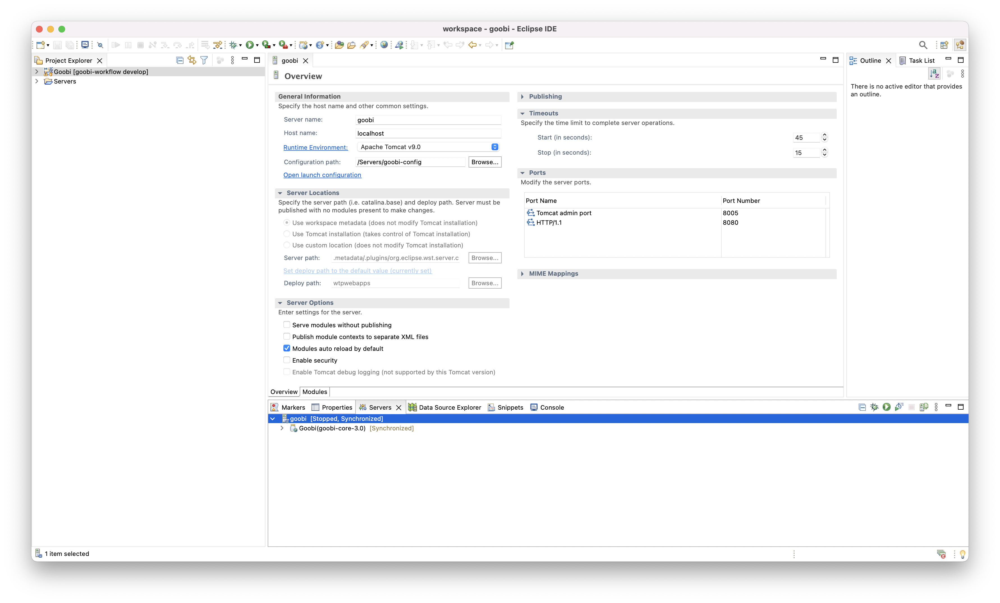

# 1.4 Best Practice für die Entwicklung von Goobi und für die Arbeit mit Eclipse

## 1.4.1 Sinnvolle Softwarepakete
Um mit den Repositories und dem Quellcode sinnvoll arbeiten zu können, sollten weitere Pakete installiert werden. Diese haben sich als sinnvoll erwiesen:

### Linux

```bash
sudo apt install git
sudo apt install maven
```

### Mac

```bash
brew install git
brew install maven
```


## Timeout beim Starten vermeiden
Unter Umständen dauert der Start des Tomcat länger als der per default gesetzte Timeout. Daher kann es sinnvoll sein, diesen anzupassen. Dies kann innerhalb des `Servers View` erfolgen. Dazu müssen die Einstellungen per Doppelklick auf den erzeugen Server `goobi` geöffnet werden, so dass dann im obereren rechten Bereich der Konfiguration im Bereich `Timeouts` ein anderer Wert für den Start des Tomcat Servers angegeben werden kann.

