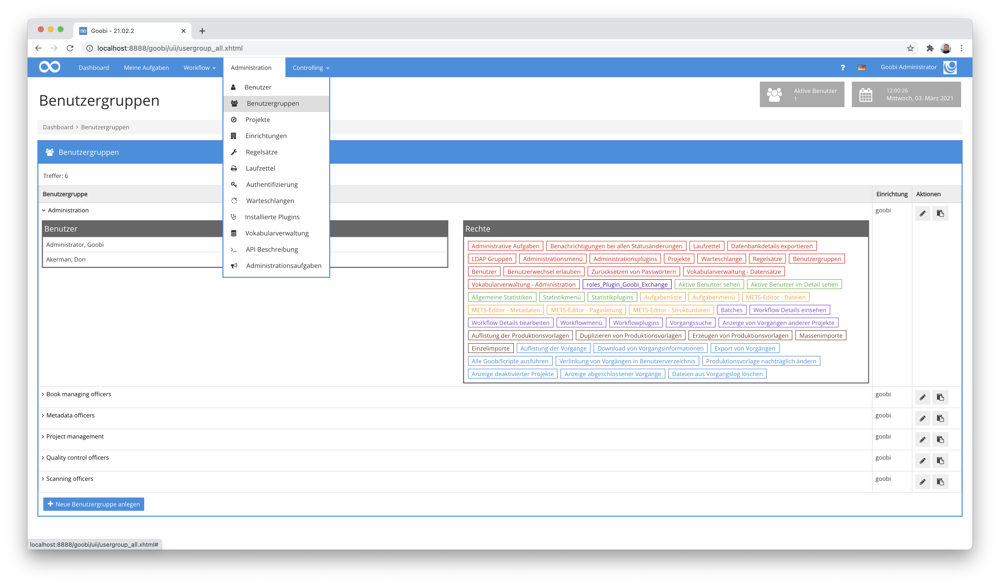
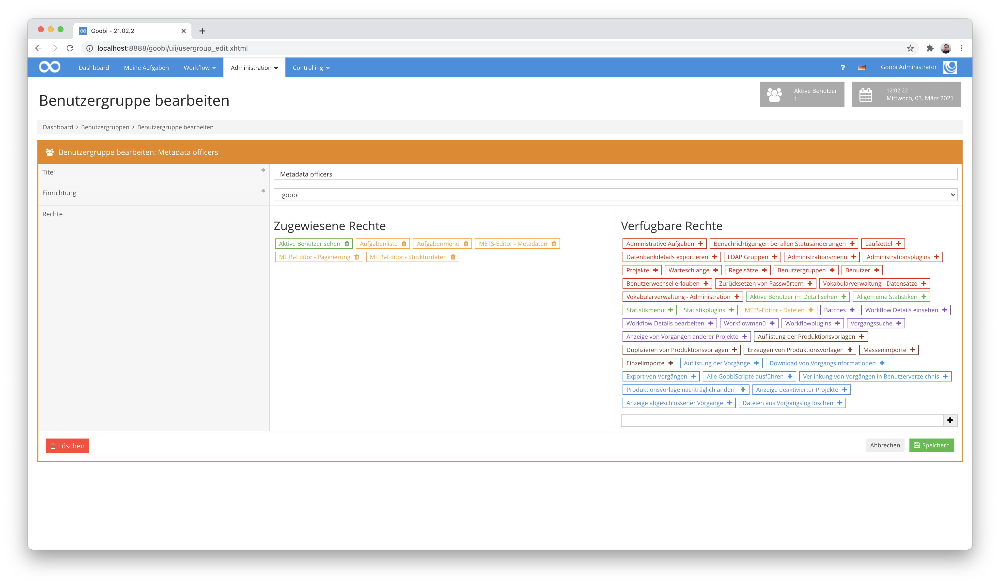
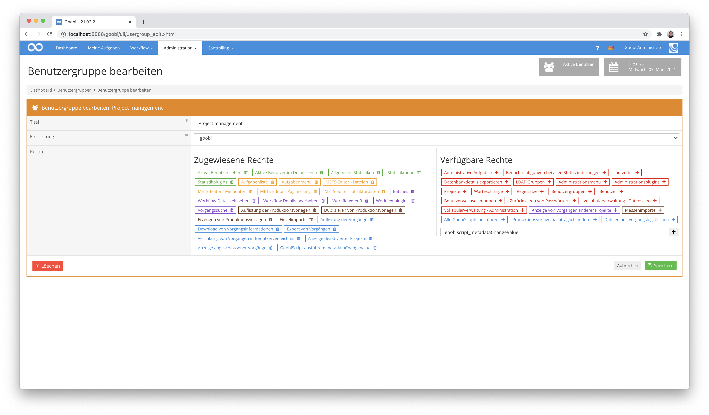

# 6. Benutzergruppen

Goobi benötigt für die flexible Handhabung der frei konfigurierbaren Workflows und der damit involvierten Benutzer, dass verschiedene Benutzergruppen festgelegt werden. Solche Benutzergruppen lassen sich verstehen als Rollen, Tätigkeiten oder Qualifikationen, die einzelne Personen innerhalb von Workflows haben können. Typische Beispiele für solche Benutzergruppen oder Rollen können unter anderem beispielsweise Scanoperateure, Metadatenbearbeiter oder Administratoren sein. Definieren Sie in Goobi diese Gruppen frei, um diese anschließend einzelnen Benutzern zuordnen zu können. Sie gelangen in die Auflistung der bestehenden Benutzergruppen, indem Sie über den Menüpunkt `Administration` in der Menüleiste den Menüpunkt `Benutzergruppen` auswählen. In der somit geöffneten Liste der Benutzergruppen werden nun all diejenigen Gruppen angezeigt, die bereits in Goobi festgelegt wurden. Zu jeder dieser festgelegten Benutzergruppe lassen sich alle Benutzer auflisten, die dieser Benutzergruppe zugewiesen wurden. Klicken Sie für diese Auflistung einfach auf das kleine Symbol vor jeder aufgelisteten Benutzergruppe. Anschließend erhalten Sie Einsicht in alle zugewiesenen Benutzer.

Zusätzliche Benutzergruppen können Sie erzeugen, indem Sie einfach auf den Link `Neue Benutzergruppe anlegen` klicken. Bestehende Benutzergruppen hingegen lassen sich bearbeiten, indem in der Spalte `Aktionen` auf das Editieren-Icon geklickt wird.

| Icon | Beschreibung |
| :--- | :--- |
|  | Neue Benutzergruppe anlegen |
|  | Neue Benutzergruppe anlegen |

Innerhalb der Bearbeitungsmaske muss für eine Benutzergruppe stets ein Titel vergeben werden. Dieser kann frei ausgewählt werden. Beachten Sie hierbei, dass Sie diesen Titel möglichst sprechend wählen, um Ihnen und anderen Administratoren in Goobi eine bessere Übersicht zu gewährleisten.

Zu jeder definierten Benutzergruppe können nun sehr granulare Berechtigungen vergeben werden. Diese können im rechten Bereich des Formulars durch einen einfachen Klick auf eine Berechtigung hinzugefügt werden. Ein Klick auf eine Berechtigung im linken Bereich entfernt diese wieder aus der Benutzergruppe.

Folgende Berechtigungen stehen für die Auswahl zur Verfügung:

## Berechtigungen auf administrativer Ebene

### Administrationsmenü

Diese Berechtigung erlaubt es dem Nutzer des Menü `Administration` zu sehen und Menüpunkte darin zu verwenden.

### Administrative Aufgaben

Diese Berechtigung erlaubt den Zugriff auf die administrative Maske, in der allen eingeloggten Nutzern eine Nachricht gesendet werden kann.

### Laufzettel

Diese Berechtigung erlaubt die Auflistung und Bearbeitung von Laufzetteln.

### LDAP Gruppen

Diese Berechtigung erlaubt die Auflistung und Bearbeitung von LDAP Gruppen.

### Administrationsplugins

Diese Berechtigung erlaubt die Ausführung von Administrationsplugins, sofern diese installiert sind und keine besonderen individuellen weiteren Rechte erfordern. 

### Projekte

Diese Berechtigung erlaubt die Auflistung und Bearbeitung von Projekten.

### Regelsätze

Diese Berechtigung erlaubt die Auflistung und Bearbeitung von Regelsätzen.

### Benutzergruppen

Diese Berechtigung erlaubt die Auflistung und Bearbeitung von Benutzergruppen und Ihrer Berechtigungen.

### Benutzer

Diese Berechtigung erlaubt die Auflistung und Bearbeitung von Benutzern.

### Benutzerwechsel erlauben

Diese Berechtigung erlaubt es, in das Benutzerkonto eines anderen Goobi-Nutzers zu wechseln, ohne dessen Login-Daten verwenden zu müssen. Vorbedingung hierfür ist jedoch, dass ebenfalls die Berechtigung `Benutzer` sowie `Administrationsmenü` vorliegen.

### Aktive Benutzer sehen

Diese Berechtigung erlaubt die Anzeige einer Information, wie viele Nutzer derzeit in Goobi aktiv arbeiten.

### Aktive Benutzer im Detail sehen

Diese Berechtigung erlaubt, dass neben der Anzeige der Anzahl der aktiven Nutzer in Goobi detailliert aufgelistet werden kann, um welche Nutzer es sich hierbei genau handelt und wann sie das letzte Mal Aktivität zeigten.

### Dateien aus Vorgangslog löschen

Mit dieser Berechtigung hat der Nutzer die Möglichkeit, Dateien zu löschen, die für einem Vorgang innerhalb des Vorgangslogs oder in eines der Verzeichnisse `import/`, `export/` bzw. `source/` hochgeladen wurden.

### Benachrichtigungen bei allen Statusänderungen

Nutzer mit dieser Berechtigung können konfigurieren, für welche Statusänderungen sie informiert werden möchten. Innerhalb der Benutzereinstellungen jedes Nutzers stehen hierfür Felder zur Verfügung, die die  Benachrichtigung für Statusänderungen per Mail festlegen. Eine Benachrichtigung ist für den Statuswechsel von Aufgaben für folgende Fälle möglich:

* Wenn Aufgaben für die Bearbeitung bereit stehen werden
* Wenn Aufgaben für die Bearbeitung durch einen Nutzer angenommen werden
* Wenn Aufgaben abgeschlossen wurden
* Wenn Aufgaben einen Fehlerstatus erreichen

## Berechtigungen für Statistiken 

### Statistikmenü

Diese Berechtigung erlaubt es dem Nutzer des Menü `Statistiken` zu sehen und Menüpunkte darin zu verwenden.

### Allgemeine Statistiken

Diese Berechtigung gewährleistet Zugriff auf die Standard-Statistiken, die innerhalb von Goobi vorliegen.

### Statistikplugins

Diese Berechtigung erlaubt, dass zusätzlich installierte Statistikplugins aufgerufen werden dürfen.

## Berechtigungen für Aufgaben

### Aufgabenmenü

Diese Berechtigung erlaubt es dem Nutzer des Menü `Meine Aufgaben` zu sehen und damit zu arbeiten.

### Aufgabenliste

Diese Berechtigung erlaubt die Anzeige und Arbeit mit der eigenen Aufgabenliste des Nutzers.

### METS-Editor - Paginierung

Diese Berechtigung legt für Benutzer mit Zugriff auf den internen Metadateneditor fest, ob darin mit dem Bereich `Paginierung` gearbeitet werden darf. 

### METS-Editor - Strukturdaten

Diese Berechtigung legt für Benutzer mit Zugriff auf den internen Metadateneditor fest, ob darin mit dem Bereich `Strukturdaten` gearbeitet werden darf. 

### METS-Editor - Metadaten

Diese Berechtigung legt für Benutzer mit Zugriff auf den internen Metadateneditor fest, ob darin mit dem Bereich `Metadaten` gearbeitet werden darf. 

### METS-Editor - Dateien

Diese Berechtigung legt für Benutzer mit Zugriff auf den internen Metadateneditor fest, ob darin mit dem Bereich `Dateien` gearbeitet werden darf. 

## Berechtigungen für Workflows

### Workflowmenü

Diese Berechtigung erlaubt es dem Nutzer des Menü `Workflow` zu sehen und Menüpunkte darin zu verwenden.

### Vorgangssuche

Diese Berechtigung steuert, ob der Nutzer die Suchmaske zum Suchen von Vorgängen benutzen darf.

### Anzeige von Vorgängen anderer Projekte

Diese Berechtigung legt fest, ob ein Nutzer auch Vorgänge sehen darf, in denen er selbst nicht Mitglied ist.

### Batches

Diese Berechtigung legt fest, ob der Nutzer Vorgänge zu Batches gruppieren oder bestehende Batches verändern darf.

### Workflow Details einsehen

Diese Berechtigung legt fest, ob ein Nutzer von einem Vorgang dessen Details sehen darf.

### Workflow Details bearbeiten

Diese Berechtigung legt fest, ob ein Nutzer von einem Vorgang dessen Details sehen und bearbeiten darf.

### Workflowplugins

Diese Berechtigung erlaubt, dass zusätzlich installierte Workflowplugins aufgerufen werden dürfen.

## Berechtigungen für Produktionsvorlagen

### Auflistung der Produktionsvorlagen

Diese Berechtigung steuert, ob ein Nutzer Zugriff auf die Auflistung der Produktionsvorlagen haben darf.

### Duplizieren von Produktionsvorlagen

Diese Berechtigung legt fest, ob ein Nutzer eine bestehende Produktionsvorlage duplizieren darf, um somit eine neue Produktionsvorlage zu erzeugen.

### Erzeugen von Produktionsvorlagen

Diese Berechtigung legt fest, ob ein Nutzer neue Produktionsvorlagen erstellen darf. 

### Einzelimporte

Mit dieser Berechtigung ist es dem Nutzer möglich, auf der Basis bestehender Produktionsvorlage neue Vorgänge einzeln zu erzeugen

### Massenimporte

Mit dieser Berechtigung ist es dem Nutzer möglich, auf der Basis bestehender Produktionsvorlage neue Vorgänge mittels Durchführung eines Massenimports zu erzeugen.

## Berechtigungen für Vorgänge 

### Auflistung der Vorgänge

Mit dieser Berechtigung hat der Nutzer die Möglichkeit, sich Vorgänge auflisten zu lassen.

### Produktionsvorlage nachträglich ändern

Mit dieser Berechtigung hat der Nutzer die Möglichkeit für einen bestehenden Vorgang nachträglich die zu verwendende Produktionsvorlage zu ändern.

### Download von Vorgangsinformationen

Mit dieser Berechtigung hat der Nutzer die Möglichkeit, sich Vorgangsinformationen als XML-Datei herunterzuladen.

### Export von Vorgängen

Mit dieser Berechtigung ist es dem Nutzer möglich, einen tabellarischen Export eine Vorgangsliste durchzuführen.

### Verlinkung von Vorgängen in Homeverzeichnis

Mit dieser Berechtigung kann festgelegt werden, ob ein Nutzer für einen gewünschten Vorgang eine Verlinkung der Daten in sein Homeverzeichnis erzeugen darf.

### Anzeige deaktivierter Projekte

Mit dieser Berechtigung kann festgelegt werden, ob ein Nutzer auch Vorgänge von deaktivierten Projekten sehen darf.

### Anzeige abgeschlossener Vorgänge

Mit dieser Berechtigung kann festgelegt werden, ob ein Nutzer auf abgeschlossene Vorgänge Zugriff erhalten soll.

### Alle GoobiScripte ausführen

Mit dieser Berechtigung erhält der Nutzer die Rechte, sämtliche GoobiScripts über eine Anzahl an Vorgängen anwenden zu dürfen.

## Individuelle GoobiScripte

Es besteht die Möglichkeit, dass Benutzergruppen gezielt Rechte zur Ausführung ausgewählter GoobiScripte erhalten können. Hierfür erfolgt die Zuweisung der Berechtigung nicht durch einen Klick auf eines der angezeichten Rechte im rechten Bereich. Stattdessen erfolgt die Nennung des zu erlaubenden GoobiScripts in dem rechten Eingabefeld und wir mit einem Klick auf dem Button mit Plus-Icon übernommen. Die Zuweisung der Berechtigung erfolgt dabei so, dass `goobiscript_` gefolgt von dem Namen des konkreten GoobiScripts eingetragen wird. 

Entsprechend sind beispielhaft folgende Berechtigungen zuweisbar:

| Name des GoobiScripts | Zuweisung des GoobiScripts als Berechtigung |
| :--- | :--- |
| goobiscript_addStep | `goobiscript_addStep` |
| metadataChangeValue    | `goobiscript_metadataChangeValue` |
| setTaskProperty    | `goobiscript_setTaskProperty` |
