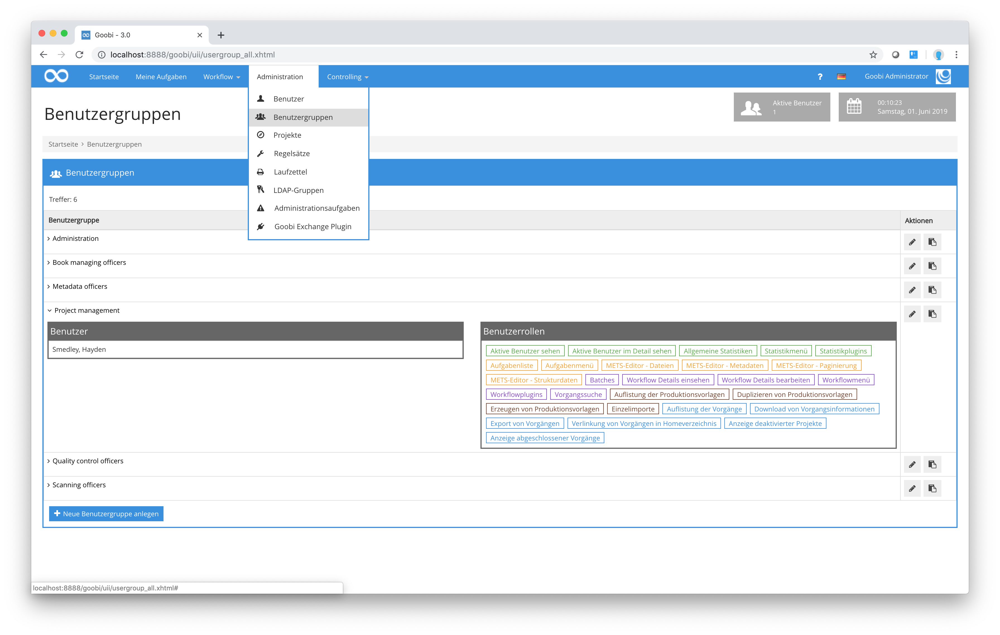
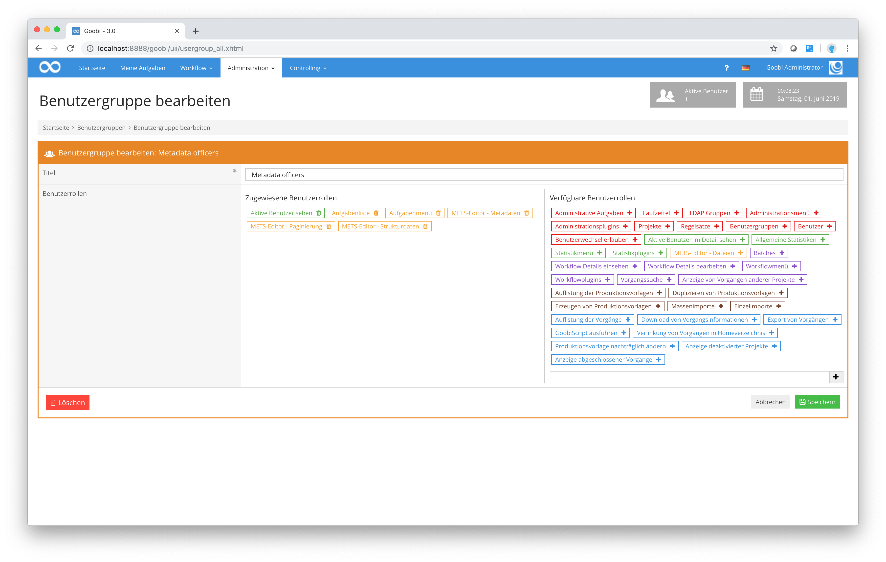

# 6. Benutzergruppen

Goobi benötigt für die flexible Handhabung der frei konfigurierbaren Workflows und der damit involvierten Benutzer, dass verschiedene Benutzergruppen festgelegt werden. Solche Benutzergruppen lassen sich verstehen als Rollen, Tätigkeiten oder Qualifikationen, die einzelne Personen innerhalb von Workflows haben können. Typische Beispiele für solche Benutzergruppen oder Rollen können unter anderem beispielsweise Scanoperateure, Metadatenbearbeiter oder Administratoren sein. Definieren Sie in Goobi diese Gruppen frei, um diese anschließend einzelnen Benutzern zuordnen zu können. Sie gelangen in die Auflistung der bestehenden Benutzergruppen, indem Sie über den Menüpunkt `Administration` in der Menüleiste den Menüpunkt `Benutzergruppen` auswählen. In der somit geöffneten Liste der Benutzergruppen werden nun all diejenigen Gruppen angezeigt, die bereits in Goobi festgelegt wurden. Zu jeder dieser festgelegten Benutzergruppe lassen sich alle Benutzer auflisten, die dieser Benutzergruppe zugewiesen wurden. Klicken Sie für diese Auflistung einfach auf das kleine Symbol vor jeder aufgelisteten Benutzergruppe. Anschließend erhalten Sie Einsicht in alle zugewiesenen Benutzer.

Zusätzliche Benutzergruppen können Sie erzeugen, indem Sie einfach auf den Link `Neue Benutzergruppe anlegen` klicken. Bestehende Benutzergruppen hingegen lassen sich bearbeiten, indem in der Spalte `Aktionen` auf das Editieren-Icon geklickt wird.

| Icon | Beschreibung |
| :--- | :--- |
|  | Neue Benutzergruppe anlegen |
|  | Neue Benutzergruppe anlegen |

Innerhalb der Bearbeitungsmaske muss für eine Benutzergruppe stets ein Titel vergeben werden. Dieser kann frei ausgewählt werden. Beachten Sie hierbei, dass Sie diesen Titel möglichst sprechend wählen, um Ihnen und anderen Administratoren in Goobi eine bessere Übersicht zu gewährleisten.

Zu jeder definierten Benutzergruppe können nun sehr granulare Berechtigungen vergeben werden. Diese können im rechten Bereich des Formulars durch einen einfachen Klick auf eine Berechtigung hinzugefügt werden. Ein Klick auf eine Berechtigung im linken Bereich entfernt diese wieder aus der Benutzergruppe.

Folgende Berechtigungen stehen für die Auswahl zur Verfügung:

## Berechtigungen auf administrativer Ebene

### Administrationsmenü

Diese Berechtigung erlaubt es dem Nutzer des Menü `Administration` zu sehen und Menüpunkte darin zu verwenden.

### Administrative Aufgaben

Diese Berechtigung erlaubt den Zugriff auf die administrative Maske, in der allen eingeloggten Nutzern eine Nachricht gesendet werden kann.

### Laufzettel

Diese Berechtigung erlaubt die Auflistung und Bearbeitung von Laufzetteln.

### LDAP Gruppen

Diese Berechtigung erlaubt die Auflistung und Bearbeitung von LDAP Gruppen.

### Administrationsplugins

Diese Berechtigung erlaubt die Ausführung von Administrationsplugins, sofern diese installiert sind und keine besonderen individuellen weiteren Rechte erfordern. 

### Projekte

Diese Berechtigung erlaubt die Auflistung und Bearbeitung von Projekten.

### Regelsätze

Diese Berechtigung erlaubt die Auflistung und Bearbeitung von Regelsätzen.

### Benutzergruppen

Diese Berechtigung erlaubt die Auflistung und Bearbeitung von Benutzergruppen und Ihrer Berechtigungen.

### Benutzer

Diese Berechtigung erlaubt die Auflistung und Bearbeitung von Benutzern.

### Benutzerwechsel erlauben

Diese Berechtigung erlaubt es, in das Benutzerkonto eines anderen Goobi-Nutzers zu wechseln, ohne dessen Login-Daten verwenden zu müssen. Vorbedingung hierfür ist jedoch, dass ebenfalls die Berechtigung `Benutzer` sowie `Administrationsmenü` vorliegen.

### Aktive Benutzer sehen

Diese Berechtigung erlaubt die Anzeige einer Information, wie viele Nutzer derzeit in Goobi aktiv arbeiten.

### Aktive Benutzer im Detail sehen

Diese Berechtigung erlaubt, dass neben der Anzeige der Anzahl der aktiven Nutzer in Goobi detailliert aufgelistet werden kann, um welche Nutzer es sich hierbei genau handelt und wann sie das letzte Mal Aktivität zeigten.

## Berechtigungen für Statistiken 

### Statistikmenü

Diese Berechtigung erlaubt es dem Nutzer des Menü `Statistiken` zu sehen und Menüpunkte darin zu verwenden.

### Allgemeine Statistiken

### Statistikplugins

## Berechtigungen für Aufgaben

### Aufgabenliste

### Aufgabenmenü

Diese Berechtigung erlaubt es dem Nutzer des Menü `Meine Aufgaben` zu sehen und damit zu arbeiten.

### METS-Editor - Dateien

### METS-Editor - Metadaten

### METS-Editor - Paginierung

### METS-Editor - Strukturdaten

## Berechtigungen für Workflows

### Workflowmenü

Diese Berechtigung erlaubt es dem Nutzer des Menü `Workflow` zu sehen und Menüpunkte darin zu verwenden.

### Batches

### Workflow Details einsehen

### Workflow Details bearbeiten

### Workflowplugins

### Vorgangssuche

### Anzeige von Vorgängen anderer Projekte

## Berechtigungen für Produktionsvorlagen

### Auflistung der Produktionsvorlagen

### Duplizieren von Produktionsvorlagen

### Erzeugen von Produktionsvorlagen

### Massenimporte

### Einzelimporte

## Berechtigungen für Vorgänge

### Auflistung der Vorgänge

### Produktionsvorlage nachträglich ändern

### Download von Vorgangsinformationen

### Export von Vorgängen

### GoobiScript ausführen

### Verlinkung von Vorgängen in Homeverzeichnis

### Anzeige deaktivierter Projekte

### Anzeige abgeschlossener Vorgänge

