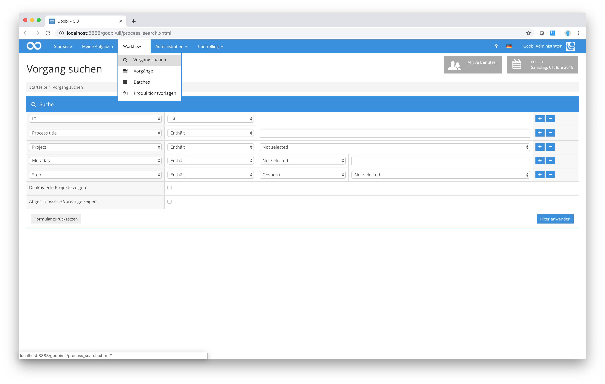
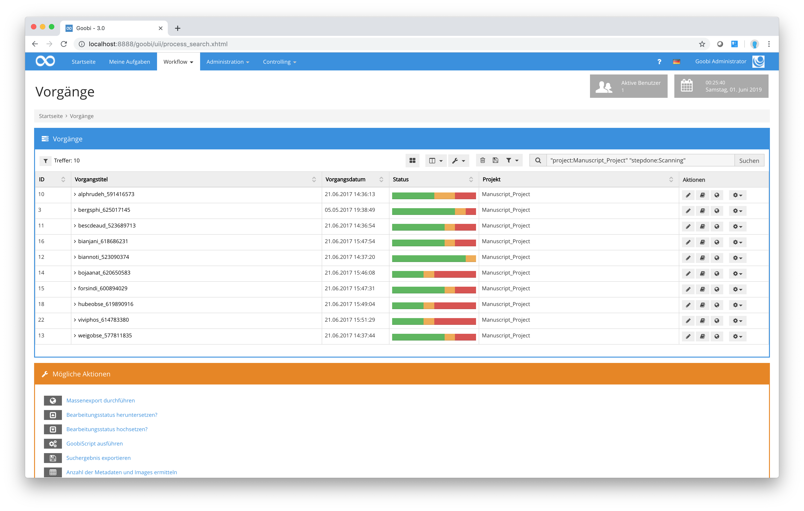

# 7.1. Vorgänge filtern

Möchten Sie gezielt nach Vorgängen suchen, stellt Goobi hierfür eine erweiterte Suchmaske zur Verfügung. Diese erreichen Sie über das Menü `Workflow` - `Vorgang suchen`.

Für eine granulare Suche ist in diesem Zusammenhang relevant, dass auch diese Suchmaske Goobi-intern eine Filtersyntax verwendet, um damit die gesuchten Vorgänge aus der Datenbank zu ermitteln.

Aus den vorhergehenden Abbildungen wird deutlich, wie aus der Suchanfrage, die mittels der Suchmaske erfolgte, intern eine Suchabfrage auf der Basis der internen Suchsyntax durchgeführt wurde. Die generierte Suchanfrage ist im Filterfeld `Vorgänge filtern` oberhalb der Tabelle sichtbar und kann um zusätzliche Parameter erweitert werden. Außerdem ist es ebenfalls möglich, eine Suchanfrage dauerhaft zu speichern für den Fall, dass eine solche Suchanfrage häufiger aufgerufen werden soll.

Damit steht sie in der Auswahlliste der vordefinierten Filter zur Verfügung und kann jederzeit neu ausgeführt werden. Die hier im Hintergrund wirkende Filtersyntax soll in diesem Abschnitt beispielhaft erläutert werden. Dies ist aus dem Grunde sinnvoll, da mit einer manuellen Kombination der im Folgenden beschriebenen Suchparameter noch detailliertere Suchanfragen möglich sind, als diese durch die Suchmaske angeboten werden. In der folgenden Tabelle werden einige beispielhafte Filter zusammen mit deren Suchverhalten detailliert beschrieben.

_**Die detaillierte Filtersyntax für Vorgänge an Beispielen**_

| **Filtersyntax** | **Beschreibung der Filterfunktionalität** |
| :--- | :--- |
| ab | Filter nach allen Vorgängen aus allen Projekten mit der Einschränkung, dass im Vorgangstitel `ab` vorkommen muss |
| -ab | Filter nach allen Vorgängen, in denen kein `ab` im Vorgangstitel vorkommen darf |
| ab -abc | Filter nach allen Vorgängen, die `ab` enthalten, in denen jedoch nicht `abc` vorkommen darf |
| a?c | Filter nach allen Vorgängen mit der Einschränkung, dass im Vorgangstitel `a`, `ein beliebiges Zeichen` und `c` vorkommen muss |
| a\*c | Filter nach allen Vorgängen mit der Einschränkung, dass im Vorgangstitel `a`, `beliebig viele Zeichen (auch keins)` und `c` vorkommen muss |
| meta:Shelfmark:123 | Filter nach allen Vorgängen, die das Metadatum `Signatur (shelfmark)` mit dem Wert `123` enthalten |
| meta:Author:Mustermann | Filter nach allen Vorgängen, die das Metadatum `Author` mit dem Wert `Mustermann` enthalten |
| "meta:Author:Max Mustermann" "meta:Author:John Doe" | Filter nach allen Vorgängen, bei denen die beiden Autoren `Max Mustermann` und `John Doe` erfasst wurden |
| meta:index.Person:Mustermann | Filter nach allen Vorgängen, die im Personenindex den Wert `Mustermann` enthalten. |
| meta:\*:123 | Filter nach allen Vorgängen, die in einem beliebigen Metadatum den Wert `123` enthalten. |
| -meta:Shelfmark:\* | Filtere nach allen Vorgängen, die keine `Signatur` haben. |
| batch:3 | Filtere nach allen Vorgängen, die dem `batch` mit der Nummer `3` zugeordnet sind. |
| -batch:3 | Filtere nach allen Vorgängen, die nicht dem `batch` mit der Nummer `3` zugeordnet sind. |
| log:intranda | Filtere nach allen Vorgängen, die im `Vorgangslog` das Wort `intranda` enthalten. |
| project:sample\_project | Filter nach allen Vorgängen aus dem Projekt `sample_project`. |
| „project:sample project“ | Filter nach allen Vorgängen eines Projektes, wenn der Name des Projektes `Leerzeichen` beinhaltet. |
| -ab project:sample\_project | Filter nach allen Projekten, die `ab` im Titel beinhalten und aus dem Projekt `sample_project` stammen. |
| ab -abc „project:sample project” | Filter nach allen Vorgängen aus dem Projekt `sample project`, dessen Titel `ab` aber nicht `abc` enthält. |
| „-project:sample project“ | Filter nach allen Vorgängen, die nicht aus dem Projekt `sample project` stammen. |
| step:6 | Filter nach allen Vorgängen in allen Projekten, deren Workflowschritt mit der Reihenfolgennummer `6` bereits `abgeschlossen` wurde. |
| stepInWork:7 | Filter nach allen Vorgängen in allen Projekten, deren Arbeitsschritt mit der Reihenfolgennummer `7` innerhalb des Workflows sich derzeitig `in Bearbeitung` befindet . |
| stepOpen:7 | Filter nach allen Vorgängen, deren Arbeitsschritt mit der Reihenfolgennummer `7` auf eine Bearbeitung durch einen Benutzer `wartet`. |
| stepLocked:7 | Filter für alle Vorgänge, deren Arbeitsschritt mit der Reihenfolgennummer `7` noch `gesperrt` ist. |
| stepDone4: stepLocked:7 | Filter für alle Vorgänge, von denen mindestens der Arbeitsschritt `4` abgeschlossen, der Schritt `7` allerdings noch nicht `für die Bearbeitung frei gegeben` wurde. |
| stepInWork:Imaging | Filter für alle Vorgänge, deren Arbeitsschritt mit dem Titel `Imaging` sich gerade `in Bearbeitung` findet. |
| stepDone:Export „project:sample project” | Filter nach allen Vorgängen, deren Arbeitsschritt mit dem Titel `Export` `bereits abgeschlossen` wurde und die zu dem Projekt mit dem Namen `sample project` gehören. |
| „id:17 18 19“ | Filter nach allen Vorgängen mit den internen Goobi-Identifiern `17`, `18` oder `19`. |
| template:123 | Filter nach allen Vorgängen, deren `physische Vorlage` eine Eigenschaft enthält, deren Wert `123` beinhaltet . |
| template:shelfmark:123 intranda | Filter nach allen Vorgängen, deren Eigenschaft `Signatur (shelfmark)` der physischen Vorlage den Wert `123` und der Titel des Vorgangs `intranda` enthält. |
| workpiece:intranda | Filter nach allen Vorgängen, deren Eigenschaft des zugehörigen Werkstücks als Wert `intranda` enthält . |
| workpiece:Artist:intranda | Filter nach allen Vorgängen, deren Werkstückeigenschaft `Artist` den Wert `intranda` enthält. |
| workpiece:Artist:intranda process:shelfmark:123 „project:sample project” stepDone:Imaging 456 | Filter nach allen Vorgängen des Projektes sample project, die im Vorgangstitel `456` enthalten, von denen mindestens der Arbeitsschritt Imaging abgeschlossen ist, deren Signatur der physischen Vorlage `123` enthält und deren Werkstückeigenschaften als `Artist` `intranda`. |
| processproperty:Schrifttyp:fra | Filter nach allen Vorgängen, deren Vorgangseigenschaft `Schrifttyp` den Wert `fra` enthält. |
| project:Berlin \|project:London | Oder-Suche nach allen Vorgängen, deren `Projekttitel` entweder `Berlin` oder `London` enthält. |
| "project:Palma de Mallorca" "\|project:New York" | Oder-Suche nach allen Vorgängen, deren `Projekttitel` entweder `Palma de Mallorce` oder `New York` enthält. Die einzelnen Suchparameter sind hier in `Anführungszeichen` gesetzt, da die Projekttitel hier Leerzeichen enthalten. |
| "meta:TitleDocMain:1801" "\|meta:TitleDocMain:1802" | Oder-Suche nach Vorgängen, deren Metadaten im `Haupttitel` `1801` oder `1802` enthält. Die `Anführungszeichen` sind hierbei nur dann nötig, wenn innerhalb des Suchbegriffs Leerzeichen enthalten sind. |
| processdate=2021 | Suche nach Vorgängen, deren `Erstellungszeitpunkt` im Jahr `2021` liegt. |
| "processdate&lt;2020-01-01 12:00:00" | Suche nach Vorgängen, deren `Erstellungszeitpunkt` vor dem `01.01.2020 12:00:00` liegt. |
| processdate&gt;2020-01-01 processdate&lt;2020-12-31 | Suche nach Vorgängen, deren `Erstellungszeitpunkt` nach dem `01.01.2020` und vor dem `31.12.2020` liegt. |
| stepdone:Scanning stepfinishdate:2021 | Suche nach Arbeitsschritte mit dem Titel `Scanning`, die im Jahr `2021` abgeschlossen wurden. |
| stepstartdate:2021 | Suche nach  Arbeitsschritten, deren Bearbeitung im Jahr `2021` begonnen hat. |
| stepdone:Scanning "stepdone:Quality control" stepfinishdate:2021 | Suche nach den Arbeitsschritten `Scanning` und `Quality control`, die beide im Jahr `2021` abgeschlossen wurden. |
| stepdone:Scanning stepfinishdate>2021-08-01 stepfinishdate<2021-08-31 | Suche nach Arbeitsschritten `Scanning`, die im August 2021 abgeschlossen wurden. |

Wie Sie an den Beispielen der Filter erkennen können, sind über die freie Kombinierbarkeit verschiedenster Parameter miteinander auch sehr komplexe Filteranfragen möglich. Im Gegensatz zur einfach zu bedienenden Filtermaske können mittels der Suchsyntax auch gleiche Parameter mit unterschiedlichen Werten mehrfach innerhalb einer Anfrage verwendet werden \(z.B. die gleichzeitige Suche nach abgeschlossenen sowie nach offenen Arbeitsschritten eines Workflows\).

Sämtliche der hier aufgeführten Parameter sind beliebig untereinander kombinierbar. Bitte beachten Sie, dass jeder Parameter, der Leerzeichen beinhaltet, stets von Anführungszeichen eingeschlossen wird.

