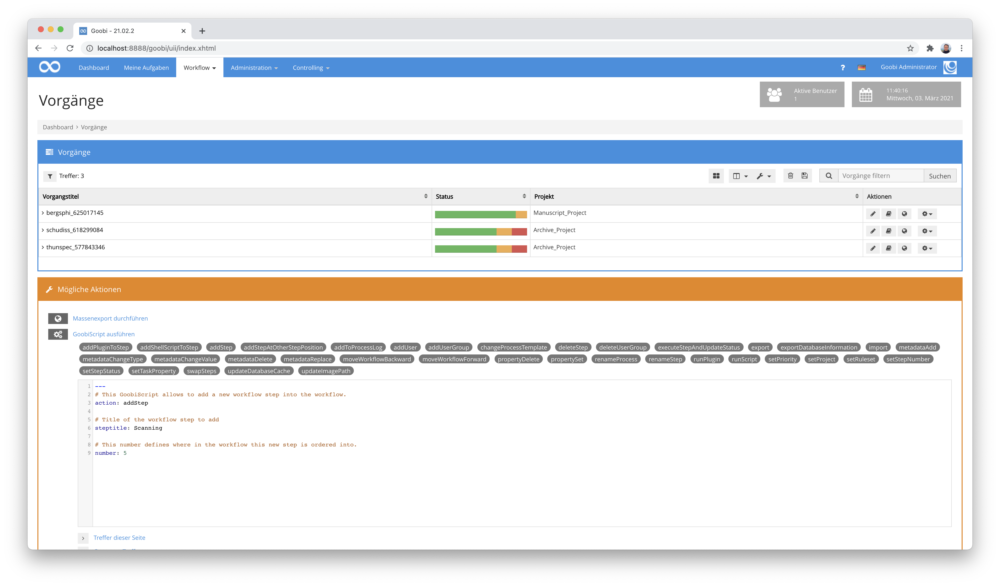
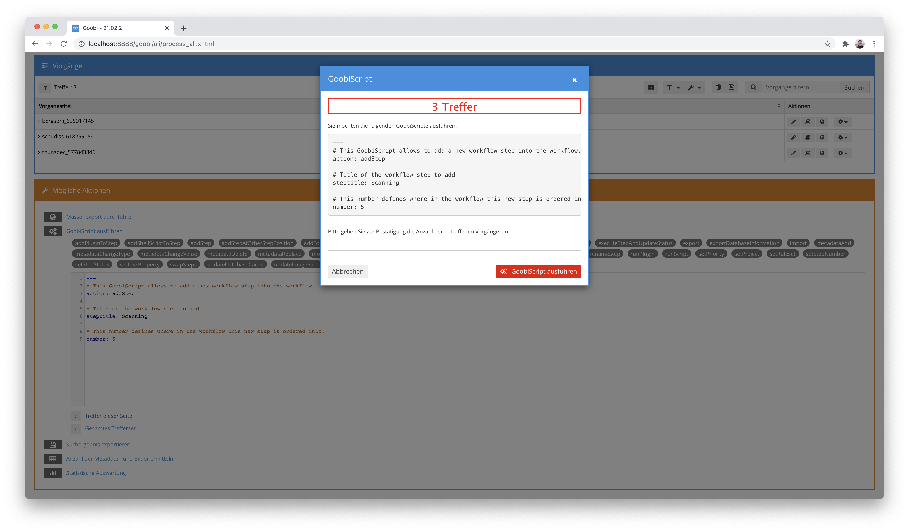
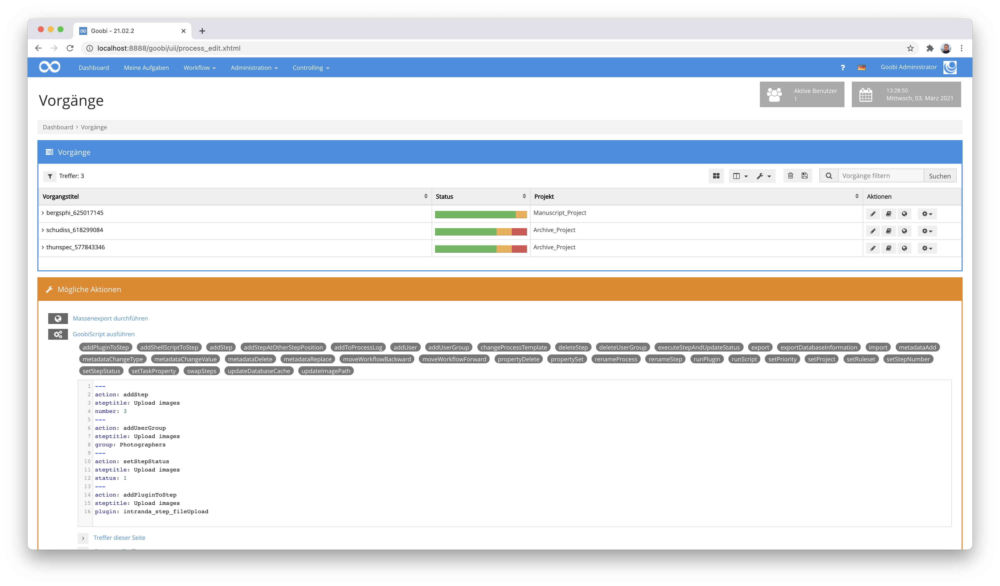
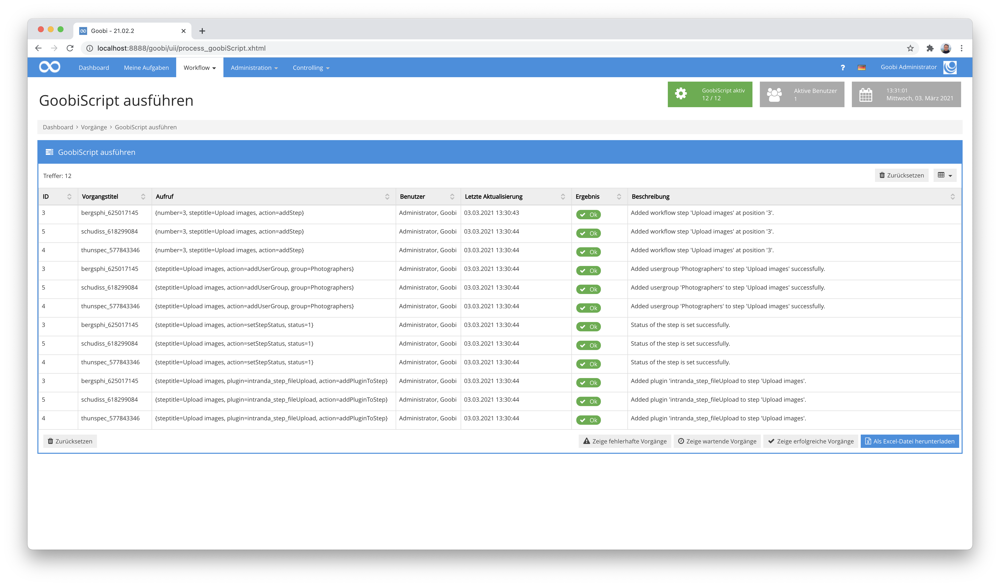

# 7.4. GoobiScript

Innerhalb der möglichen Aktionen, die sich auf mehrere Vorgänge gemeinsam anwenden lassen, besteht die Möglichkeit, GoobiScripts ausführen zu lassen. Klicken Sie hierfür im Bereich der möglichen Aktionen auf die Aktion `GoobiScript` ausführen. Anschließend erhalten Sie eine Übersicht über all diejenigen Aktionen, die sich auf das Trefferset, die aktuelle Trefferseite oder auch nur eine Auswahl an Treffern anwenden lassen.

Jedes GoobiScript besteht aus der Nennung des Namens, welches GoobiScript ausgeführt werden soll, sowie den zugehörigen Parametern. Sämtliche aufgelisteten GoobiScripts zeigen nach einem Klick auf eines dieser Skripte die jeweils relevanten Parameter an. Ersetzen Sie hierbei die beispielshaft angezeigten Parameter durch ihre gewünschten Einstellungen. 



Nach dem Vervollständigen des GoobiScripts können Sie dieses nun auf ausgewählte Treffer oder auch die gesamte Trefferliste anwenden. Vor der Ausführung erscheint jedoch noch eine Sicherheitsabfrage, in der zunächst noch einmal bestätigt werden muss, auf welche Anzahl an Vorgängen das GoobiScript angewendet werden soll.




Bitte beachten Sie, dass Sie ggf. nicht auf alle GoobiScripte Zugriff haben, über die Goobi verfügt. Einige der GoobiScripte können ausgeblendet sein. Unter Umständen wurde Ihrer Benutzergruppe auch nicht der Zugriff auf alle GoobiScripte gewährt. Eine genauer Erläuterung über die Zuweisung der Berechtigungen für GoobiScripte findet sich hier:

 [https://docs.goobi.io/goobi-workflow-de/manager/6#individuelle-goobiscripte](https://docs.goobi.io/goobi-workflow-de/manager/6#individuelle-goobiscripte) 


## Syntax

Die Syntax für die Verwendung von GoobiScript basiert auf der [Auszeichnungssprache YAML](https://de.wikipedia.org/wiki/YAML).  Dadurch ist es möglich, dass jedes GoobiScript über eine integrierte Dokumentation mit kleinen Hilfetexten verfügt und die einzelnen Parameter mit Syntax-Highlighting visuell klar ersichtlich sind. Jeder Parameter steht hierbei in einer eigenen Zeile und ist vom seinem Wert mit einem Doppelpunkt und einem Leerzeichen getrennt. Entgegen früherer Versionen von Goobi sind innerhalb von GoobiScript mittlerweile auch Werte für Parameter möglich, die Leerzeichen enthalten, ohne dass diese mit Anführungszeichen umschlossen werden müssen. Ein einfaches GoobiScript ist beispielhaft so aufgebaut:

```yaml
---
# This GoobiScript allows to add a new workflow step into the workflow.
action: addStep

# Title of the workflow step to add
steptitle: Upload images

# This number defines where in the workflow this new step is ordered into.
number: 3
```

Die Zeilen, die mit einem Hash `#` beginnen, bilden Kommentare zu Hilfezwecken. Sie können vor dem Absenden des GoobiScripts auch weggelassen werden. Entsprechend ist das GoobiScript anschliessend etwas kompakter:

```yaml
---
action: addStep
steptitle: Upload images
number: 3
```

## Mehrere GoobiScripte zusammen ausführen

Dank der Umstellung auf die neue Syntax ist es nun auch relativ unproblematisch, mehrere GoobiScripte gemeinsam starten zu lassen. Zu beachten ist hierbei, dass jedes GoobiScript mit dem Trennzeichen `---` von dem vorherigen GoobiScript getrennt wurde. Auf diese Weise lassen sich mehrere Befehle bequem zusammenstellen und gemeinsan starten. Dies könnte beispielsweise so aussehen:

```yaml
---
# This GoobiScript allows to add a new workflow step into the workflow.
action: addStep

# Title of the workflow step to add
steptitle: Upload images

# This number defines where in the workflow this new step is ordered into.
number: 3

---
# This GoobiScript allows to assign a user group to an existing workflow step.
action: addUserGroup

# Title of the workflow step to be edited
steptitle: Upload images

# Use the name of the user group to be assigned to the selected workflow step.
group: Photographers

---
# This GoobiScript allows to change the current status of a specific step in the workflow.
action: setStepStatus

# Title of the workflow step to be changed
steptitle: Upload images

# Value of the status. Possible values are `0` (locked), `1` (open), `2` (in work), `3` (done), `4` (error), `5` (deactivated)
status: 1

---
# This GoobiScript allows to add a plugin to a defined workflow step
action: addPluginToStep

# Title of the step to adapt
steptitle: Upload images

# Name of the plugin to be assigned to the workflow step
plugin: intranda_step_fileUpload
```
Auch hier können entsprechend für eine verkürzte Anwendung die Kommantare ausgelassen werden, so dass der gesamte Aufruf übersichtlicher wird:

```yaml
---
action: addStep
steptitle: Upload images
number: 3
---
action: addUserGroup
steptitle: Upload images
group: Photographers
---
action: setStepStatus
steptitle: Upload images
status: 1
---
action: addPluginToStep
steptitle: Upload images
plugin: intranda_step_fileUpload
```



Die Verarbeitung solcher mehrfachen GoobiScripte erfolgt nach dem Absenden in der Reihenfolge der Nennung jeweils über alle betroffenen Vorgänge. Bezogen auf dieses Beispiel bedeuted dies, wenn 3 Vorgänge betroffen sind folgende Abarbeitung:




Bitte vermeiden Sie, dass Sie weitere GoobiScripte nur starten sollten, wenn nicht gerade andere GoobiScripte bereits in Bearbeitung sind. Hier kann es ansonsten zu unerwünschten Abbrüchen der Abarbeitung der GoobiScripte kommen. Diese Einschränkung soll allerdings in künftigen Versionen Goobi workflow behoben werden.


## Verfügbare GoobiScripts

Folgende GoobiScripts stehen Ihnen zur Verfügung:

### GoobiScript: addUser

Das GoobiScript `addUser` erlaubt das Hinzufügen eines Benutzers zu einem bestimmten Arbeitsschritt. Bevor Sie dieses GoobiScript anwenden, stellen Sie zunächst sicher, wie der genaue Login-Name desjenigen Nutzers lautet, den Sie für einen Arbeitsschritt hinzufügen möchten. Anschließend prüfen Sie, wie die genaue Bezeichnung für den Arbeitsschritt lautet, zu dem sie den Nutzer hinzufügen möchten. Wählen Sie für den Parameter `steptitle` denjenigen Titel des Arbeitsschrittes, zu dem Sie den Benutzer hinzufügen möchten.

### GoobiScript: addUserGroup

Ähnlich wie bei `addUser` werden auch in diesem GoobiScript Berechtigungen für Arbeitsschritte ergänzt. Versehen Sie den Parameter `steptitle` mit dem vollständigen Titel desjenigen Arbeitsschrittes, zu dem Sie die Benutzergruppe hinzufügen möchten, und nennen Sie den Namen der Benutzergruppe als Parameter `group`, den Sie zu diesem Arbeitsschritt hinzufügen möchten.

### GoobiScript: deleteTiffHeaderFile

Das GoobiScript `deleteTiffHeaderFile` erfordert keine Eingabe zusätzlicher Parameter. Nach dem Ausführen dieses GoobiScripts werden die bereits generierten Tiff-Header-Dateien gelöscht, die durch ein Programm verwendet werden können, das die Tiff-Header in Images schreibt. Auf diese Weise ist es z.B. möglich, zentral geänderte Tiff-Header für die Zukunft anwenden zu lassen, da nicht bestehende Tiff-Header-Dateien bei dem nächsten Zugriff auf die Datei automatisch neu auf der Basis der Konfiguration erzeugt werden.

### GoobiScript: swapSteps

Das GoobiScript `swapSteps` erlaubt Ihnen, dass zwei Arbeitsschritte innerhalb des Workflows mehrerer Vorgänge in der Reihenfolge gegeneinander getauscht werden. Führen Sie hierfür Details der beiden Arbeitsschritte auf, die Sie gegeneinander tauschen möchten. Nennen Sie hierfür die Nummer innerhalb des Workflows sowie den vollständigen Titel des ersten und des zweiten Arbeitsschrittes. Nach dem Ausführen dieses GoobiScripts sind die beiden genannten Arbeitsschritte in ihren Reihenfolgennummern getauscht. Somit lässt sich recht einfach eine Änderung von Workflows über viele Vorgänge hinweg erzielen.

### GoobiScript: importFromFileSystem

Das GoobiScript `importFromFileSystem` importiert aus einem definierten Ausgangsverzeichnis bestehende Imagesets zu den bereits in Goobi vorhandenen Vorgängen. Dies ist z.B. für einen Einsatzzweck nützlich, wo Projekte, die vor dem Einsatz von Goobi erzeugt wurden, einfach nach Goobi importiert werden können. Bitte beachten Sie hierbei, dass sämtliche vorhandenen Image-Verzeichnisse innerhalb des definierten Ausgangsverzeichnisses die gleiche Benennung haben müssen, wie die Vorgänge in Goobi. Nur bei identischer Schreibweise der Ordnernamen und Vorgangstitel kann ein korrekter automatischer Import aus dem Dateisystem erfolgen. Definieren Sie im Parameter `sourcefolder` denjenigen Pfad, innerhalb dessen sich die einzelnen Verzeichnisse für die zu importierenden Vorgänge befinden.

### GoobiScript: setRuleset

Das GoobiScript `setRuleset` erlaubt an zentraler Stelle den zu verwendenden Regelsatz von Goobi für mehrere Vorgänge gemeinsam zu ändern. Dies könnte vor allem dann wichtig sein, wenn nach intensiven Regelsatzbearbeitungen und den dazu gehörigen Tests, die aus Sicherheitsgründen in einem neu erzeugten Regelsatz stattfanden, der neue Regelsatz nun auf die Vorgänge angewendet werden soll. Definieren Sie hierfür einfach mit dem Parameter `ruleset` den Namen für den Regelsatz, wie er innerhalb der Auflistung der Regelsätze in Goobi definiert wurde. Beim Ausführen dieses GoobiScripts wird unabhängig davon, welcher Regelsatz derzeitig für die einzelnen zu ändernden Vorgänge gerade eingestellt ist, der neu zugewiesene Regelsatz eingetragen.

### GoobiScript: deleteStep

Führen Sie das GoobiScript `deleteStep` aus, um für mehrere Vorgänge gemeinsam einen ausgewählten Arbeitsschritt aus dem Workflow zu löschen. Bitte beachten Sie hierbei, dass sämtliche produktionsrelevanten Daten, die für diesen Arbeitsschritt mitgeführt wurden \(z. B. Bearbeiter, Bearbeitungsdatum, Status\) ebenfalls gelöscht werden. Das Ausführen dieses GoobiScripts löscht den in dem Parameter `steptitle` mit seinem vollständigen Titel definierten Arbeitsschritt aus den gewählten Vorgängen.

### GoobiScript: addStep

Das GoobiScript `addStep` ermöglicht das automatische Anlegen eines Arbeitsschrittes mit einem definierten Titel sowie einer definierten Reihenfolgenposition. Setzen Sie den Parameter `steptitle`, um für diesen neu hinzuzufügenden Arbeitsschritt einen Titel zu vergeben und definieren Sie im Parameter `number`, welche Reihenfolgennummer dieser Arbeitsschritt innerhalb des Workflows haben soll.

### GoobiScript: addStepAtOtherStepPosition

Das GoobiScript `addStepAtOtherStepPosition` ermöglicht das Erzeugen eines Arbeitsschrittes mit einem definierten Titel an eine definierte Postion innerhalb des Workflows, an der sich bereits ein anderer Arbeitsschritt befindet. Durch das Einfügen des neuen Arbeitsschrittes werden alle existierenden Arbeitsschritte mit dieser oder einer nachfolgenden Position so nach hinten verschoben, dass der neue Arbeitsschritt an der gewünschten Zielposition eingefügt werden kann. Der Parameter `newsteptitle` erlaubt die Festlegung des Titels für den neuen einzufügenden Arbeitsschritt. Mit dem Parameter `existingsteptitle` wird der Name desjenigen Arbeitsschrittes definiert, der die Zielposition des einzufügenden Schrittes bestimmt. Der Parameter `insertionstrategy` definiert hierbei, ob der neue Schritt vor (`before`) oder nach (`after`) dem angegebenen bereits existierenden Schritt eingefügt werden soll.

### GoobiScript: setStepStatus

Wählen Sie das GoobiScript `setStepStatus` um den Workflowstatus für mehrere Vorgänge gemeinsam zu verändern.  
Definieren Sie im Parameter `steptitle` den Titel desjenigen Arbeitsschrittes, dessen Status Sie ändern möchten, und definieren Sie im Parameter `status` den numerischen Wert für den einzustellenden Status.

Die erlaubten Werte sind hierbei:

```text
0 = gesperrt
1 = offen
2 = in Bearbeitung
3 = geschlossen
4 = Fehler
5 = deaktiviert
```

### GoobiScript: setStepNumber

Führen Sie das GoobiScript `setStepNumber` aus, um die Reihenfolgennummer eines Arbeitsschrittes für mehrere Vorgänge zu verändern. Definieren Sie hierfür im Parameter `steptitle` den vollständigen Titel des zu ändernden Arbeitsschrittes und vergeben Sie mit dem Parameter `number` diejenige Reihenfolgennummer, die alle Arbeitsschritte dieser gewählten Vorgänge erhalten sollen.

### GoobiScript: addShellScriptToStep

Das GoobiScript `addShellScriptToStep` erlaubt das Hinzufügen von Shell-Scripten oder anderen Komandozeilen-Aufrufen zu gewünschten Arbeitsschritten mehrerer Vorgänge.

Definieren Sie hierfür zunächst in dem Parameter `steptitle` den vollständigen Titel der zu ändernden Arbeitsschritte und geben in dem Parameter `script` den vollständigen Befehl an, den Goobi per Kommandozeile bei Aktivierung dieses Arbeitsschrittes ausführen soll.

Beachten Sie hierfür, dass Shell-Kommandos auf Linux-Ebene stets mit `/bin/bash/` beginnen.


Wenn in dem Befehl Parameter gruppiert werden sollen, damit sie als ein Argument an den neuen Prozess übergeben werden, müssen die dafür nötigen Anführungszeichen mit jeweils einem vorangeführten Anführungszeichen escaped werden. Ein Beispiel für den Parameter `script` wäre entsprechend:

`script: /bin/bash /path/to/script.sh "parameter with blanks"`


### GoobiScript: setTaskProperty

Verwenden Sie das GoobiScript `setTaskProperty`, um einzelne Optionen für einen bestimmten Arbeitsschritt in mehreren Vorgängen gemeinsam zu setzen. Definieren Sie im Parameter `steptitle` zunächst den vollständigen Titel des Arbeitsschrittes, den Sie wählen möchten. Im Parameter `property` wählen Sie einen der folgenden Werte aus:

| Parameter | Beschreibung |
| :--- | :--- |
| `metadata` | für die Änderung der Eigenschaft Metadaten |
| `readimages` | für die Änderung der Eigenschaft, ob ein lesender Zugriff auf die Bilder möglich sein soll |
| `writeimages` | für die Eigenschaft, ob ein schreibender Zugriff auf die Bilder erfolgen soll |
| `validate` | für die Eigenschaft, ob bei Abschluss des Arbeitsschrittes eine Validierung erfolgen soll |
| `exportdms` | für die Eigenschaft, ob der Arbeitsschritt einen Export in das Präsentationssystem durchführen können soll |
| `batch` | für die Eigenschaft, ob der Arbeitsschritt zusammen mit allen anderen Arbeitsschritten im Batch-Modus ausgeführt werden soll. |
| `automatic` | für die Eigenschaft, ob der Arbeitsschritt automatisch ausgeführt werden soll |
| `importfileupload` | für die Eigenschaft, ob in diesem Arbeitsschritt ein Datei-Upload für den import verwendet werden soll  \(Bitte beachten, dass diese Funktion keine Verwendung mehr in Goobi findet.\) |
| `acceptandclose` | für die Eigenschaft, ob der Arbeitsschritt ohne Aktion direkt angenommen und wieder geschlossen werden soll. \(Bitte beachten, dass diese Funktion keine Verwendung mehr in Goobi findet.\) |
| `acceptmoduleandclose` | für die Eigenschaft, ob ein Modul eine Arbeitsschritts angenommen   und ausgeführt werden soll und der Arbeitsschritt auch sofort abgeschlossen   werden soll.\(Bitte beachten, dass diese Funktion keine Verwendung mehr in Goobi findet.\) |
| `script` | für die Eigenschaft, ob der Arbeitsschritt ein Script ausführen soll. |
| `delay` | für die Eigenschaft, ob dieser Arbeitsschritt ein Delay-Arbeitsschritt ist, der eine konfigurierte Zeit warten soll |
| `updatemetadataindex` | für die Eigenschaft, dass der interne Datenbank-Index in diesem Arbeitsschritt aktualisiert werden soll |
| `generatedocket` | für die Eigenschaft, ob der Nutzer in diesem Arbeitsschritt einen Laufzettel herunterladen können soll |

Setzen sie darüber hinaus den Wert der hier definierten Aktionen auf aktiviert oder deaktiviert, indem Sie den Parameter `value` mit den Werten `true` oder `false` setzen.


**Beispiel:** Wählen Sie als steptitle Scanning, als property `writeimages` und als value `true` und wenden Sie dieses GoobiScript für mehrere Vorgänge an, so haben Sie für den innerhalb des Workflows definierten Arbeitsschritt `Scanning` erlaubt, dass ein Benutzer, der diesen Arbeitsschritt annimmt, einen schreibenden Zugriff auf die Images in seinem Arbeitsverzeichnis erhält.


### GoobiScript: export

Mit dem GoobiScript `export` können viele Vorgänge exportiert werden. Mit den Parametern `exportImages` und `exportOcr` wird festgelegt, ob die zugehörigen Bilder und die OCR-Daten ebenfalls exportiert werden sollen. Falls im Workflow ein Export-Plugin konfiguriert wurde, wird dieses Plugin geladen und der Export damit durchgeführt, andernfalls findet der Standard-Export statt.

### GoobiScript: runScript

Mittels des GoobiScripts `runScript` können die Skripte eines Arbeitsschrittes außerhalb des regulären Workflows gestartet werden. Hierzu wird mit dem Parameter `steptitle` der vollständige Titel des Arbeitsschrittes angegeben, dessen Skripte gestartet werden sollen.

Enthält der Arbeitsschritt mehrere Skripte, kann der Parameter `script` verwendet werden, um den Namen des zu startenden Skriptes zu übergeben. Andernfalls werden alle Skripte des Arbeitsschrittes in der angegebenen Reihenfolge gestartet.

### GoobiScript: deleteProcess

Führen Sie das GoobiScript `deleteProcess` aus, um Vorgänge zu löschen. Dabei muss mit dem Parameter `contentOnly` \(Werte `true` oder `false`\)angegeben werden, ob nur die Daten aus dem Dateisystem oder auch alle Informationen aus der Datenbank gelöscht werden sollen. Fehlt dieser Wert, wird der Vorgang vollständig entfernt.

### GoobiScript: addPluginToStep

Mit dem GoobiScript `addPluginToStep` können Plugins zu Arbeitsschritten hinzugefügt werden. Legen Sie hierzu mit dem Parameter `steptitle` then Namen des Arbeitsschrittes fest und verwenden Sie im Parameter `plugin` den Identifier des einzufügenden Plugins.

### GoobiScript: updateImagePath

Das GoobiScript `updateImagePath` aktualisiert die Pfadangabe zu den Bilddateien innerhalb der METS-Dateien. Es werden keine Parameter für die Ausführung dieses GoobiScripts benötigt.

### GoobiScript: updateContentFiles

Das GoobiScript `updateContentFiles` aktualisiert die Auflistung aller Bilddateien innerhalb der METS-Dateien. Es werden keine Parameter für die Ausführung dieses GoobiScripts benötigt.

### GoobiScript: addToProcessLog

Das GoobiScript `addToProcessLog` erlaubt das Hinzufügen von Meldungen in das Vorgangslog. Der Parameter `type` bestimmt dabei, wie die Meldung als klassifiziert werden soll. Der Parameter `message` legt den Inhalt der Meldung fest.

| Mögliche Werte für type | Beschreibung |
| :--- | :--- |
| `debug` | Interne Systemmeldungen, vorrangig für Administratoren |
| `info` | Informationen, die jeder Nutzer sehen können soll |
| `warn` | Warnmeldungen, die jeder Nutzer sehen soll |
| `error` | Fehlermeldungen, die jeder Nutzer sehen soll |
| `user` | Benutzerkommentare, die Nutzer sichtbar für alle anderen Nutzer eintragen |

### GoobiScript: setProject

Das GoobiScript `setProject` erlaubt das zuweisen der gewählten Vorgänge zu einem definierten Projekt. Der Parameter `project` gibt dabei an, welches Projekt hierfür verwendet werden soll.

### GoobiScript: runPlugin

Das GoobiScript `runPlugin` erlaubt die Ausführung eines Step-Plugins für die ausgewählten Vorgänge. Der Parameter `steptitle` legt dabei fest, von welchem Arbeitsschritt der betroffenen Vorgänge das Plugin ausgeführt werden soll.

### GoobiScript: import

Das GoobiScript `import` ist nicht für die Ausführung durch Nutzer aus der Oberfläche heraus bestimmt. Stattdessen wird während der Ausführung von Massenimporten aus dem jeweilig ausgewählten Plugin gestartet. Es übernimmt dann die Durchführung eines Massenimport in der Form, wie dies in dem Importplugin festgelegt ist. Der Parameter `plugin` definiert dabei den eindeutigen Namen des Plugins. Der Parameter `identifiers` legt fest, welche Identifier die Datensätze besitzen, die importiert werden sollen. Der Parameter `template` bestimmt, welche Produktionsvorlage für die Durchführung des Imports verwendet werden soll.

### GoobiScript: metadataDelete

Das GoobiScript `metadataDelete` erlaubt das Löschen von Metadaten aus einem Vorgang. Der Parameter `field` legt dabei fest, welchen Typ das Metadatum besitzt, wobei hier der interne Regelsatz-Name verwendet werden muss. Der Parameter `value` definiert, welchen Inhalt das Metadatum aufweisen soll. Der Parameter `ignoreValue` legt fest, ob der Inhalt des Parameters `value` ignoriert werden soll und die Löschung des Metadatums unabhängig von dessen Wert erfolgen soll. Der Parameter `position` erlaubt die Festlegung, wo das Metadatum vorgefunden werden soll:

| Position | Beschreibung |
| :--- | :--- |
| `work` | Dieser Parameter legt fest, dass das Metadatum auf Ebene des physischen Werkes angepasst werden soll. Diese Auswahl wählt automatisch das Hauptelement \(z.B. eine Monographie\) oder im Falle eines Anchor-Datensatzes das Unterelement \(z.B. den Zeitschriftenband\). |
| `child` | Dieser Parameter legt fest, dass das Metadatum auf Ebene des Unterelementes eines Anchor-Datensatzes angepasst werden soll \(z.B. eines Zeitschriftenbandes oder eines Bandes\). |
| `top` | Dieser Parameter legt fest, dass das Metadatum auf Ebene des Anchor-Datensatzes angepasst werden soll \(z.B. auf Ebene einer Zeitschrift oder eines mehrbändigen Werkes\). |
| `any` | Dieser Parameter legt fest, dass das Metadatum auf allen Ebenen des Objekts angepasst werden soll \(z.B. im Band, in allen Kapiteln, Titelblättern, Abbildungen usw.\). |


**Beispiele für den Aufruf:**

Löschen eines Metadatums auf oberster Ebene:

```yaml
---
action: metadataDelete
field: DocLanguage
value: deutsch
position: child
ignoreValue: false
```

Löschen eines Metadatums auf oberster Ebene, allerdings soll der derzeitige Wert ignoriert werden:

```yaml
---
action: metadataDelete
field: DocLanguage
value: deutsch
position: top
ignoreValue: true
```


### GoobiScript: metadataAdd

Das GoobiScript `metadataAdd` erlaubt das Hinzufügen von neuen Metadaten zu einem Vorgang. Der Parameter `field` legt dabei fest, welchen Typ das Metadatum besitzen soll, wobei hier der interne Regelsatz-Name verwendet werden muss. Der Parameter `value` definiert, welchen Inhalt das neue Metadatum erhalten soll. Der Parameter `ignoreErrors` legt fest, ob im Fehlerfall die Bearbeitung und Speicherung der METS-Datei fortgesetzt werden oder die Bearbeitung für das Objekt abgebrochen werden soll. Der Parameter `position` erlaubt die Festlegung, wo das Metadatum eingefügt werden soll:

| Position | Beschreibung |
| :--- | :--- |
| `work` | Dieser Parameter legt fest, dass das Metadatum auf Ebene des physischen Werkes angepasst werden soll. Diese Auswahl wählt automatisch das Hauptelement \(z.B. eine Monographie\) oder im Falle eines Anchor-Datensatzes das Unterelement \(z.B. den Zeitschriftenband\). |
| `child` | Dieser Parameter legt fest, dass das Metadatum auf Ebene des Unterelementes eines Anchor-Datensatzes angepasst werden soll \(z.B. eines Zeitschriftenbandes oder eines Bandes\). |
| `top` | Dieser Parameter legt fest, dass das Metadatum auf Ebene des Anchor-Datensatzes angepasst werden soll \(z.B. auf Ebene einer Zeitschrift oder eines mehrbändigen Werkes\). |
| `any` | Dieser Parameter legt fest, dass das Metadatum auf allen Ebenen des Objekts angepasst werden soll \(z.B. im Band, in allen Kapiteln, Titelblättern, Abbildungen usw.\). |


**Beispiele für den Aufruf:**

Hinzufügen eines Metadatums auf oberster Ebene:

```yaml
---
action: metadataAdd
field: DocLanguage
value: deutschTop
position: top
ignoreErrors: false
```

Hinzufügen eines Metadatums auf zweiter Ebene:

```yaml
---
action: metadataAdd
field: DocLanguage
value: deutschChild
position: child
ignoreErrors: false
```


### GoobiScript: metadataReplace

Das GoobiScript `metadataReplace` erlaubt das Ersetzen eines Metadatums durch einen neuen Wert. Der alte Wert wird somit durch einen anderen Wert ersetzt und ist daher nicht mehr vorhanden. Der Parameter `field` legt fest, welchen Typ das Metadatum besitzt, wobei hier der interne Regelsatz-Name verwendet werden muss. Der Parameter `search` definiert, welchen Inhalt das Metadatum derzeit besitzt. Der Parameter `replace` definiert, welchen Inhalt das Metadatum stattdessen erhalten soll. Der Parameter `position` erlaubt die Festlegung, wo das zu ersetzende Metadatum vorkommen und ersetzt werden soll:

| Position | Beschreibung |
| :--- | :--- |
| `work` | Dieser Parameter legt fest, dass das Metadatum auf Ebene des physischen Werkes angepasst werden soll. Diese Auswahl wählt automatisch das Hauptelement \(z.B. eine Monographie\) oder im Falle eines Anchor-Datensatzes das Unterelement \(z.B. den Zeitschriftenband\). |
| `child` | Dieser Parameter legt fest, dass das Metadatum auf Ebene des Unterelementes eines Anchor-Datensatzes angepasst werden soll \(z.B. eines Zeitschriftenbandes oder eines Bandes\). |
| `top` | Dieser Parameter legt fest, dass das Metadatum auf Ebene des Anchor-Datensatzes angepasst werden soll \(z.B. auf Ebene einer Zeitschrift oder eines mehrbändigen Werkes\). |
| `any` | Dieser Parameter legt fest, dass das Metadatum auf allen Ebenen des Objekts angepasst werden soll \(z.B. im Band, in allen Kapiteln, Titelblättern, Abbildungen usw.\). |


**Beispiele für den Aufruf:**

Suchen eines Wertes innerhalb eines bestimmten Metadatums auf oberster Ebene und ersetzen durch etwas anderes:

```yaml
---
action: metadataReplace
field: DocLanguage
search: deutschTop
replace: deutschNewTop
regularExpression: false
position: top
```

Suchen eines Wertes innerhalb eines bestimmten Metadatums auf zweiter Ebene und ersetzen durch etwas anderes:

```yaml
---
action: metadataReplace
field: DocLanguage
search: deutschChild
replace: deutschNewChild
regularExpression: false
position: child
```


### GoobiScript: metadataChangeValue

Das GoobiScript `metadataChangeValue` erlaubt eine Manipulation bestehender Metadaten eines Vorgangs. Hierbei können zu einem bestehenden Metadatum Präfixe oder Suffixe eingefügt werden, um den Inhalt eines Metadatum zu erweitern. Der Parameter `field` legt fest, welchen Typ das Metadatum besitzt, wobei hier der interne Regelsatz-Name verwendet werden muss. Der Inhalt des Parameter `prefix` dient zum Voranstellen eines Textes vor den aktuellen Wert des Metadatum. Der Inhalt des Parameter `suffix` dient zum Anfügen eines Textes hinter den aktuellen Wert des Metadatum. Der Parameter `position` erlaubt die Festlegung, wo das Metadatum vorliegen und angepasst werden soll:

| Position | Beschreibung |
| :--- | :--- |
| `work` | Dieser Parameter legt fest, dass das Metadatum auf Ebene des physischen Werkes angepasst werden soll. Diese Auswahl wählt automatisch das Hauptelement \(z.B. eine Monographie\) oder im Falle eines Anchor-Datensatzes das Unterelement \(z.B. den Zeitschriftenband\). |
| `child` | Dieser Parameter legt fest, dass das Metadatum auf Ebene des Unterelementes eines Anchor-Datensatzes angepasst werden soll \(z.B. eines Zeitschriftenbandes oder eines Bandes\). |
| `top` | Dieser Parameter legt fest, dass das Metadatum auf Ebene des Anchor-Datensatzes angepasst werden soll \(z.B. auf Ebene einer Zeitschrift oder eines mehrbändigen Werkes\). |
| `any` | Dieser Parameter legt fest, dass das Metadatum auf allen Ebenen des Objekts angepasst werden soll \(z.B. im Band, in allen Kapiteln, Titelblättern, Abbildungen usw.\). |


**Beispiele für den Aufruf:**

Hinzufügen eines Präfix an ein Metadatum auf oberster Ebene:

```yaml
---
action: metadataChangeValue
field: DocLanguage
prefix: start_
suffix: _end
position: top
```

Hinzufügen eines Suffix an ein Metadatum auf oberster Ebene, aber es muss ein bestimmter Wert im Metadatum vorkommen:

```yaml
---
action: metadataChangeValue
field: DocLanguage
suffix: ist eine schwierige Sprache
position: top
condition: Deutsch
```

Hinzufügen eines Präfix und eines Suffix an ein Metadatum auf zweiter Ebene:

```yaml
---
action: metadataChangeValue
field: DocLanguage
prefix: start_
suffix: _end
position: child
```


### GoobiScript: metadataChangeType

Das GoobiScript `metadataChangeType` ändert den Typ eines Metadatums. Der Aufruf verlangt drei Parameter. Der Parameter `oldType` legt fest, wie der alte Typ lauten soll. Der Parameter `newType` legt den neuen Typ fest. Der Parameter `ignoreErrors` legt fest, ob im Fehlerfall die Bearbeitung und Speicherung der METS-Datei fortgesetzt werden oder die Bearbeitung für das Objekt abgebrochen werden soll. Der Parameter `position` erlaubt die Festlegung, wo das Metadatum vorliegen und angepasst werdern sein soll:

| Position | Beschreibung |
| :--- | :--- |
| `work` | Dieser Parameter legt fest, dass das Metadatum auf Ebene des physischen Werkes angepasst werden soll. Diese Auswahl wählt automatisch das Hauptelement \(z.B. eine Monographie\) oder im Falle eines Anchor-Datensatzes das Unterelement \(z.B. den Zeitschriftenband\). |
| `child` | Dieser Parameter legt fest, dass das Metadatum auf Ebene des Unterelementes eines Anchor-Datensatzes angepasst werden soll \(z.B. eines Zeitschriftenbandes oder eines Bandes\). |
| `top` | Dieser Parameter legt fest, dass das Metadatum auf Ebene des Anchor-Datensatzes angepasst werden soll \(z.B. auf Ebene einer Zeitschrift oder eines mehrbändigen Werkes\). |
| `any` | Dieser Parameter legt fest, dass das Metadatum auf allen Ebenen des Objekts angepasst werden soll \(z.B. im Band, in allen Kapiteln, Titelblättern, Abbildungen usw.\). |

### GoobiScript: changeProcessTemplate

Das GoobiScript `changeProcessTemplate` erlaubt das Ändern des Workflows für die betroffenen Vorgänge. Der Parameter `templateName` definiert hierbei, welche Produktionsvorlage für die Vorgänge gelten soll. Wird dieses GoobiScript auf Vorgänge angewendet, so versucht Goobi die bisher bereits durchgeführten Arbeitsschritte möglichst auch in dem aktualisierten Workflow auf den identischen Status zu setzen. Dies kann ausschließlich gelingen, wenn die Arbeitsschritte die gleichen Titel besitzen.

### GoobiScript: updateDatabaseCache

Das GoobiScript `updateDatabaseCache` sorgt dafür, dass die internen Datenbanktabelle der Goobi-Datenbank über den Status der Workflows und der zugehörigen Mediendateien sowie Metadaten aktualisiert werden. Dies ist dann wichtig, wenn die Metadaten beispielsweise außerhalb von Goobi verändert wurden oder wenn ein neues Indexfeld definiert wurde. Unter anderem basieren verschiedene Statistiken auf diesen Datenbanktabellen und benötigen daher möglichst aktuelle Werte für die Visualisierung von Informationen.

Es werden keine Parameter für die Ausführung dieses GoobiScripts benötigt.

### GoobiScript: propertySet

Das GoobiScript `propertySet` erlaubt das Hinzufügen und Ändern einer Vorgangseigenschaft. Der Parameter `name` legt dabei fest, welche Bezeichnung die Eigenschaft besitzt. Der Parameter `value` legt fest, welchen Wert die Eigenschaft erhalten soll. Besteht bereits eine Eigenschaft mit der hier angegebenen Bezeichnung, so wird deren Wert auf den hier angegebenen Wert geändert.

### GoobiScript: propertyDelete

Das GoobiScript `propertyDelete` erlaubt das Löschen von Vorgangseigenschaften. Der Parameter `name` legt hierbei fest, welche Bezeichnung die Eigenschaften haben sollen, die gelöscht werden sollen.

### GoobiScript: executeStepAndUpdateStatus

Das GoobiScript `executeStepAndUpdateStatus` führt einen gewählten Arbeitsschritt durch und aktualisiert anschließend den Workflow für die weitere Verarbeitung der nachfolgenden Arbeitsschritte. Der Parameter `steptitle` legt dabei fest, welcher Arbeitsschritt ausgeführt werden soll. Goobi prüft nach dem Aufruf, ob es sich hierbei um einen Script-Schritt, einen Export-Schritt, einen Plugin-Schritt oder einen HTTP-Schritt handelt und führt diesen entsprechend durch. Ist der Arbeitsschritt als automatisch gekennzeichnet, so wird nach der Durchführung der weitere Workflowverlauf fortgesetzt. Wenn der Aufruf hingegen einen Wartemodus auslöst, so wird der Status nicht von Goobi geändert sondern wartet auf Statusänderung durch das jeweilige Plugin oder Script selbst. Tritt während der Ausführung des gestarteten Schrittes ein Fehler auf, wird der Status des Arbeitsschritts im Workflow auf `Fehler` gesetzt.

### GoobiScript: exportDatabaseInformation

Das GoobiScript `exportDatabaseInformation` führt für alle gewählten Goobi-Vorgänge einen Export sämtlicher Datenbankinhalte des Vorgangs in eine interne XML-Datei durch. Diese befindet sich anschließend im Dateisystem von Goobi innerhalb des Vorgangsordners und trägt einen Dateinamen, der für den Import der Daten in einer anderen Goobi-Instanz verwendet werden kann. Der Pfad einer solchen Datei lautet z.B.

```text
/opt/digiverso/goobi/metadata/123/123_db_export.xml
```

Es werden keine Parameter für die Ausführung dieses GoobiScripts benötigt.

### GoobiScript: moveWorkflowForward

Mit dem GoobiScript `moveWorkflowForward` läßt sich der Status des Workflows Arbeitsschritt für Arbeitsschritt vorwärts bewegen. Mit jeder Ausführung dieses GoobiScripts wird entsprechend der jeweils aktive Arbeitsschritt verändert \(z.B. von `offen` zu `in Bearbeitung`\).

### GoobiScript: moveWorkflowBackward

Mit dem GoobiScript `moveWorkflowBackward` läßt sich der Status des Workflows Arbeitsschritt für Arbeitsschritt rückwärts bewegen. Mit jeder Ausführung dieses GoobiScripts wird entsprechend der jeweils aktive Arbeitsschritt verändert \(z.B. von `abgeschlossen` zu `in Bearbeitung`\).

### GoobiScript: setPriority

Mit dem GoobiScript `setPriority` kann die Priorität einzelner oder auch aller Arbeitsschritte von Vorgängen festgelegt werden. Der Parameter `priority` bestimmt, welche Priorität hierbei verwendet werden soll. Dabei stehen als Werte `standard`, `high`, `higher`, `highest` und `correction` zur Verfügung. Der Parameter `steptitle` legt fest, für welchen Arbeitsschritt die Priorität gesetzt werden soll. Wird der Parameter `steptitle` nicht angegeben, wird die Priorität für alle Arbeitsschritte der gewählten Vorgänge geändert.

