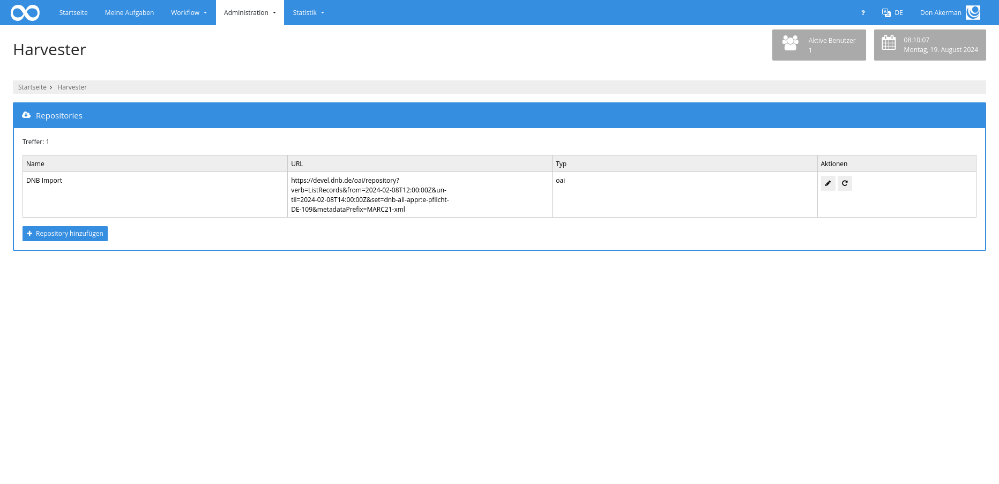
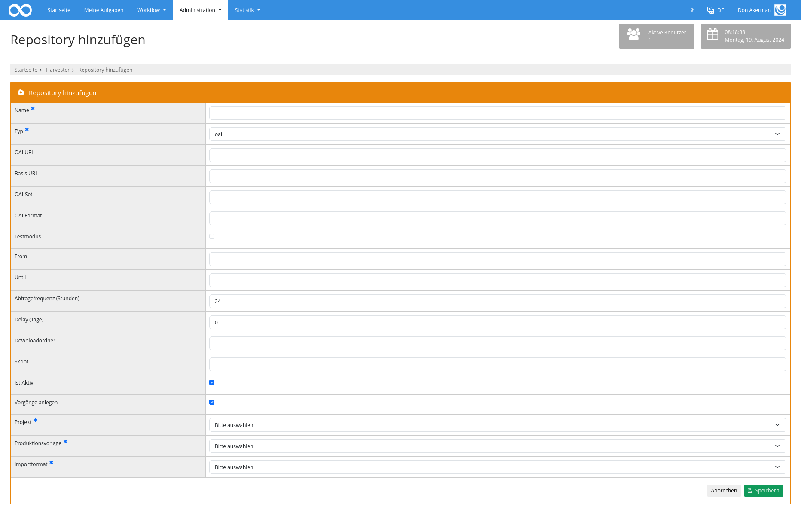

# 9. Harvester

Der Harvester kann genutzt werden, um automatisiert Daten aus externen Repositorien zu importieren. 

## Übersicht

Um auf den Harvester zugreifen zu können, muss der Nutzer über das Recht `Harvester Repositories bearbeiten` verfügen. Dann steht innerhalb des Menüpunkts `Administration` der Punkt `Harvester` zur Verfügung. Dort öffnet sich dann die Maske für die Auflistung aller konfigurierten Repositorien. 

Die Funktion ein neues `Repository hinzufügen` öffnet die Bearbeitungsmaske zum Anlegen eines neuen Repositorium. 

## Konfiguration

Als erstes muss ein Name angegeben werden und der Protokolltyp ausgewählt werden. Dabei stehen `OAI-PMH`, `Internet Archive Websuche`, `Internet Archive CLI` und die `BACH API` zur Verfügung. 

Bei `BACH` müssen die `URL` zum BACH-Server und der `Authentifizierungstoken` angegeben werden.

Wird die `Internet Archive Websuche` gewählt, muss die `URL` zum Interface zur erweiterten Suche angegeben werden. Um nur bestimmte Werke zu importieren, muss auch ein Suchfilter als Teil der URL angegeben werden.
Auf diese Weise können nur Werke importiert werden, die als Open Access markiert sind und veröffentlicht wurden.

Um auch zugriffsgeschützte Werke zu importieren, muss das `Internet Archive CLI` genutzt werden. Hierzu muss das CLI installiert worden sein, üblicherweise unter dem Pfad `/usr/local/bin/ia`. Daneben müssen die Environment Variablen `IA_USERNAME` und `IA_PASSWORD` gesetzt sein. Auch hier kann ein Suchfilter angegeben werden, um das Trefferset einzugrenzen.

Bei `OAI-PMH` muss die `URL` zum OAI Server angegeben werden. Wenn die URL die Parameter `set` und `format` enthält, werden diese Informationen zusammen mit der Basis URL automatisch ermittelt. Ansonsten müssen sie von Hand angegeben werden.

Bei OAI können außerdem noch die Angaben `From` und `Until` gesetzt werden, um die Abfrage auf einen bestimmten Zeitraum zu begrenzen. Wenn die Felder leer sind, wird automatisch der gesammte Zeitraum seit der letzten Abfrage abgefragt.

Zusätzlich kann der Testmodus aktiviert werden. Dann werden nur die ersten Datensätze des Treffersets importiert, ohne das der resumptionToken ausgewertet wird.

Die weiteren Einstellungen gelten dann für alle Typen. 

Die `Abfragefrequenz` definiert, in welchen Abständen das Repository abgefragt werden soll. Die Angabe ist in Stunden.

`Delay` definiert einen Zeitraum, bis zu dem neue Daten abgefragt werden sollen. Wenn hier eine Zahl größer 0 steht, wird bei einer Suche nicht nach allen Daten bis zum aktuellen Datum gesucht, sondern nach Daten, die bis zur konfigurierten Anzahl an Tagen vor dem aktuellen Zeitpunkt veröffentlich wurden. 

Im Feld `Downloadordner` wird festgelegt, in welchen Ordner die Daten heruntergeladen und gespeichert werden sollen. Der Ordner wird automatisch beim ersten Harvesting erzeugt, wenn er noch nicht existiert.

Optional kann anschließend ein `Skript` aufgerufen werden, das auf jede heruntergeladene Datei ausgeführt wird. Damit kann zum Beispiel eine XSL Transformation jede XML Datei durchgeführt werden oder zusätzliche Informationen in alle JSON Dateien eingetragen werden.

Wenn die Daten nicht nur heruntergeladen, sondern auch als Goobi-Vorgänge import werden sollen, muss die Checkbox für `Vorgänge anlegen` aktiviert werden.

Anschließend kann das zu verwendende `Projekt`, die `Produktionsvorlage` und das `Format` festgelegt werden.

## Harvesting von Hand starten

Um das Harvesting von Hand zu starten, kann in der Übersicht der in der Spalte Aktionen der Button Jetzt einmal ausführen genutzt werden. Wenn das Projekt aktiv ist, wird das Harvesting dann einmalig gestartet.

## Automatisches Harvesting

Das automatische Harvesting findet regelmäßig statt. Hierzu muss definiert werden, zu welchem Zeitpunkt es laufen soll. Das passsiert in der Datei `goobi_config.properties` durch die Zeile `harvesterJob=0 0 */1 * * ?`. Hierdurch findet die Prüfung stündlich zur vollen Stunde statt. Die Konfiguration erfolgt in chron-Syntax und lässt auch beliebige andere Zeiträume zu.

Wenn die Prüfung durchgeführt wird, wird für jedes konfgurierte, aktive Repository geprüft, ob der letzte Durchlauf länger her ist, als der im Feld Abfragefrequenz konfigurierte Wert. Wenn dies der Fall ist, wird das Harvesting gestartet.

## Harvesting

Wenn ein neues Harvesting angestoßen wird, dann werden als erstes die Datensätze ermittelt, die seit dem letzten Durchlauf im Repositorium veröffentlicht oder aktualisiert wurden. Für jeden Datensatz wird geprüft, ob dieser bereits einmal verarbeitet wurde oder neu ist. Neue Dateien werden dann in den konfigurierten Ordner herunter geladen. Falls ein Skript konfiguriert wurde, wird es für jede heruntergeladene Datei aufgerufen.

Sofern konfiguriert, werden die Dateien nun importiert. Im Fall von marc-xml oder pica-xml wird dabei als erstes der Dokumententyp ermittelt. Übergeordneten Daten wie Zeitschriftentitel oder Mehrbändigen Werken werden übersprungen. Bei untergeordneten Dokumenten (Zeitschriftenausgaben, Bände eines Mehrbändigen Werkes) wird das übergeordnete Werk gesucht und ebenfalls heruntergeladen. Die Metadaten werden dann auf Basis des Regelsatzes aus der konfigurierten Produktionsvorlage geparsed. 

Der Vorgangstitel wird auf Basis des Identifiers gebildet.
