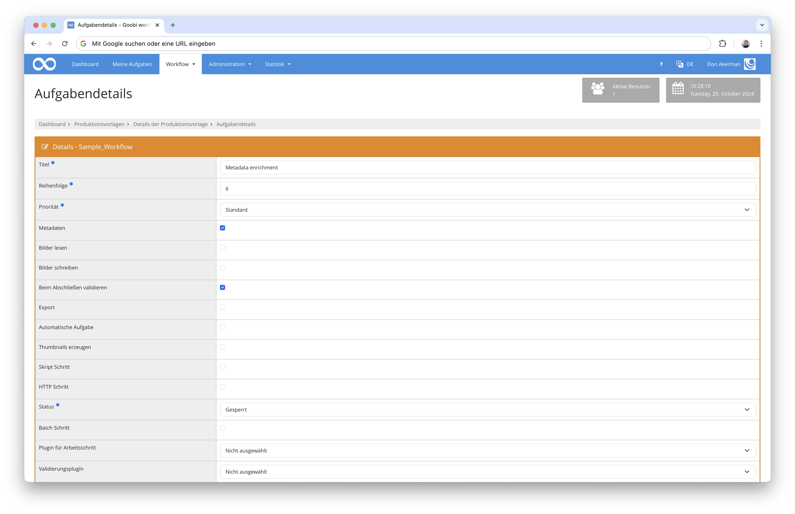

# 2.12. Aufgabendetails bearbeiten

Auf der hier dargestellten Seite können die Details und Plugins für Aufgaben konfiguriert werden. Die Seite unterscheidet sich nicht wesentlich zwischen den Aufgaben von Produktionsvorlagen und denen von bereits existierenden Vorgängen. Unterschiede sind gegebenenfalls gekennzeichnet.



## Titel

In diesem Feld wird der Titel der Aufgabe angegeben. Dieser kann frei gewählt werden. Es sollte allerdings berücksichtigt werden, dass sich zum Beispiel GoobiScript Aufrufe an den jeweiligen Aufgabentiteln orientieren, um automatisiert über viele Vorgänge hinweg Hintergrundaufgaben auszuführen.

Daher sollten Titel kurz, aussagekräftig und eindeutig sein. Leerzeichen und Sonderzeichen sind dabei erlaubt.

## Reihenfolge

Mit der Reihenfolgennummer wird angegeben, an welcher Stelle eine Aufgabe in einer Produktionsvorlage oder einem existierenden Vorgang steht. Es muss hier dementsprechend eine Ganzzahl angegeben werden.

Die Reihenfolgennummer wird einerseits dazu verwendet, alle Aufgaben eines Vorgangs in der korrekten Bearbeitungsreihenfolge darzustellen. Andererseits werden beim Abschließen von Aufgaben diejenigen nächsten Aufgaben innerhalb eines Vorgangs freigeschaltet, die der Reihenfolge entsprechend der aktuellen Aufgabe folgen.

Es können mehrere Aufgaben die selbe Reihenfolgennummer haben. Dies bedeutet dann für Goobi, dass die betreffenden Aufgaben gleichzeitig ausgeführt werden dürfen. Eine parallele Bearbeitung funktioniert sowohl mit automatischen, als auch mit manuellen Aufgaben (zum Beispiel wenn mehrere Mitarbeiter parallel an einem Vorgang arbeiten).

Ist die Aufgabenreihenfolge eines Vorgangs lückenhaft konfiguriert (zum Beispiel 1, 2, 3, 6), so springt Goobi direkt weiter zur Aufgabe mit der nächstgrößeren Nummer.

Die Reihenfolge von Aufgaben spielt unter anderem auch bei GoobiScript Aufrufen eine wichtige Rolle. Dort können, basierend auf der hier angegebenen Nummer, weitere administrative Vorkehrungen getroffen werden.

## Parallele Aufgaben erlauben

**Diese Einstellung ist nur beim Anlegen einer neuen Aufgabe innerhalb einer Produktionsvorlage verfügbar.**

Diese Einstellung spielt zudem nur eine Rolle, wenn neue Aufgaben zwischen bereits bestehenden Aufgaben eingefügt werden sollen.

Ist diese Option **gesetzt**, so wird beim Anlegen der Aufgabe die Reihenfolgennummer direkt gesetzt. Dabei kann es passieren, dass eine andere Aufgabe bereits mit der selben Nummer existiert und beide Aufgaben später parallel bearbeitet werden können.

Ist diese Option **nicht gesetzt**, so werden im Falle einer Dopplung der Reihenfolgennummer mit derer einer anderen bereits bestehenden Aufgabe beim Speichern die Reihenfolgennummern der anderen und aller danach folgenden Aufgaben um genau eine Nummer nach hinten verschoben. Damit wird erzielt, dass die neu im Vorgang eingefügte Aufgabe keine bereits existierende Reihenfolgennummer dupliziert und trotzdem die danach folgenden Aufgaben ihre relativ zueinander definierte Nummerierung (inklusive fehlenden und doppelt vergebenen Nummern) beibehalten können.

Sollte sich im Nachhinein herausstellen, dass diese Option beim Anlegen der Aufgabe falsch gewählt worden ist und sämtliche danach folgende Aufgaben eine "falsche" Reihenfolgennummer haben, so gibt es zwei mögliche Lösungen: Bei kleinen Anpassungen kann jederzeit in der Aufgabenübersicht der Produktionsvorlage mit den dafür zur Verfügung stehenden Buttons die Reihenfolgennummer angepasst werden. Bei großen Anpassungen, oder wenn bereits Vorgänge zu der aktuellen Produktionsvorlage existieren, wird empfohlen, ein GoobiScript so zu schreiben, dass es alle "falschen" Nummern anpasst und an sämtlichen falsch nummerierten Vorgängen ausgeführt wird.

## Priorität

In dieser Liste kann eine Priorität für die aktuelle Aufgabe ausgewählt werden. Dabei ist zu beachten, dass die Prioritäten `Standard`, `Priorität`, `Hohe Priorität` und `Höchste Priorität` nur dazu gedacht sind, die Wichtigkeit der Abarbeitung von Aufgaben visuell darzustellen. Diese haben keine weitere technische Auswirkung auf den entsprechenden Vorgang.

Die Option `Korrektur` hat zwar ebenfalls keine Auswirkung auf den Vorgang, wird allerdings automatisch gesetzt, wenn das Endergebnis in einer abzuschließenden Aufgabe nicht akzeptiert werden soll und eine Korrekturmeldung gesendet wird.

## Metadaten

Diese Option kann aktiviert werden, wenn es im Sinne der Aufgabe ist, Metadaten zu bearbeiten.

Ist eine Aufgabe mit der Eigenschaft `Metadaten` gekennzeichnet, so werden an verschiedenen Stellen in der Benutzeroberfläche weitere Symbole und Optionen eingeblendet, um auf Metadaten zuzugreifen. So wird zum Beispiel auch der Button zum Aufrufen des Metadeteneditors eingeblendet, wenn eine Aufgabe diese Eigenschaft hat.

Sollen Metadaten in einer Aufgabe hochgeladen, heruntergeladen, validiert oder auf eine andere Art und Weise verwendet werden, so muss diese Option ausgewählt werden.

## Bilder lesen

Diese Option kann aktiviert werden, wenn der Benutzer in dieser Aufgabe einen Lesezugriff auf Bilddateien in seinem Benutzerordner (auf dem Goobi-Server) bekommen soll. Dies kann zum Beispiel der Fall sein, wenn Bilder heruntergeladen oder zur Qualitätsprüfung angezeigt werden sollen.

## Bilder schreiben

Diese Option kann aktiviert werden, wenn der Benutzer in dieser Aufgabe einen Schreibzugriff auf Bilddateien in seinem Benutzerordner (auf dem Goobi-Server) bekommen soll. Dies ist immer dann erforderlich, wenn Bilder hochgeladen oder bearbeitet werden sollen.

## Beim Abschließen validieren

Diese Option kann aktiviert werden, um beim Abschließen dieser Aufgabe die Metadaten des Vorgangs zu validieren. Diese Validierung hat nichts mit dem Validierungsplugin (siehe unten) zu tun. Die hier eingestellte Art der Validierung prüft, ob alle Metadaten, Strukturelemente (DocStructs) und Seitenzählungen entsprechend des Regelsatzes angewendet wurden.

## Export

Diese Option kann aktiviert werden, wenn es im Sinne der Aufgabe ist, Daten für die Weiterverarbeitung mit anderen Systemen zu exportieren. Dies können zum Beispiel andere Datenbankformate, Content-Management-Systeme (CMS) oder einfach nur bestimmte Dateiformate sein. Wird diese Aufgabe als Export-Aufgabe definiert, so muss im Feld `Plugin für Arbeitsschritt` ein Exportplugin ausgewählt werden. Exportplugins beginnen üblicherweise mit dem Präfix `intranda_export_`.

Ist diese Aufgabe gleichzeitig eine automatische Aufgabe und eine Exportaufgabe, so findet der Export automatisch statt. Unabhängig davon bekommt der Benutzer einen Export-Button bei der entsprechenden Aufgabe in der Übersicht angezeigt und kann den Datenbestand auch manuell exportieren.

## Aufgabe überspringen

Diese Option kann ausgewählt werden, wenn die Aufgabe im Vorgang übersprungen werden soll. Hat eine Aufgabe diese Eigenschaft, so wird sie automatisch geschlossen, sobald sie ein Nutzer annimmt. Ist diese Aufgabe eine automatische Aufgabe, so wird sie ebenfalls übersprungen und dabei geschlossen.

## Automatische Aufgabe

Verschiedene Arten von Aufgaben können als automatische Aufgaben konfiguriert werden. Damit ist es möglich, dass zum Beispiel Plugins oder GoobiScript Aufrufe entweder direkt oder in einer der zur Verfügung stehenden Warteschlangen ausgeführt werden.

Konkret können folgende Aufgabentypen automatisiert werden: Interne Aufgaben (`intranda_step_*`), Exportaufgaben (`intranda_export_*`), Skript-Aufgaben, HTTP-Aufgaben und Zeitverzögerungsaufgaben (`intranda_delay_*`). Es ist jeweils darauf zu achten, dass das entsprechende Plugin oder Skript wie im entsprechenden Kapitel beschrieben ausgewählt wird.

Um Warteschlangen nutzen zu können, müssen diese zunächst in den entsprechenden Konfigurationsdateien (`goobi_config.properties` und `goobi_activemq.xml`) eingeschaltet und eingerichtet werden. Wird danach diese Option aktiviert, so erscheint unterhalb der Checkbox ein Dropdown-Menü, aus denen die gewünschte Warteschlange ausgewählt werden kann.

Wird die Option `Nicht in Warteschlange ausführen` gewählt, so wird das entsprechende Plugin oder Skript direkt ausgeführt, sobald die Aufgabe im Vorgang erreicht wird. Diese Option wird nur für Aufgaben empfohlen, die durch den Benutzer in Echtzeit ausgelöst werden sollen, indem zum Beispiel die vorherige Aufgabe abgeschlossen wird.

Mit den Optionen `Warteschlange für schnelle Jobs` und `Warteschlange für langsame Jobs` stehen zwei unabhängig voneinander arbeitende Warteschlangen zur Verfügung, die im Normalfall für die meisten automatischen Aufgaben die richtige Wahl sind. Dabei ist die schnelle Warteschlange für Aufgaben gedacht, die eine eher kurze Ausführzeit haben und zeitnah abgeschlossen werden sollen.

Die langsame Warteschlange hingegen sollte für Aufgaben verwendet werden, die viel Rechenzeit benötigen und bei denen es nicht wirklich relevant ist, wie schnell sie abgeschlossen werden. So kann die langsame Warteschlange zum Beispiel für große Mengen an Bildexporten, OCR-Analysen, 3D-Berechnungen oder andere komplexe Anwendungen genutzt werden. Somit ist diese Warteschlange auch für Aufgaben geeignet, die mitunter über viele Tausende Vorgänge hinweg eine Gesamtrechenzeit von Stunden, Tagen oder sogar noch längeren Zeiträumen beanspruchen.

Goobi priorisiert allerdings standardmäßig immer Aufgaben, die durch Nutzer in Echtzeit ausgeführt werden und Aufgaben, die sich in der schnellen Warteschlange befinden. Ist Goobi tagsüber zum Beispiel durch die Arbeit vieler aktiver Mitarbeiter ausgelastet und besteht zusätzlich eine gut gefüllte langsame Warteschlange, ist es daher üblich, dass diese ihren größten Fortschritt nachts erzielt.

Zusätzlich gibt es eine `Von außen erreichbare Warteschlange`. Diese kann von REST-API-Anfragen verwendet werden. Passende REST-API-Anfragen werden üblicherweise durch Plugins zur Verfügung gestellt.

## Thumbnails erzeugen

Soll die Aufgabe dazu verwendet werden, Vorschaubilder (engl. thumbnails) zu generieren, so muss diese Checkbox ausgewählt werden. Es erscheint dann ein Texteingabefeld, in dem eine Beispielkonfiguration für das Generieren von Vorschaubildern angegeben ist. Diese sollte für die projekteigenen Bedürfnisse angepasst werden.

Das Texteingabefeld umfasst mehrere Zeilen, in denen eine YAML-kompatible Notation von Schlüssel-Wert-Paaren erwartet wird. Schlüssel-Wert-Paare werden durch jeweils einen Doppelpunkt (`:`) getrennt und jede Zeile darf genau ein Schlüssel-Wert-Paar beinhalten. Dabei steht in der ersten Zeile die Zeichenfolge `---`, um den Beginn des Datensatzes anzuzeigen. Kommentare sind mit einer Raute (`#`) gekennzeichnet und dürfen sowohl in einer eigenen Zeile, als auch am Ende einer inhaltlich genutzten Zeile stehen. Diese werden vom Interpreter ignoriert. Damit ist es auch möglich, bei experimentellen Konfigurationen bestimmte Teile "auszukommentieren".

Zu Beginn steht folgende Beispielkonfiguration in dem Texteingabefeld:

```yaml
---
Master: false  #use master image directory 
Media: false  #use media image directory 
Img_directory: "" #set path to custom image directory 
Custom_script_command: "" #command to execute custom thumbnail generation script 
Sizes: #define thumbnail sizes 
- 800
```

Dabei haben die Variablen folgende Bedeutung (Details, siehe unten):

| Variable                | Datentyp             | Standardwert | Bedeutung |
| ----------------------- | -------------------- | ------------ | --------- |
| `Master`                | `Boolean`            | `false`      | Dieser Wert kann auf `true` gesetzt werden, um die Generierung von Vorschaubildern aller Bilddateien im `master`-Ordner zu aktivieren. |
| `Media`                 | `Boolean`            | `false`      | Dieser Wert kann auf `true` gesetzt werden, um die Generierung von Vorschaubildern aller Bilddateien im `media`-Ordner zu aktivieren. |
| `Img_directory`         | `Text`               | `""`         | Hier kann optional ein weiterer Ordner mit Bilddateien angegeben werden.  |
| `Custom_script_command` | `Text`               | `""`         | Hier kann optional ein alternatives Skript oder ausführbares Programm angegeben werden, mit dem Vorschaubilder generiert werden sollen. |
| `Sizes`                 | Liste von Ganzzahlen | `800`        | Hier muss eine Liste von Bilddateigrößen (in Pixel) angegeben werden, in denen die Bilder generiert werden. |

Zu beachten ist, dass `Sizes` eine Liste entgegennimmt. Dabei beginnt jede Zeile mit der Zeichenfolge `- ` und beinhaltet dann eine Ganzzahl. Die Listeneinträge müssen direkt der Zeile `Sizes:` folgen. Text-Werte müssen in doppelten Anführungszeichen `"` eingefasst sein. Boolesche Werte können direkt verwendet werden und können entweder auf `true` oder `false` gesetzt werden, um das Feature ein- oder auszuschalten.

**Master**

Wird dieser Wert auf `true` gesetzt, so werden Vorschaubilder für alle Bilddateien innerhalb des `master` Ordners (üblicherweise `/opt/digiverso/goobi/metadata/{processId}/images/{processId}_master/`) generiert und im `thumbnails` Ordner (üblicherweise `/opt/digiverso/goobi/metadata/{processId}/images/thumbs/{processId}_master_{size}/`) gespeichert.

**Media**

Wird dieser Wert auf `true` gesetzt, so werden Vorschaubilder für alle Bilddateien innerhalb des `media` Ordners (üblicherweise `/opt/digiverso/goobi/metadata/{processId}/images/{processId}_media/`) generiert und im `thumbnails` Ordner (üblicherweise `/opt/digiverso/goobi/metadata/{processId}/images/thumbs/{processId}_media/_{size}`) gespeichert.

**Img_Directory**

An dieser Stelle kann ein dritter, weiterer Ordner für die Generierung der Vorschaubilder angegeben werden. Die Generierung verhält sich hier genau so, wie auch beim `master`-Ordner und beim `media`-Ordner. Dieser Ordner muss allerdings als vollständiger Ordnerpfad angegeben werden, zum Beispiel `/opt/digiverso/goobi/metadata/{processId}/images/{processId}_custom/`. Der Zielordner für die Generierung wäre dann entsprechend: `/opt/digiverso/goobi/metadata/{processId}/images/thumbs/{processId}_custom_{size}/`. Ist der hier angegebene Ordnerpfad leer oder fehlt der Parameter, so wird diese Option bei der Generierung ignoriert.

**Custom_script_command**

Hier kann ein Pfad zu einer individuellen Skript-Datei oder zu einem ausführbaren Programm angegeben werden, mit dem die Vorschaubilder generiert werden sollen. Das Skript oder Programm sollte selbstständig in der Lage sein, die Bilddateien zu erkennen und die richtigen vorgangsbezogenen Ordnerpfade zu nutzen. Wird das Feld leer gelassen, so verwendet Goobi interne Java-Bibliotheken für die Generierung.

**Hinweis:** Diese Option wird derzeit noch nicht unterstützt. Alle Vorschaubilder werden unabhängig von einem hier angegebenen Skript oder Programm mit speziellen Javabibliotheken für Bildbearbeitung generiert.

**Sizes**

An dieser Stelle kann eine Liste von Bilddateigrößen (in Pixeln) angegeben werden, in denen die Vorschaubilder generiert werden sollen. Dazu können eine oder mehrere Zeilen angegeben werden, von denen jede mit dem YAML-Listen-Eintrag-Präfix (`- `) beginnt und dann eine Ganzzahl beinhaltet. Zu beachten ist, dass jede der angegebenen Bilddateigrößen unabhängig voneinander verwendet wird und dabei immer Vorschaubilder entstehen, die an ihrer längsten Seite die angegebene Größe haben. Sind zum Beispiel die Werte `400` und `800` angegeben, so werden **sowohl** Vorschaubilder mit einer Größe von 400 Pixeln **als auch** Vorschaubilder mit einer Größe von 800 Pixeln generiert.

**Weitere technische Informationen**

* In den oberen Beispielen stehen die Platzhalter `{processId}` für die jeweilige Vorgangs-ID und `{size}` für die Vorschaubildgröße in Pixeln. Diese werden in Ordnernamen entsprechend eingesetzt.
* Alle Einstellungen (außer `Sizes`) können weggelassen werden, in diesem Fall werden die oben angegebenen Standardwerte verwendet.
* Sind mehrere Größen für Vorschaubilder angegeben, so werden alle unabhängig voneinander generiert. Alle jeweiligen Größen werden in ihren individuell benannten Ordnern (bestehend aus Bildgröße und Quellordner) gespeichert.
* Alle generierten Vorschaubilder sind JPG-Dateien, die ein Standard-Farbprofil der Bilddatei-Bearbeitungs-Java-Bibliothek verwenden.
* Wasserzeichen werden nicht mit in Vorschaubilder übernommen.
* Leerzeichen in Dateinamen von Originaldateien werden aus technischen Gründen in den Dateinamen der Vorschaubilder durch `%20` ersetzt.
* Sollten die Ordner für die Vorschaubilder nicht existieren, so werden diese automatisch angelegt.
* Sollten die Output-Ordner inklusive Vorschaubildern bereits existieren und sollten sich die Quell-Bilddateien nicht geändert haben (gemessen am `last-modified`-Wert aller beteiligten Bilddateien), so werden die Vorschaubilder nicht neu generiert

## Skript Schritt

Diese Option kann aktiviert werden, um im Rahmen der aktuellen Aufgabe ein oder mehrere Skripte auf dem Server auszuführen. Dies können zum Beispiel Bash- oder Python-Skripte sein, die Hintergrundaufgaben erledigen oder direkt mit dem Datenbestand der aktuellen Aufgabe im Dateisystem interagieren.

**Die numerischen Rückgabewerte der Skripte spielen eine wichtige Rolle in der Workflow-Steuerung. Daher sind diese im Anschluss an dieses Kapitel ausführlich dokumentiert und sollten unbedingt beachtet werden.**

Wird die Skript-Schritt-Option aktiviert, so erscheint unterhalb der Checkbox eine Tabelle, in die bis zu fünf Skript-Dateien eingetragen werden können. Für jedes Skript können ein Name und ein Pfad eingetragen werden, wobei der Pfad der absolute Pfad (inklusive Skript-Datei-Name) im Server-Dateisystem ist. Der zugehörige Name kann frei gewählt werden und dient ausschließlich der einfacheren Wiedererkennungfür den Anwender.

Es können beliebige Felder in der Tabelle ausgefüllt oder freigelassen werden. Wird diese Aufgabe später in einem Vorgang ausgeführt, so arbeitet Goobi alle ausgefüllten Skript-Pfad-Felder von oben nach unten ab.

Es ist darauf zu achten, dass die angegebenen Skripte ausführbar sind. Andernfalls werden Fehlermeldungen im Journal und in den Server-Log-Dateien die Ursache des Nicht-Ausführens aufzeigen. Häufige Fehlerursachen sind zum Beispiel fehlende Ausführrechte, falsche Umgebungsvariablen (insbesondere `PATH`), fehlende Interpreter, falsche Dateipfade oder fehlende Parameter. Parameter können einfach im Skript-Feld mit angegeben werden.

Soll eine andere Skript-Sprache verwendet werden, so ist gegebenenfalls ein Interpreter mit anzugeben. Der Interpreter ist in dem Fall das ausgeführte Programm und führt dann die als Parameter angegebene Skript-Datei aus.

Die aus der Tabelle eingelesenen Skript-Zeilen (aber nicht die Skript-Dateien selbst) werden vom Variablenersetzer in Goobi Workflow beim Ausführen der Skripte in einem Vorgang noch einmal durchgesucht und eventuelle Variablen werden ersetzt. Dies kann zum Einsetzen von Metadatenwerten in bestimmte Felder verwendet werden. Dafür können zum Beispiel Parameter für die hier angegebenen Skripte so geschrieben werden, dass die Parameter-Werte den Variablen für den Variablenersetzer entsprechen.

Ein paar Beispiele für Skripte:

```
/opt/digiverso/goobi/scripts/copyfiles.sh
bash /opt/digiverso/goobi/scripts/myExampleScript.sh --action convert
python /opt/digiverso/goobi/scripts/doAnything.py
/etc/python /opt/digiverso/goobi/scripts/convertImages.py --type *.jpg *.png
```

Sollten die verfügbaren Skript-Felder nicht ausreichen, so kann stattdessen auch eine Art Meta-Skript-Datei geschrieben werden, die ihrerseits mehrere Skripte ausführt und nur ein Feld in der Tabelle belegt.

**Rückgabewerte der Skript-Dateien**

Der jeweilige Rückgabewert eines Skriptes wird von Goobi Workflow für die Bestimmung des aktuellen Status der entsprechenden Aufgabe verwendet, insbesondere auch zwischen der Bearbeitung mehrerer Skripte innerhalb einer Aufgabe. Dabei wird zwischen `Erfolg`, `Fehler`, `Aufgabe neu öffnen` und `Aufgabe weiter bearbeiten` unterschieden.

Der Rückgabewert, zum Beispiel 99, wird in Bash-Skripten mit dem Befehl `return 99` oder in python mit `sys.exit(99)` zum Ende des Skriptes angegeben. Dabei sollten alle durch `if`-Blöcke abgefangenen Fehler oder andere Situationen korrekt behandelt und insbesondere keine `return`-Statements ohne Rückgabewerte verwendet werden.

Die folgende Tabelle gibt einen Überblick über das jeweilige Verhalten von Goobi:

| Rückgabewert | Status | Aktion von Goobi |
| ------------ | ------ | ---------------- |
| `0` | Abgeschlossen | Führt das nächste Skript dieser Aufgabe aus |
| `1` und alle nicht definierten Werte | Fehler | Bricht die Ausführung dieser Aufgabe ab |
| `98` | Offen | Bricht die Ausführung ab und startet die Aufgabe neu |
| `99` | In Bearbeitung | Führt das nächste Skript dieser Aufgabe aus |

Wenn ein Skript Ausgabetexte im Error-Output-Stream (STDERR) ausgibt, wird dies ebenfalls als Fehlerzustand (`1`) behandelt. Fehler werden im Journal und in den Server-Log-Dateien dokumentiert.

Die Input- und Output-Streams STDIN und STDOUT werden derzeit nicht verwendet.

**Kombination mehrerer Skripte**

Der Wert **0** kann verwendet werden, wenn ein Skript das einzige oder letzte Skript in einer Aufgabe ist. Wurde das Skript erfolgreich ausgeführt, so wird die Aufgabe auf den Status `Abgeschlossen` gesetzt. Wird `0` verwendet und folgen danach noch Skripte, kann es zu ungewollten Seiteneffekten kommen.

Der Wert **1** (und alle nicht definierten Werte) können verwendet werden, wenn ein Skript fehlschlägt. Goobi führt dann eventuelle weitere Skripte nicht mehr aus und setzt die aktuelle Aufgabe direkt auf den Status `Fehler`. Fehlermeldungen (STDERR-Ausgaben und goobi-interne Fehler) werden im Journal und im Server-Log protokolliert.

Der Wert **98** kann verwendet werden, wenn ein Skript nicht wie gewünscht ausgeführt werden konnte und Goobi mitteilen soll, die gesamte Aufgabe neu zu starten. Dementsprechend wird wieder mit der Ausführung des ersten definierten Skriptes begonnen, sofern es sich um eine automatische Aufgabe handelt. Der Status der Aufgabe wird durch den Rückgabewert `98` wieder auf `Offen` gesetzt und im Falle einer automatischen Aufgabe auf `In Bearbeitung`. Dieser Rückgabewert kann zum Beispiel für Situationen verwendet werden, wenn Skripte in ihrer eigenen Fehlererkennung eine Fehlerbehandlung durchführen und dann noch einmal erneut ausgeführt werden müssen, um von ihren eigenen Fehlerkorrekturen beim nächsten Ausführ-Versuch zu profitieren. An dieser Stelle können auch Validierungsskripte eingesetzt werden, die Fehler vorangegangener Skripte erkennen und dementsprechend die Aufgabe zum Neustart veranlassen.

Der Wert **99** kann verwendet werden, wenn ein Skript erfolgreich ausgeführt werden konnte und danach ein weiteres Skript ausgeführt werden soll. Der Status der Aufgabe wird bei `99` (im Gegensatz zu `0`) noch nicht auf `Abgeschlossen` gesetzt, was bei mehreren hintereinander folgenden Skripten sinnvoll ist. Das letzte Skript sollte dann `0` zurückgeben, um die Aufgabe abzuschließen.

Wenn die zur Verfügung gestellten Skript-Felder nicht ausreichen und mehrere Skript-Aufrufe in eine externe Skript-Datei ausgelagert werden, ist darauf zu achten, dass alle Rückgabewerte korrekt weitergegeben werden und wieder in Goobi ankommen, um die gewünschten Effekte in der Aufgabenautomatisierung zu erzielen.

## HTTP Schritt

Diese Option kann gewählt werden, wenn die aktuelle Aufgabe darin bestehen soll, eine HTTP (bzw. HTTPS) Transaktion mit einer API eines anderen Servers durchzuführen. Diese Anwendung ist hauptsächlich für `POST`, `PUT` und `PATCH` Anfragen gedacht, also zum Hochladen von Daten zu den jeweiligen Services. Es können bedingt allerdings auch `GET` Anfragen gesendet werden, um die Erreichbarkeit von Ressourcen zu prüfen. Sobald die entsprechende Checkbox ausgewählt wird, erscheinen mehrere Eingabefelder, in die die Details der Anfrage eingegeben werden können.

Mit der Option `Schritt nach erfolgreichem HTTP Aufruf schließen` kann eingestellt werden, ob bei erfolgreichen HTTP Aufrufen die Aufgabe automatisch geschlossen werden soll. Mehr Details dazu, siehe unten.

Zunächst muss die **HTTP Methode** ausgewählt werden. Die zu verwendende Methode ist durch den genutzten API Endpunkt (üblicherweise innerhalb einer REST-API) festgelegt und muss mit der in der zugehörigen Spezifikation angegebenen Methode übereinstimmen. Andernfalls ist damit zu rechnen, dass der angesprochene Server eine Fehlermeldung (`405 Method Not Allowed`, siehe unten) zurückgibt.

Allgemein sollten APIs folgende Konventionen für Anfragemethoden einhalten, wobei Abweichungen möglich sind:

| HTTP Methode | URL oder URI                | Aktion                   | Anfrageinhalt |
| ------------ | --------------------------- | ------------------------ | ------------- |
| `POST`       | Zu erstellende Ziel-Adresse | Datensatz wird erstellt  | Alle zu erstellenden Eigenschaften |
| `PUT`\*      | Existierende Ziel-Adresse   | Datensatz wird ersetzt   | Gleichbleibende und geänderte Eigenschaften |
| `PATCH`      | Existierende Ziel-Adresse   | Datensatz wird angepasst | Nur geänderte Eigenschaften |
| `GET`\*\*    | Abzufragende Ziel-Adresse   | Datensatz wird abgefragt | - Kein Inhalt - |

\* Werden unveränderte Eigenschaften weggelassen, so kann dies zur unbeabsichtigten Löschung der betreffenden Daten führen, da der API-Endpunkt davon ausgeht, dass die Eigenschaften mit "leeren" Daten überschrieben werden sollen. Details zum konkreten Verhalten der API sollten immer in der zugehörigen Spezifikation nachgelesen werden.

\*\* Beachten Sie, dass die `GET`-Methode an dieser Stelle nur anteilig unterstützt wird. Die empfangenen Daten werden nicht gespeichert oder weiterverarbeitet. Die `GET`-Methode kann verwendet werden, um die Existenz oder Erreichbarkeit von Daten abzufragen.

Im nächsten Schritt wird die **HTTP URL** festgelegt. Diese setzt sich zusammen aus dem Domainnamen oder der IP Adresse des Servers, optional der Port-Nummer, dem API-Endpunkt und den erforderlichen URL-Parametern. Wird der Standard HTTP-Port `80` verwendet, so kann dieser weggelassen werden.

Einige Beispiele für API-Anfrage-URLs:

```
http://localhost:8080/api/endpoint/delete?id=20&project=2
http://192.168.178.21:8888/api/endpoint/list
https://goobi.example.org/api/endpoint/list?project=1
```

Danach wird der **HTTP Inhalt** (engl. **HTTP body**) eingegeben. Dieser ist nur relevant, sofern es sich um eine `POST`, `PUT` oder `PATCH`-Methode handelt. Der Inhalt der Anfrage richtet sich nach der verwendeten API und dem entsprechenden API-Endpunkt, daher kann an dieser Stelle nicht näher darauf eingegangen werden. Wird allerdings eine REST-API verwendet, so sind Daten grundsätzlich im JSON-Format einzugeben.

Die angegebenen Daten im **HTTP body** werden, sobald die HTTP-Anfrage später für einen Vorgang durchgeführt wird, durch den goobiinternen Variablenersetzer nachbearbeitet. Damit ist es möglich, Metadatenfeld-Bezeichnungen entsprechend der Syntaxregeln des Variablenersetzers im Anfrageinhalt zu verwenden. Diese werden dann durch die tatsächlichen Daten im jeweiligen Vorgang ersetzt, bevor die Anfrage gesendet wird.

Zusätzlich kann die Option **HTTP body als JSON escapen** gewählt werden. Diese ändert Steuerzeichen (zum Beispiel Zeilenumbrüche oder Tabulatoren) im Anfrage-Inhalt so ab, dass sie durch Backslashes (`\\`) maskiert sind und gegebenenfalls durch den API Endpunkt korrekt verwendet werden können. Der genaue Umgang mit solchen Steuerzeichen ist allerdings ebenfalls vom API-Endpunkt abhängig und muss in der zugehörigen Spezifikation nachgelesen oder beim Anbieter erfragt werden. 

Damit sind die Einstellungen für die Anfrage vollständig.

Sobald die Anfrage später während der Bearbeitung der Aufgabe innerhalb eines Vorgangs gesendet wird, antwortet der angefragte Server mit einem **HTTP-Status-Code**. Dieser wird von Goobi ausgelesen und entscheidet über eine weitere Bearbeitung des Vorgangs. Generell gilt, dass erfolgreich beantwortete Anfragen zu einem Abschließen der jeweiligen Aufgabe führen. Ist die nächste im Vorgang befindliche Aufgabe eine automatische Aufgabe, so wird diese ausgeführt.

Mit der Option `Schritt nach erfolgreichem HTTP Aufruf schließen` kann eingestellt werden, ob die Aufgabe tatsächlich geschlossen werden soll, wenn der HTTP Aufruf erfolgreich war. Ist die Option nicht gewählt, so bleibt die Aufgabe im Status `Offen`.

Fehler-Status-Codes führen dazu, dass die Aufgabe im Fehlerzustand verbleibt und ein manueller Eingriff erforderlich ist. Fehler werden im Journal und in den Server-Log-Dateien protokolliert.

Im Bereich der HTTP-Status-Codes sind normalerweise alle Status-Codes `< 400` als Erfolg und alle `>= 400` als Fehler zu werten.

Es folgt eine Auflistung der häufigsten Status-Codes im Zusammenhang mit REST-APIs:

**Erfolgreiche Status-Codes:**

* `200 OK` - Die Anfrage wurde erfolgreich bearbeitet oder der Datensatz wurde gefunden
* `201 Created` - Die Ressource wurde erfolgreich erstellt
* `204 No Content` - Die Anfrage wurde erfolgreich bearbeitet, die Antwort beinhaltet absichtlich keine Daten

**Fehler-Status-Codes**

* `400 Bad Request` - Die Anfrage war nicht korrekt formatiert - Die Syntax sollte überprüft werden
* `401 Unauthorized` - Für diese Anfrage ist eine Authentifizierung erforderlich (oder die angegebene Authentifizierung ist ungültig)
* `403 Forbidden` - Diese Ressource existiert zwar, darf allerdings nicht angefragt werden
* `404 Not Found` - Die Ressource existiert nicht - Möglicherweise ist die URL oder URI falsch
* `405 Method Not Allowed` - Die falsche HTTP-Methode wurde verwendet (siehe oben)
* `429 Too Many Requests` - Es wurden zu viele Anfragen innerhalb eines bestimmten Zeitraumes gesendet
* `500 Internal Server Error` - Der Server hat einen internen Fehler festgestellt, für den die Anfrage nicht direkt verantwortlich ist
* `501 Not Implemented` - Der API-Endpunkt existiert nicht - Möglicherweise wird eine falsche API-Version verwendet

Darüber hinaus können einige weitere Status-Codes zurückgesendet werden. Die jeweilige Bedeutung kann in den betreffenden RFC-Standards nachgelesen werden. Bei speziellen Problemen sollte allerdings der zuständige Support kontaktiert werden.

## Status

In diesem Dropdown-Menü kann der Status der Aufgabe manuell gesetzt werden. Üblicherweise werden bei einer Produktionsvorlage alle Aufgaben auf `Gesperrt` gesetzt und die erste auf `Offen`, damit später in jedem Vorgang bei der ersten Aufgabe mit der Bearbeitung begonnen werden kann. Im Laufe der Bearbeitung setzt Goobi alle geöffneten Aufgaben auf `In Warteschlange` oder `In Bearbeitung` und fertig bearbeitete Aufgaben auf `Abgeschlossen`. Im Falle eines Fehlers wird die Aufgabe automatisch auf `Fehler` gesetzt.

Zusätzlich gibt es die Option `Deaktiviert`, um eine Aufgabe ganz zu deaktivieren. Diese wird von Goobi beim Bearbeiten des Vorgangs übersprungen. Der der Status `Fehler` kann auch manuell verwendet werden, um anzuzeigen, dass eine Bearbeitung nicht wie gewünscht stattgefunden hat und gegebenenfalls wiederholt werden muss.

Beim Setzen des Status in einer Aufgabe in einem bereits existierenden und bearbeiteten Vorgang sollte hier unbedingt darauf geachtet werden, dass nicht durch das manuelle Öffnen oder Schließen von Aufgaben ungewollte Seiteneffekte durch automatische Aufgaben entstehen, die durch diesen Eingriff in den Workflow ausgelöst werden.

## Batch Schritt

Diese Option kann aktiviert werden, wenn die aktuelle Aufgabe zusammen mit gleichartigen Aufgaben innerhalb eines Batches gruppiert und ausgeführt werden können soll.

## Plugin für Arbeitsschritt

In diesem Dropdown-Menü wird ein Plugin ausgewählt, das für die aktuell bearbeitete Aufgabe verwendet werden soll. Dabei gibt es verschiedene Möglichkeiten, für was das hier ausgewählte Plugin verwendet werden kann. Verschiedene Möglichkeiten sind in anderen Unterkapiteln auf dieser Seite näher beschrieben.

Plugins können für automatische oder teilautomatische Aufgaben verwendet werden. In diesem Fall können Zeitverzögerungsplugins (`intranda_delay_*`), Validierungsplugins (`intranda_validation_*`), Exportplugins (`intranda_export_*`) oder andere Arten von Plugins ausgewählt werden. Auch Plugins, die eine eigene Benutzeroberfläche mitbringen und nicht bereits in einer der anderen Kategorien auf dieser Seite beschrieben sind, können hier ausgewählt werden (z.B. `intranda_step_*`).

Bei Aufgaben, die kein Plugin verwenden sollen, wird dieses Feld freigelassen.

## Validierungsplugin

Eine Aufgabe kann so konfiguriert werden, dass beim Abschließen ein Validierungsplugin ausgeführt wird. Das entsprechende Plugin kann in diesem Feld eingestellt werden. Validierungsplugins beginnen üblicherweise mit dem Präfix `intranda_validation_`.

## Plugin für Zeitverzögerung

Zeitverzögerungsplugins können als Aufgaben in den Vorgang eingebunden werden, um die automatische Bearbeitung für eine gewisse Zeit zu pausieren. Soll eine Aufgabe für die Zeitverzögerung genutzt werden, so muss diese Checkbox gesetzt und ein entsprechendes Plugin eingestellt werden.

Das entsprechende Plugin wird im Feld `Plugin für Arbeitsschritt` ausgewählt. Plugins, die für die Zeitverzögerung verwendet werden können, beginnen üblicherweise mit dem Präfix `intranda_delay_`.

## Metadatenindex beim Abschließen aktualisieren

Diese Option kann aktiviert werden, wenn durch das Abschließen dieser Aufgabe Metadaten verändert worden sind und der Suchindex für den gesamten Datenbestand dieses Vorgangs aktualisiert werden soll.

## Laufzettel als PDF-Datei herunterladen

Diese Option kann aktiviert werden, um in der Aufgabenübersicht das Generieren und Herunterladen einer Laufzettel-PDF-Datei für den aktuellen Zwischenstand des entsprechenden Vorgangs anzubieten. Dies kann praktisch sein, um den aktuellen technischen Stand des Vorgangs manuell zu überprüfen.
