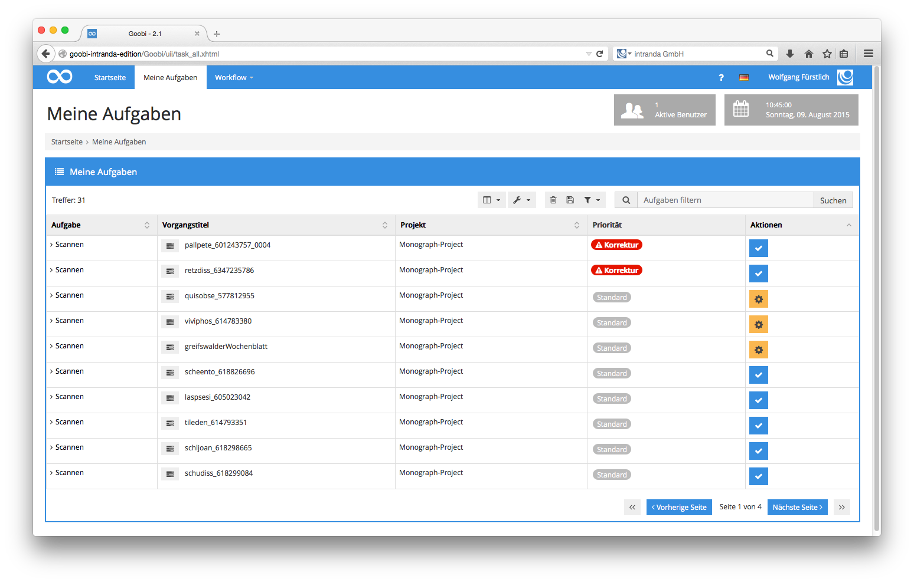
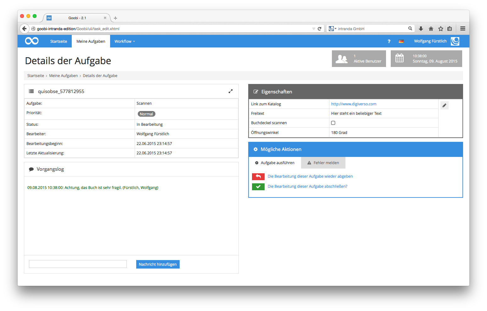

# 4.2.1. Scannen

Ein Scanoperateur, der in Goobi seine tägliche Arbeit verrichtet, unterscheidet sich in seiner Arbeitsweise unwesentlich von anderen Nutzern mit anderen Qualifikationen oder Tätigkeitsbereichen in Goobi. Allen gemein ist, dass sie sich in Goobi zunächst einloggen und anschließend in der Menüleiste auf den Menüpunkt `Meine Aufgaben` klicken.

Die Liste dieser Aufgaben enthält sämtliche Arbeitsschritte, für die der Scanoperateur aufgrund seiner Mitgliedschaft in Projekten und Benutzergruppen berechtigt ist. In der Liste seiner Aufgaben ist in der Spalte `Aktionen` erkennbar, in welchem Status sich die einzelnen Arbeitsschritte gerade befinden. Wie bereits in [Abschnitt Meine Aufgaben beschrieben](../4.1/4.1.8.md), ist für den einzelnen Nutzer sofort erkennbar, welche Aufgaben noch im Status auf offen stehen und auf die Bearbeitung durch einen Nutzer warten, oder welche sich bereits im Status `In Bearbeitung` durch die eigene oder eine anderer Person gleicher Berechtigung und gleicher Qualifikation befinden. Die Symbole in der Spalte `Priorität` weisen auf Korrekturmeldungen oder Prioritäten hin.

In der täglichen Arbeitsweise mit Goobi erfolgt die aufgabenorientierte Erledigung der Arbeit üblicherweise so, dass der Nutzer eine Aufgabe aus der Liste seiner angebotenen Aufgaben auswählt und auf die Schaltfläche Aktionen der zugehörigen Aufgabe klickt. Es öffnet sich eine Maske mit erweiterten Details zu der Aufgabe.

Neben einigen im linken oberen Bereich dargestellten allgemeinen Details zu der ausgewählten Aufgabe, die zur Bearbeitung übernommen wurde, bietet Goobi Ihnen im linken unteren Bereich das `Vorgangslog`, in das Sie beliebige Informationen eintragen können. Diese Informationen sind für sämtliche Bearbeiter sichtbar, die diesen vorliegenden Vorgang an späterer Stelle in einer anderen Aufgabe innerhalb des Workflows bearbeiten werden. Es handelt sich hierbei demnach um ein freies Kommunikationsfeld für allgemeine Anmerkungen oder Hinweise. So kann an dieser Stelle beispielsweise darauf hingewiesen werden, dass für das vorliegende Werk aufgrund seiner Beschaffenheit mit besonderer Vorsicht zu arbeiten ist, oder eine Besonderheit zu diesem Vorgang in Goobi von sämtlichen Bearbeitern an nachfolgende Arbeitsstationen zur Kenntnis genommen werden soll. Kommentare, die Nutzer manuell in dieses `Vorgangslog` eintragen, werden generell in grüner Farbe dargestellt.

Informationen, die durch externe Applikationen oder Skripte zu dem aktuell dargestellten Vorgang übergeben wurden, werden in unterschiedlichen Farben dargestellt. Die hierbei verwendeten Farben haben die folgenden Bedeutungen:

_**Farben innerhalb des Vorgangslogs**_

| **Farben** | **Bedeutung** |
| :--- | :--- |
| Grau | Meldungen mit detaillierten Informationen zum Programmablauf. Diese sind in erster Linie für genauere Analysen gedacht und weniger für den Anwender. |
| Blau | Meldungen mit allgemeinen Informationen. |
| Orange | Warnmeldungen, die auf einen kritischen Status hinweisen. |
| Rot | Fehlermeldungen, die aufgetretene Fehler dokumentieren. |
| Grün | Meldungen, die Benutzer in der Oberfläche von Goobi manuell eingetragen haben. |

Rechts neben den allgemeinen Eigenschaften erscheinen je nach Konfiguration eines jeden Standortes, Projektes und Arbeitsschrittes verschiedene erweiterte Eigenschaften, die der Nutzer angeben soll oder unter Umständen auch als Pflichtangabe ausfüllen muss. So ist wie im vorliegenden Screenshot beispielsweise die Angabe über den verwendeten Öffnungswinkel oder das gewählte Scangerät als Pflichtangabe für einen Scanoperateur vorgegeben worden.

Nach der Annahme einer Aufgabe durch den Scanoperateur stellt Goobi in dem Arbeitsverzeichnis des Scanoperateurs ein Verzeichnis bereit, in dem der Scanoperateur seine Digitalisate speichern soll. Dieses Verzeichnis ist üblicherweise je nach Installation und Konfiguration auf dem lokalen Arbeitsplatzrechner des Benutzers als eine Festplatte in Form eines Netzlaufwerkes eingebunden. Nach der Übernahme einer Aufgabe befindet sich dort ein zusätzlicher Ordner, in den der Scanoperateur üblicherweise direkt hinein scannt.

Nach Fertigstellung der Arbeit, wenn also alle Digitalisate des physischen Werkes erzeugt und in den von Goobi angebotenen Ordner abgelegt worden sind, klickt der Nutzer in dem Bereich `Mögliche Aktionen` einfach auf den Link `Die Bearbeitung dieser Aufgabe abschließen`. Damit erkennt Goobi, dass die Arbeit abgeschlossen wurde, prüft das Vorhandensein von Grafikdateien innerhalb des bereitgestellten Verzeichnisses im Arbeitsverzeichnis des Benutzers, prüft die verwendete Benennung der dort eingestellten Dateien und schließt die Aufgabe für den Benutzer ab. Darüber hinaus entfernt Goobi aus dem Arbeitsverzeichnis des Benutzers das zwischenzeitlich bereitgestellte Verzeichnis für den Vorgang, so dass der Scanoperateur keinen weiteren Zugriff auf das Verzeichnis und die darin enthaltenen Digitalisate hat. Auf gegebenenfalls erforderliche Pflichtangaben - wie im Fall des oben aufgeführten Screenshots zum gewählten Öffnungswinkel und zu dem Scangerät - weist Goobi bei dem Versuch, die Aufgabe abzuschließen, automatisch hin und verhindert somit das Abschließen von Aufgaben, solange nicht alle erforderlichen Angaben durch den Benutzer vollständig angegeben wurden.

Stellen Sie während der Arbeit fest, dass Sie mit dem ausgewählten Vorgang nicht arbeiten möchten, so können Sie diese Aufgabe auch einfach wieder zurückgeben, womit der Arbeitsschritt in seinen ursprünglichen Status `offen` versetzt wird. Damit ist er erneut verfügbar für jeden anderen berechtigten Benutzer oder auch für den Scanoperateur selbst zu einem späteren Zeitpunkt. Diese Arbeitsweise kann beispielsweise dann sinnvoll sein, wenn ein ausgewählter Vorgang einen zu großen Arbeitsaufwand mit sich bringt, der z.B. am letzten Tag vor dem Urlaub nicht mehr erfolgreich abgeschlossen werden kann und somit längere Zeit auch für andere Benutzer nicht zugänglich wäre.

Fällt Ihnen während der Arbeit auf, dass an einer der früheren Arbeitsstationen innerhalb des Workflows ein Fehler aufgetreten ist, dessen Behebung zur Fertigstellung Ihrer Arbeit Voraussetzung ist, so können Sie eine Korrekturmeldung an einen solchen früheren Arbeitsschritt zurücksenden. Dies ist erfahrungsgemäß im Fall von Scanoperateuren eher selten der Fall. Eine Beschreibung solcher Korrekturmeldungen erhalten Sie im [Abschnitt Qualitätskontrolle](4.2.2.md).

Nach dem Abschließen einer Aufgabe gelangen Sie automatisch zurück zur Liste der eigenen Aufgaben, in der die eben abgeschlossene Aufgabe nun nicht mehr enthalten ist. Sie können somit mit der nächsten Aufgabe aus Ihrer Liste fortfahren.

